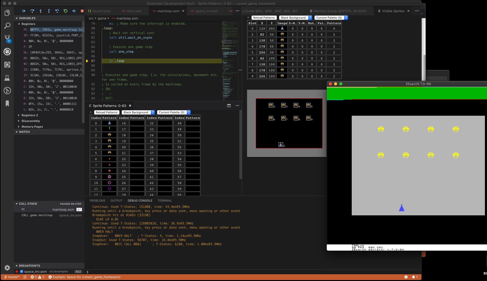
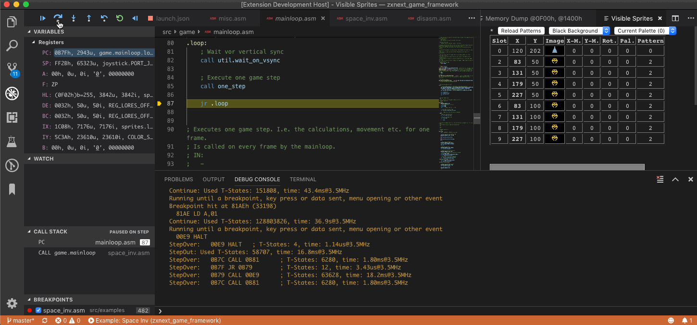

# Support

If you like Dezog please consider supporting it.

# DeZog - The Z80 Debugger

The goal of this project is to achieve a development environment for Z80 assembler programs much the same as developers are nowadays used to for other programming languages. An experience similar to what you would expect from Eclipse, Visual Studio or XCode.

As this is a huge goal the focus is here on
- Easy navigating/stepping through assembler source files with step-over, step-into and step-out
- Data representation by viewing memory area, adding watches conversion between hex, decimal numbers and labels.
- Easy access to data: a lot of information is already available by simply hovering over it.
- Offering a unit test framework.
- Displaying ZX Next specific data like sprites.

DeZog lets you use Visual Studio Code (vscode) as development environment for debugging your Z80 assembler programs.
It's primary intention is to support building new programs, i.e. programs with existing assembler source code.
(It may also be used without source code to debug binaries but in that case the support is limited and you could probably better directly debug with ZEsarUX or CSpect.)
The biggest help it offers is that you are able to step through your sources and that DeZog is aware of all labels and can give hints to what label a number resolves.

DeZog needs a Remote to  execute the Z80 binaries. You can either use the built-in Z80/ZX simulator or connect to ZEsarUX or CSpect via a socket connection for more advanced projects.

Note: DeZog itself does not include any support for building from assembler sources. For this you need a build task and an assembler. For an example look here: https://github.com/maziac/z80-sample-program

**Important note for Windows users:**
Some people encounter a crash (rainbow/kernel panic) of ZEsarUX at the start of a debug session.
If that is true for you as well you can experiment with the "[loadDelay](documentation/Usage.md#zesarux)" option which adds an additional delay at startup. This mitigates the problem.
The default for Windows is 100 (ms). If you run into this problem you can try to increase the value to 400 or even 1000. (You can also try smaller values than 100).

## Gallery

### Sprites:

- Display of sprites with register indices and position
- Display of all patterns with indices

### Execution time:

### Unit tests:

## Features

- supports [ZEsarUX](https://github.com/chernandezba/zesarux) emulator (>= v8.1)
- supports [CSpect](http://www.cspect.org) emulator (>= v2.12.26)
- can be used with the internal simulator (does not require ZEsarUX or CSpect))
- reads .list files
	- supports stepping through source code
	- either in .list file or in .asm files
- step-over, step-in, step-out, continue, pause
- [reverse debugging](documentation/Usage.md#reverse-debugging) via step back and reverse continue
- [code coverage](documentation/Usage.md#code-coverage) visualization
- [state save/restore](documentation/Usage.md#state-saverestore)
- breakpoints (and breakpoints with conditions)
- display of
	- disassembly
	- Z80 registers
	- stack
	- callstack
	- tbblue sprites and patterns
- changing of Z80 registers from vscode
- labels
	- number-label resolution, i.e. along with numbers also the corresponding label is displayed
- hovering
	- registers: reveals its contents and associated label
	- labels: reveals their value
- [watches](documentation/Usage.md#watches) of labels
- formatting registers
	- customizable formatting for registers, e.g. format as hex and/or decimal and/or label etc.
	- different formatting for registers while hovering
- [memory viewer](documentation/Usage.md#memory-dumps) / editor
- automatic display of memory that is pointed to by HL, DE, etc.
- [change of program counter](documentation/Usage.md#change-the-program-counter) through menu
- support for assembler [unit tests](documentation/Unittests.md)
- Display of ZXNext [sprites and sprite patterns](documentation/Usage.md#sprites--patterns)

## Constraints

- supports ZEsarUX, CSpect and the internal simulator
- build output must
	- create a .list file (support for sjasmplus, Savannah's z80asm, z88dk).
	- _alternatively you can use other list files with limited functionality, please consult the documentation. You can also simply fetch a disassembly of your code from ZEsarUX. Please see the "List file" section in the documentation._
	- create a .sna, .nex or .tap file containing the binary

## Roadmap

Next to implement:
- Serial interface: Allows remote debugging via a serial connection on a real ZX Spectrum Next with breakpoints etc.
- ZesarusExt: Make ZesarusExt publicly available. ZesarusExt is a Zesarux fork with small enhancements like faster breakpoints.

## Installation

### Prerequisites

In order to use DeZog you need at least vscode (Linux, macOS or Windows).

If you are writing pure Z80 programs or simple ZX Spectrum 48K programs this might already be sufficient as you can use the [internal Z80 Simulator](documentation/Usage.md#the-internal-z80-simulator).

For more demanding projects you have the choice to install a real emulator.

These are the options:

- the ZEsarUX ZX Spectrum emulator (https://github.com/chernandezba/zesarux). At least version 8.1 is required.
- the [CSpect](http://www.cspect.org) emulator. At least version v2.12.26 is required.

The different DeZog/emulator configurations have different advantages.
But which one you choose mainly depends on your personal preference.
The table [here](documentation/Usage.md#remote-capabilities) shows a comparison of the features.

### DeZog

In Visual Studio Code simply install "DeZog" (maziac.dezog) from the Marketplace.

There are 3 other extensions that are not required to work with DeZog but may help:
- [asm-code-lens](https://github.com/maziac/asm-code-lens):
	- Z80 assembler syntax highlighting
	- completions, references, jump to label, renaming
- [z80-unit-tests](https://github.com/maziac/z80-unit-tests):
	- an extension to start/debug unit tests from a graphical UI
- [z80-instruction-set](https://github.com/maziac/z80-instruction-set):
	- shows the opcode, affected flags and a description on hovering over a Z80 instruction

All can be installed from the market place.

## Usage

Please look at the documentation ['Usage of DeZog'](documentation/Usage.md).

## License

DeZog is licensed under the [MIT license](https://github.com/maziac/dezog/blob/master/LICENSE.txt).

The source code is available on [github](https://github.com/maziac/dezog).

DeZog also includes a Z80/48k ZX Spectrum simulator. For this the original 48/128k ROM code is included and here is the copyright notice:
"Amstrad have kindly given their permission for the redistribution of their copyrighted material but retain that copyright".
See [Amstrad ROM permissions](documentation/amstrad-rom-permissions.txt).

Furthermore DeZog includes slightly modified sources of the Z80.js simulator. It was taken from https://bitbucket.org/DrGoldfire/z80.js/src/master/ which is MIT licensed. Many thanks to Molly Howell.

For the "What's New" feature the [vscode-whats-new](https://github.com/alefragnani/vscode-whats-new) project from Alessandro Fragnani aka [alefragni](https://github.com/alefragnani) has been incorporated. The project is MIT licensed.

## Acknowledgements

I would like to thank a few people for their support
- Cesar Hernandez Bano for developing the great [ZEsarUX](https://github.com/chernandezba/zesarux) emulator which very early offered the possibility to remotely connect to it. And for being patient with all my request for the ZRCP protocol. Without ZEsarUX I wouldn't have started DeZog at all. So, if you like DeZog thank Cesar.
- Mike Dailly for the wonderful [CSpect](http://www.cspect.org) emulator, for opening the debug interface to plugins and for giving support to use it properly.
- [Molly Howell/DrGoldfire](https://bitbucket.org/DrGoldfire/z80.js/src/master/) for the Z80 CPU simulation code.
- [Kris Borowinski](https://github.com/kborowinski) for his tireless efforts testing DeZog.
- [Peter Ped Helcmanovsky](https://github.com/ped7g) for his support. Especially to get the display of the relative-sprites correct.
- Cesar Wagener Moriana, [Dean Belfield](https://github.com/breakintoprogram) and [Daren May](https://github.com/darenm) for writing tutorials.

# Tutorials

## CSpect/DeZog

An excellent tutorial by [Daren May](https://github.com/darenm) which shows how to setup [DeZog with CSpect](https://github.com/darenm/SpectrumNextTutorials/blob/master/DeZog%20Setup%20Tutorial.md) on Windows.
Although it was made for Windows you can easily apply it to macOS or Linux.

Please note: Daren creates an SD card image that is loaded when CSpect is started. For many projects this is not necessary as you can transfer .nex and .sna files directly from DeZog to CSpect.

## ZEsarUX/DeZog

Here is an older (but still great) **tutorial from Cesar Wagener Moriana**.
He documented how he put all things together. It describes how to setup an integrated development environment for ZEsarUX with DeZog.
It deals with setting up
- sjasmplus
- ZEsarUX and the
- DeZog

and is available in English, Spain and German [here](documentation/extras/Tutorial_ZEsarUX_sjasmplus_z80-debug/).

Please note: The tutorial is a bit outdated, it uses 'z80-debug'. This was the former name of the project. It has been renamed to 'dezog'. This means especially that in the launch.json files you need to change 'z80-debug' to 'dezog'.

Nevertheless Cesar (W. M.) also shows how to setup the system under Windows and explains a few features of z80-debug/DeZog so that it is a great advice to get you started.

And here is another shorter **tutorial by Dean Belfield** ([L BREAK into program, 0:1](http://www.breakintoprogram.co.uk/programming/assembly-language/z80/z80-development-toolchain)). For this one you don't need to compile ZEsarUX by yourself.

