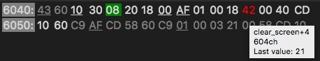

# VS Code Z80 Debug Adapter

**Note: the current implementation is still experimental. Most of the features have not been thoroughly tested. It may or may not work for you.**

The Z80-Debug-Adapter (z80-debug) lets you use Visual Studio Code (vscode) as IDE for ZEsarUX (a ZX Spectrum emulator).
With this extension it is possible to debug assembler programs built for the ZX Spectrum.
It's primary intention is to support building new programs, i.e. programs with existent assembler source code.
(It may also be used without source code to debug binaries but in that case the support is very limited and you could probably better directly debug at ZEsarUX.)
The biggest help it offers is that you are able to step through your sources and that  z80-debug is aware of all labels and can give hints to what label a number resolves.

The z80-debug connects to ZEsarUX via a socket connection. ZEsarUX offers quite a few commands accessible via socket according to the so-called ZRCP (Zesarux Remote Control Protocol). See [ZEsarUX](https://github.com/chernandezba/zesarux) for more information.

Note: The Z80-Debug-Adapter does not include any support for building from assembler sources. For this you need to create a build task yourself. For an example look here: https://github.com/maziac/z80-sample-program

## Features

- supports ZEsarUX emulator
- reads .list and .labels files
	- supports stepping through source code
	- either in .list file or in .asm files
- step-over, step-in, step-out, continue, pause
- display of
	- disassembly
	- Z80 registers
	- stack
	- callstack
- changing of Z80 registers from vscode IDE
- labels
	- number-label resolution, i.e. along with numbers also the corresponding label is displayed
- hovering
	- registers: reveals its contents and associated label
	- labels: reveals their value
- watches of labels
- formatting registers
	- customizable formatting for registers, e.g. format as hex and/or decimal and/or label etc.
	- different formatting for registers while hovering
- memory viewer / editor
- automatic display of memory that is pointed to by HL, DE, etc.

## Constraints

- supports only ZEsarUX emulator
- build output must
	- create a .list file (format as of Z80 Assembler: http://savannah.nongnu.org/projects/z80asm/)
	- create a .sna file containing the binary

## Using Z80 Debug Adapter

### Installation

#### Prerequisites

In order to use z80-debug you need
- vscode (of course)
- the ZEsarUX ZX Spectrum emulator (https://github.com/chernandezba/zesarux). Tested was version 7.

#### z80-debug

Installation is not (yet) possible through the Extension Marketplace.

Instead you have to install the vsix file directly:
- download the latest vsix file (under Releases)
- in vscode press F1 and enter "Extensions: Install from VSIX..."
- don't forget to press "Reload" in vscode

### Sample Program

You can find sample code here:
https://github.com/maziac/z80-sample-program

It includes the sources and the binaries (.list, .labels, .sna files). So, if you don't want to change the sources, you can try debugging even without building from the sources.

### Setup

After installing you need to add the configuration for "z80-debug".

A typical configuration looks like this:
~~~~
    "configurations": [
        {
            "type": "z80-debug",
            "request": "launch",
            "name": "Z80 Debugger",
            "zhostname": "localhost",
            "zport": 10000,
            "disassemblies": [
              //  [ 0, 16384 ]    // Spectrum ROM disassembly
            ],
            "listFiles": [
                //{ "path": "rom48.list", "useFiles": false },
                { "path": "z80-sample-program.list", "useFiles": true }
            ],
            "labelsFiles": [
                //"rom48.labels",
                "z80-sample-program.labels"
             ],
            "startAutomatically": true,
            "skipInterrupt": true,
            "rootFolder": "${workspaceFolder}",
            "topOfStack": "stack_top",
            "loadSnap": "z80-sample-program.sna",
            "disableLabelResolutionBelow": 513,
            "tmpDir": ".tmp"
       }
~~~~

- name: The (human readable) name of the Z80-Debug-Adapter as it appears in vscode.
- zhostname: The host's name. I.e. the IP of the machine that is running ZEsarUX. If you are not doing any remote debugging this is typically "localhost". Note: remote debugging would work, but has not been tested yet. There is also no mechanism included to copy the.sna file to a remote computer. So better stick to local debugging for now.
- zport: The ZEsarUX port. If not changed in ZEsarUX this defaults to 10000.
- disassemblies: You can add address/length tuples here that are disassmbled before startup. Can be used e.g. to disassemble ROM areas. Don't expect too much as the disassembly is not aware of data areas and will disassemble them as they were code.
- listFiles: An array of list files. Typically it includes only one. But if you e.g. have a
list file also for the ROM area you can add it here.
    - path: the path to the list file (relative to the 'rootFolder').
    - useFiles:
        - false = Use .list file directly for stepping and setting of breakpoints.
        - true = Use the (original source) files mentioned in the .list file. I.e. this allows you to step through .asm source files.
        - If you build your .list files from .asm files then use 'true'. If you just own the .list file and not the corresponding .asm files use 'false'.
- labelsFiles: The paths (relative to the 'rootFolder') of the labels files. Typically
this is only one file created during building. But you could add multiple files here.
You can also completely omit the label files but in that case the z80-debug support is very limited because it cannot help in resolving any labels to numbers and vice versa.
- startAutomatically: see [Notes](#Notes)
- skipInterrupt: Is passed to ZEsarUX at the start of the debug session.
    If true ZEsarUX does not break in interrupts (on manual break)
- rootFolder: Typically = workspaceFolder. All other file paths are relative to this path.
- topOfStack: This is an important parameter to make the callstack display convenient to use. Please add here the label of the top of the stack. Without this information z80-debug does not know where the stack ends and may show useless/misleading/wrong information. In order to use this correctly first you need a label that indicates the top of your stack. Here is an example how this may look like:

~~~
Your assembler file:
stack_bottom:
    defs    STACK_SIZE*2, 0
stack_top:

In your launch.json:
"topOfStack": "stack_top"
~~~

Note: instead of a label you can also use a fixed number.
- loadSnap: The snaphsot file to load. On start of the debug session ZEsarUX is instructed to load this file.
- disableLabelResolutionBelow: z80-debug will try to resolve numbers into labels. This is fine most of the time, but for very low numbers this can also be annoying because z80-debug will normally find a load of matching labels whcih are all shown. You can disable it here if the label is below a certain value. Disabling it for all values 0-512 seems to be a good choice.
- tmpDir: A temporary directory used for files created during the debugging. At the moment this is only used to create files for the disassemblies given in 'disassemblies'.

### Usage

After configuring you are ready to go.
But before you start z80-debug in vscode make sure that you started ZEsarUX.
In ZEsarUX enable the socket ZRCP protocol either by commandline ("--enable-remoteprotocol")
or from the ZEsarUX UI ("Settings"->"Debug"->"Remote protocol" to "Enabled").

Important: Make sure that there is no UI window open in ZEsarUX when you try to connect it from vscode.
Sometimes it works but sometimes ZEsarUX will not connect.
You might get an error like "ZEsarUX did not communicate!" in vscode.

Now start z80-debug by pressing the green arrow in the debug pane (make sure that you chose the right debugger, i.e. "Z80 Debug").

z80-debug will now
- open the socket connection to ZEsarUX
- instruct ZEsarUX to load the snapshot file
- set breakpoints (if there are breakpoints set in vscode)
- put ZEsarUX into step mode ('enter-cpu-step') and stop/break the jst started assembler program

z80-debug/vscode will now display the opcode of the current PC (program counter) in the right position in your .asm file.
At the left side you see the disassembly and the registers in the VARIABLES section and the
call stack in the CALL STACK section.

You can now try the following:
- hover over registers in your source code -> should display the value of the register
- step-over, step-in etc.
- click in the call stack -> will navigate you directly to the file
- set breakpoints, press continue to run to the breakpoints

If that is not enough you also have full access to the ZEsarUX ZRCP through vscode's debug console.
Enter "-help" in the debug console to see all available commands.
Enter e.g. "-e h 0 100" to get a hexdump from address 0 to 99.

### Stop Debugging

To stop debugging press the orange square button in vscode. This will stop the z80-debug adapter and disconnect from ZEsarUX.
After disconnecting ZEsarUX, ZEsarUX will also leave cpu-step mode and therefore continue running the program.

### WPMEM

WPMEM offers a way to put watch points persistently into your sources.

WPMEM is put into a comment in your assembler source files. As the comments also appear in the .list file these comments will be parsed when the .list file is read.

Here are some examples how this looks like in code:
~~~
fill_colors:    ; WPMEM, 5, w
    defb RED, YELLOW, BLUE, GREEN, MAGENTA
fill_colors_end:
~~~
~~~
; WPMEM 0x0000, 0x4000
~~~
~~~
; WPMEM fill_colors, 5, r
~~~

Syntax:
~~~~
WPMEM [addr [, length [, access]]]
~~~~
with:
- addr = address (or label) to observe (optional). Defaults to current address.
- length = the count of bytes to observe (optional). Default = 1.
- access = Read/write access (optional). Possible values: r, w or rw. Defaults to rw.

I.e. if you omit all values a watch-point will be created for the current address.
E.g. in the first example a watchpoint is created that checks that the array (fill_colors) is not overwritten with something else.

The most often used form of WPMEM is to put a WPMEM simply after an byte area that is used for reading/writing. E.g. like this:
~~~~
scratch_area:
    defs 10
    defb 1      ; WPMEM
~~~~
In this example it is assumed that your algorithm uses the 'scratch_area' to write some data. You defined that this area is 10 bytes in size. Thus if someone would write after
these 10 bytes it would mean that the algorithm is wrong.
Please note that we waste 1 byte (defb 1) for this safety check. This byte is not to be used by any pointer in our program. So writing/reading to it is a failure and teh program will break if this happens.

Caveats:
- The parser of the list file is very simple. I.e. it cannot distinguish if
the comment is in an area that is conditionally not assembled. So even if the code is not assembled it would honor the WPMEM comment and assign a watch point.

### Debug Console

You can add commands directly at the debug console. E.g. you can pass commands directly to ZEsarUX or you can enable/disable WPMEM.

Enter '-help' in the debug console to see all available commands.

### Memory Dumps

If you enter
~~~~
-md <address> <size>
~~~~
in the debug console you open a memory viewer.

Here an example:

The memory viewer will offer a few extra info:
- The address is printed on the left side.
- The selected area (address, size) is emphasized, the other area is grayed out.
- Any address for which a label exists is underlined.
- Addresses that are pointed to by registers (e.g HL, DE, IX) are displayed with a colored background (here HL got green).
- Any changed value is highlighted in red.
- Hovering over values reveals more information. In the picture above the move was hovering over the red "42". You can see the associated address, label(s) and (since the value was changed) also the previous value.

You can also open multiple memory dumps at once by adding more address/size ranges to the command, e.g.:
~~~~
-md 0 0x100 0x8000 0x40 0x8340 0x10
~~~~
This opens a memory dump view 3 memory blocks.
Please note that if ou enter overlapping blocks the dump will merge them in the display.

z80-debug opens a special memory viewer by itself on startup: it shows the locations around some registers. I.e. you can directly see where the registers are pointing at and what the values before and after are. This memory will change its range automatically if the associated register(s) change.

#### Memory Editor

In the memory viewer you can edit indivdual memory values with a double-click on the value.
You can now enter the new value as hex, decimal, bin or even as a math formula.

Any changed value wil be updated automatically in all memory views.
Note: The changed value is not updated immediately in the WATCH area. There you need to 'step' once to get the updated values.

#### Configuration

The visualization of the memory viewer can be configured. All values are collected under the 'memoryViewer' setting. You can change the registers in the registers-memory-viewer, the colors of the register pointers and the format of values that is shown when you hover over the memory values.

### WATCHES

If you select a label with the mouse in the source code and do a right-click you can add it to the watches. The watches show a memory dump for that label.
The dump is updated on each step.
z80-debug cannot determine the "type" and size the data associated with the label therefore it assumes 100 bytes or words and shows both,
a byte array and a word array, on default.
However you have a few options if you add more parameters to the label.

If you double-click on the label in the WATCHES area you can edit it. You can tell z80-debug the number of elements to show and if it should show bytes, words or both.
The format is:
~~~~
label,size,types
~~~~
with
- label: The label, e.g. LBL_TEXT or just a number e.g. 0x4000
- size: The number of elements to show. Defaults to 100 if omitted.
- types: Determines if a byte array ('b'), a word array ('w') or both ('bw') should be shown. Defaults to 'bw'.

Here is an example:
~~~~
fill_colors,5,b
~~~~
It shows an array of 5 bytes beginning at label fill_colors.

## Differences to ZEsarUX

Stepping works slightly different to stepping in ZEsarUX.

- step-over: A step-over always returns. step-over should work like you would intuitively expect it to work (at least for me :-) ). You can step-over a 'jp' opcode and it will break on the next opcode, the jump address. z80-debug does so by looking at the current opcode: If a 'call' or a 'ldir/lddr' is found a ZEsarUX 'cpu-step-over' is done, in all other case a 'cpu-step' (into) is done.

- step-out: This is not available in ZEsarUX, but in z80-debug you can make use of a step-out. z80 debug examines the call stack and sets a temporary breakpoint to the return address. So step-out should work as expected. Note: if the stack pointer is already at the top of the call stack a step-out will do nothing because there is nothing to step-out from.

## Notes

- "startAutomatically" is ignored at the moment. ZEsarUX should be started manually before debugging
- vscode breakpoint conditions: those are directly passed to ZEsarUX. Conditions have not been tested at all.
- Don't use "-exec run" in the debug console. It will lead to a disconnection of ZEsarUX. Instead use the continue button (the green arrow).

## License

z80-debug is licensed under the [MIT license](https://github.com/maziac/z80-debug/blob/master/LICENSE.txt).

The source code is available on [github](https://github.com/maziac/z80-sample-program).
