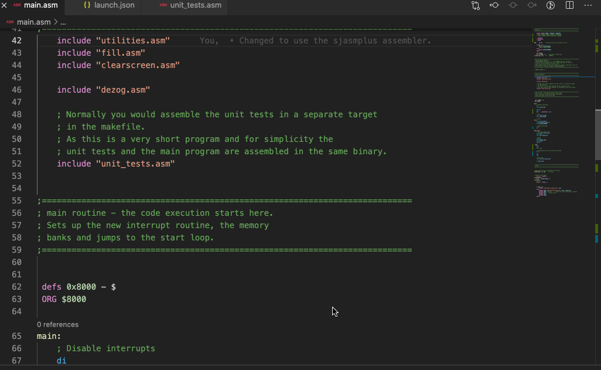

# Support

If you like DeZog please consider supporting it.

&nbsp;&nbsp;

<!-- References -->

[ASM Code Lens]: https://github.com/maziac/asm-code-lens
[Z80 Instruction Set]: https://github.com/maziac/z80-instruction-set
[Hex Hover Converter]: https://github.com/maziac/hex-hover-converter
[ZX SNA File Viewer]: https://github.com/maziac/sna-fileviewer
[ZX NEX File Viewer]: https://github.com/maziac/nex-fileviewer

[z80-sample-program]: https://github.com/maziac/z80-sample-program
[z80-peripherals-sample]: https://github.com/maziac/z80-peripherals-sample
[dezogif]: https://github.com/maziac/dezogif
[DZRP]: https://github.com/maziac/DeZog/blob/master/design/DeZogProtocol.md

[zesarux]: https://github.com/chernandezba/zesarux
[cspect]: http://www.cspect.org
[mame]: https://www.mamedev.org
[sjasmplus]: https://github.com/z00m128/sjasmplus
[savannah-z80asm]: https://savannah.nongnu.org/projects/z80asm/
[z88dk-z80asm]: https://github.com/z88dk/z88dk
[NEX File Format]: https://wiki.specnext.dev/NEX_file_format
[ZX Spectrum Next]: https://www.specnext.com
[zx next]: https://www.specnext.com
[zxnext]: https://www.specnext.com

# DeZog - The Z80 Debugger

The objective of this project is to provide a development environment for Z80 assembler programs that offers similar features to those found in high-level programming languages, such as Eclipse, Visual Studio, or XCode.

This includes functionalities like
- easy stepping/navigation through source files with step-over, step-into and step-out capabilities
- data representation through memory views and data watches
- easy data access through hover-over information
- data display in structures
- a unit test framework

Additionally it offers some ZX Next specific capabilities like displaying sprites.

DeZog facilitates the debugging of Z80 assembler programs using Visual Studio Code (vscode) as the development environment. This tool can be used to build programs, step through sources, use labels, watches, memory views, and other useful features. Additionally, it can be used to reverse engineer old Z80 programs, such as ZX Spectrum, ZX81 or MAME arcade games, by debugging and creating commented list files of the program.

DeZog needs a "[Remote](documentation/Usage.md#remote-types)" to  execute the Z80 binaries. You can either use the built-in Z80/ZX simulator or connect to [ZEsarUX], [CSpect] or [MAME] via a socket connection for more advanced projects.

Note: DeZog itself does not include any support for building from assembler sources. For this you need a build task and an assembler. For an example look here: https://github.com/maziac/z80-sample-program

## Gallery

### Sprites:

- Display of sprites with register indices and position
- Display of all patterns with indices

### Execution time:

### Unit tests:

## Features

- supports the [ZEsarUX] emulator
- supports the [CSpect] emulator
- supports [MAME]
- can be used with the internal simulator (does not require ZEsarUX, CSpect, ...)
- reads .list and .sld files
	- supports stepping through source code
	- either in .list file or in .asm files
- step-over, step-in, step-out, continue, pause
- [reverse debugging](documentation/Usage.md#reverse-debugging) via step back and reverse continue
- [code coverage](documentation/Usage.md#code-coverage) visualization
- [state save/restore](documentation/Usage.md#state-saverestore)
- breakpoints (and breakpoints with conditions)
- display of
	- disassembly
	- Z80 registers
	- stack
	- callstack
	- data
	- tbblue sprites and patterns
- changing of Z80 registers from vscode
- labels
	- number-label resolution, i.e. along with numbers also the corresponding label is displayed
- hovering
	- registers: reveals its contents and associated label
	- labels: reveals their value
- [watches](documentation/Usage.md#watches) of labels
- formatting registers
	- customizable formatting for registers, e.g. format as hex and/or decimal and/or label etc.
	- different formatting for registers while hovering
- [memory viewer](documentation/Usage.md#memory-dumps) / editor
- automatic display of memory that is pointed to by HL, DE, etc.
- [change of program counter](documentation/Usage.md#change-the-program-counter) through menu
- display of ZXNext [sprites and sprite patterns](documentation/Usage.md#sprites--patterns)
- supports banking (['long addresses'](documentation/Usage.md#long-addresses-explanation))
- support for Z80 [unit tests](documentation/UnitTests.md)
- [custom extensions](documentation/zsimPeripherals.md) to the internal simulator to simulate peripherals.
- [custom memory models](documentation/Usage.md#custommemory)

## Installation

### Prerequisites

In order to use DeZog you need at least vscode (Linux, macOS or Windows).

If you are writing pure Z80 programs, simple ZX Spectrum or ZX81 programs this might already be sufficient as you can use the [internal Z80 Simulator](documentation/Usage.md#the-internal-z80-simulator).

For more demanding projects you have the choice to install a real emulator.

These are the options:

- the [CSpect](http://www.cspect.org) emulator (known to be interoperable is version 2.19.7.1)
- the [ZEsarUX](https://github.com/chernandezba/zesarux) emulator (known to be interoperable is version 11.0. Versions older than 10.3 are not compatible.)
- [MAME](https://www.mamedev.org/release.html) (known to be interoperable is version 0.242)

Note: The version numbers given here are versions that I have used myself. Newer versions probably also work, but I can't judge that myself.

The different DeZog/emulator configurations have different advantages.
But which one you choose mainly depends on your personal preference.
The table [here](documentation/Usage.md#remote-capabilities-comparison) shows a comparison of the features.

If you own a ZX Next you also have the option to debug your SW directly on the Next.

### DeZog

In Visual Studio Code simply install "DeZog" (maziac.dezog) from the Marketplace.

There are a few other extensions that are not required to work with DeZog but may help:
- [ASM Code Lens]:
	- Z80 assembler syntax highlighting
	- completions, references, jump to label, renaming
- [Z80 Instruction Set]:
	- shows the opcode, affected flags and a description on hovering over a Z80 instruction
- [Hex Hover Converter]:
	- converts numbers into their decimal, hexadecimal and binary format on hovering
- [ZX SNA File Viewer]/[ZX NEX File Viewer]:
	- Viewer for the ZX Spectrum snapshot (.sna) format and the ZX Spectrum Next (.nex) file format (in marketplace search for "snafile" and "nexfile")

All can be installed directly inside vscode from the market place.

To use DeZog in Visual Studio Code, simply install the "DeZog" extension (maziac.dezog) from the Marketplace. Although not required, there are several other helpful extensions available, including:

- [ASM Code Lens], which provides syntax highlighting for Z80 assembler, as well as completions, references, jump to label, and renaming functionality.
- [Z80 Instruction Set], which displays opcode, affected flags, and a description when hovering over a Z80 instruction.
- [Hex Hover Converter], which converts numbers to decimal, hexadecimal, and binary formats when hovering over them.
- [ZX SNA File Viewer]/[ZX NEX File Viewer], which allow viewing of ZX Spectrum snapshot (.sna) and ZX Spectrum Next (.nex) files (search for "snafile" and "nexfile" in the Marketplace).

All of these extensions can be easily installed directly from the Visual Studio Code Marketplace.

## Usage

Please refer to the ['Usage of DeZog'](documentation/Usage.md) documentation.

You can also access the documentation from within vscode/DeZog.
Enter "dezog: Show the DeZog Help page" in the command palette (F1 key) or reveal the "DeZog Help" from the debugging sidebar.

## Contribution

If you would like to help extending the DeZog functionality in one of the following areas you are very welcome:

- Add **new assembler** parsers: The process of writing a parser is described in detail here: [AddingNewAssemblers.md](design/AddingNewAssemblers.md)
Shouldn't be to hard.
- Adding other Remotes (emulators): See [AddingNewRemotes.md](design/AddingNewRemotes.md).
[S0urceror has done so for OpenMSX](https://www.youtube.com/watch?v=cf4nPzoosAw&feature=youtu.be), so it is doable.

You can create a pull request so I can add your sources to the official release. Most probably I will first move them to a new feature branch for testing.
Please note that all your contributions/sources should be under MIT license.

If you would like to contact me beforehand you can create a new issue in github and we can discuss.

## License

DeZog is licensed under the [MIT license](https://github.com/maziac/dezog/blob/master/LICENSE.txt).

The source code is available on [github](https://github.com/maziac/dezog).

DeZog also includes a Z80/48k ZX Spectrum simulator. For this the original 48/128k ROM code is included and here is the copyright notice:
"Amstrad have kindly given their permission for the redistribution of their copyrighted material but retain that copyright".
See [Amstrad ROM permissions](documentation/amstrad-rom-permissions.txt).

Furthermore DeZog includes slightly modified sources of the Z80.js simulator. It was taken from https://bitbucket.org/DrGoldfire/z80.js/src/master/ which is MIT licensed. Many thanks to Molly Howell.

For the "What's New" feature the [vscode-whats-new](https://github.com/alefragnani/vscode-whats-new) project from Alessandro Fragnani aka [alefragni](https://github.com/alefragnani) has been incorporated. The project is MIT licensed.

For the other included SW see the 'dependencies' section in [package.json](https://github.com/maziac/DeZog/blob/main/package.json)

## Acknowledgements

I would like to express my gratitude to the following individuals for their invaluable support:

- Cesar Hernandez Bano for developing the great [ZEsarUX] emulator which very early offered the possibility to remotely connect to it. And for being patient with all my request for the ZRCP protocol. Without ZEsarUX I wouldn't have started DeZog at all. So, if you like DeZog thank Cesar.
- Mike Dailly for the wonderful [CSpect] emulator, for opening the debug interface to plugins and for giving support to use it properly.
- [Molly Howell/DrGoldfire](https://bitbucket.org/DrGoldfire/z80.js/src/main/) for the Z80 CPU simulation code.
- [Kris Borowinski](https://github.com/kborowinski) for his tireless efforts testing DeZog.
- [Peter Ped Helcmanovsky](https://github.com/ped7g) for his support to get the display of the relative-sprites correct and for the changes he implemented for DeZog in [sjasmplus] in the SLD format.
- Cesar Wagener Moriana, [Dean Belfield](https://github.com/breakintoprogram), [Daren May](https://github.com/darenm), [Patricia Curtis](https://luckyredfish.com/who-am-i/) and [A MAN IN HIS TECHNO SHED](https://amaninhistechnoshed.com/a-man-in-his-technoshed/) for writing tutorials.
- [Luciano Martorella](https://github.com/lmartorella) for his contribution of the custom memory model.
- [Sebastien Andrivet](https://github.com/andrivet) for help with the ZX81 simulator and the ZX81 and ZX Spectrum keyboard svg files. Great work. Both are included under the [CC BY-SA 4.0](https://creativecommons.org/licenses/by-sa/4.0/?ref=chooser-v1) license.

# Tutorials

Please note that the tutorials listed here are normally not updated when a new DeZog version arrives.
Especially for changes in the 'launch.json' it might happen that some properties (names) have changed/removed/added.

If you are writing a tutorial please let me know, I'm happy to list it here. **Any contributions are very welcome.**

The tutorials that I'm aware of are listed here by date.

## A Man in his Techno Shed

Date: Apr-2022, DeZog 2.7, ZX Next

The most recent and only tutorial[tutorial](https://amaninhistechnoshed.com/a-man-in-his-technoshed/coding) for DeZog 2.x, by [A MAN IN HIS TECHNO SHED](https://amaninhistechnoshed.com/a-man-in-his-technoshed/).
It shows debugging with a ZX Next and DeZog.

## Patricia Curtis

Date: Sep-2020, DeZog 1.4, CSpect

A great [tutorial](https://luckyredfish.com/coding-for-the-spectrum-next-emulator-cspect/) by [Patricia Curtis](https://luckyredfish.com/who-am-i/) describing the setup with sjasmplus, CSpect and DeZog.

## Retro Coder TV

Date: Sep-2020, DeZog 1.4, Internal Z80 Simulator, ZEsarUX, CSpect

A quite lengthy tutorial. But as a YouTube [video](https://www.youtube.com/watch?v=a16PG2YOqIg&t=4904s) it shows a 'live' DeZog setup.
By [Retro Coder TV](https://www.twitch.tv/retrocodertv).

## L BREAK into program, 0:1

Date: Aug-2020, DeZog 1.4 (with a few updates for 2.0), ZEsarUX

And here is another shorter **tutorial by Dean Belfield** ([L BREAK into program, 0:1](http://www.breakintoprogram.co.uk/programming/assembly-language/z80/z80-development-toolchain)).

## Daren May

Date: May-2020, DeZog v1.2, CSpect

An excellent tutorial by [Daren May](https://github.com/darenm) which shows how to setup [DeZog with CSpect](https://github.com/darenm/SpectrumNextTutorials/blob/master/DeZog%20Setup%20Tutorial.md) on Windows.
Although it was made for Windows you can easily apply it to macOS or Linux.

Please note: Daren creates an SD card image that is loaded when CSpect is started. For many projects this is not necessary as you can transfer .nex and .sna files directly from DeZog to CSpect.

## Cesar Wagener Moriana

Date: Dec-2019, DeZog 0.9 (Z80 Debug), ZEsarUX

Here is an older (but still great) **tutorial from Cesar Wagener Moriana**.
He documented how he put all things together. It describes how to setup an integrated development environment for ZEsarUX with DeZog.
It deals with setting up
- sjasmplus
- ZEsarUX and the
- DeZog

and is available in English, Spain and German [here](documentation/extras/Tutorial_ZEsarUX_sjasmplus_z80-debug/).

Please note: The tutorial is a bit outdated, it uses 'z80-debug'. This was the former name of the project. It has been renamed to 'dezog'. This means especially that in the launch.json files you need to change 'z80-debug' to 'dezog'.

Nevertheless Cesar (W. M.) also shows how to setup the system under Windows and explains a few features of z80-debug/DeZog so that it is a great advice to get you started.

# Fork

The [ZX81 Debugger](https://github.com/andrivet/ZX81-Debugger) by [Sebastien Andrivet](https://github.com/andrivet) is a fork of DeZog that contains a complete development environment for the ZX81. I.e. it comes with an integrated Z80 assembler, an integrated ZX81 simulator, syntax highlighting, sample code that you just need to paste to get started and DeZog as a debugging backend.
So if you're looking for a development program for the ZX81, you should give it a try.
It's also much easier to set up than DeZog because you don't have any external dependencies.
If you want to test the capabilities of DeZog without configuring anything, then you should also check it out.

