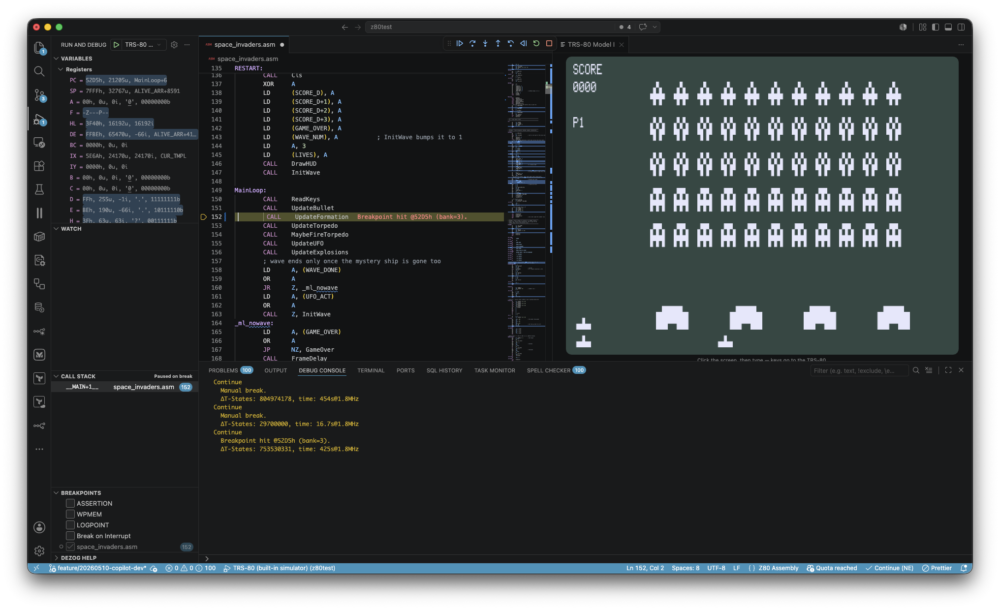
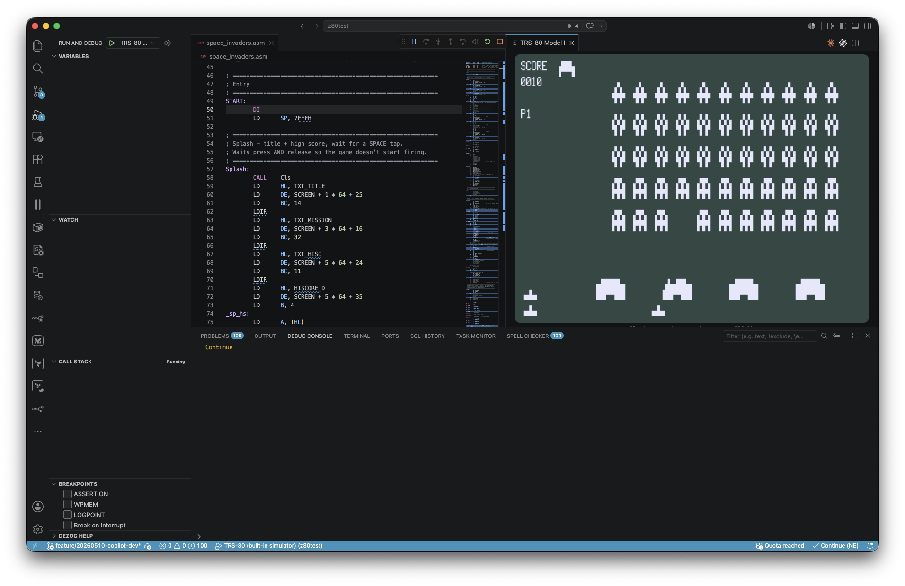
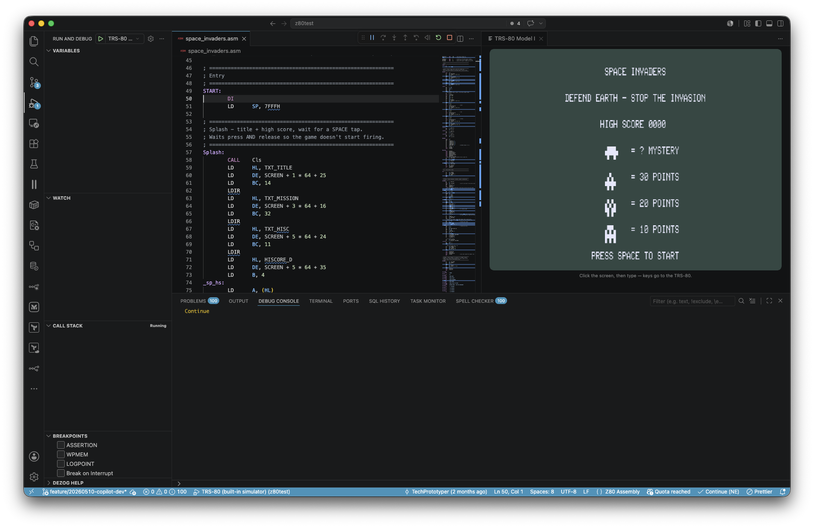
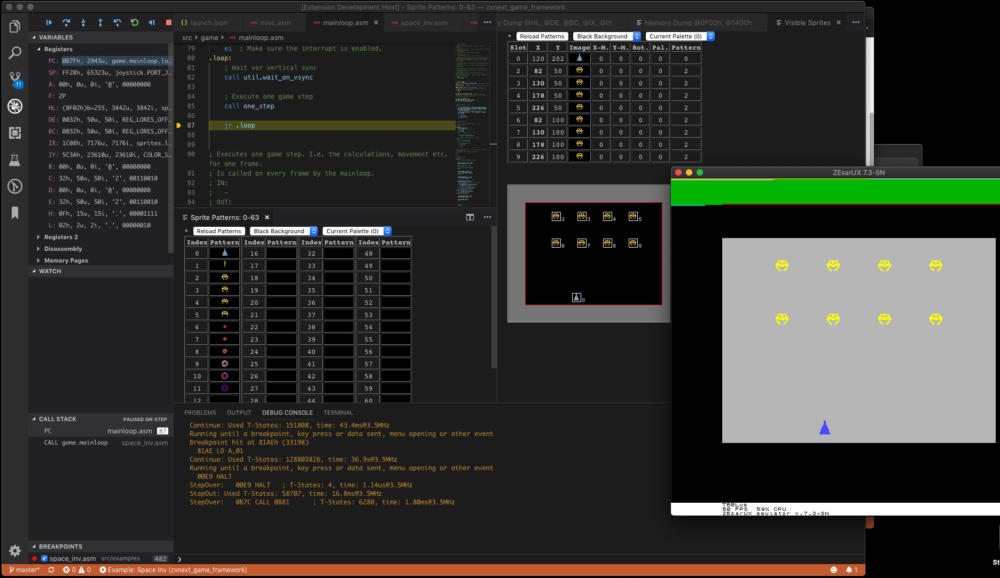
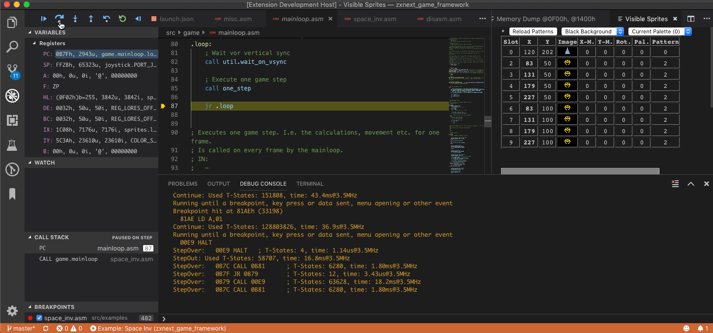
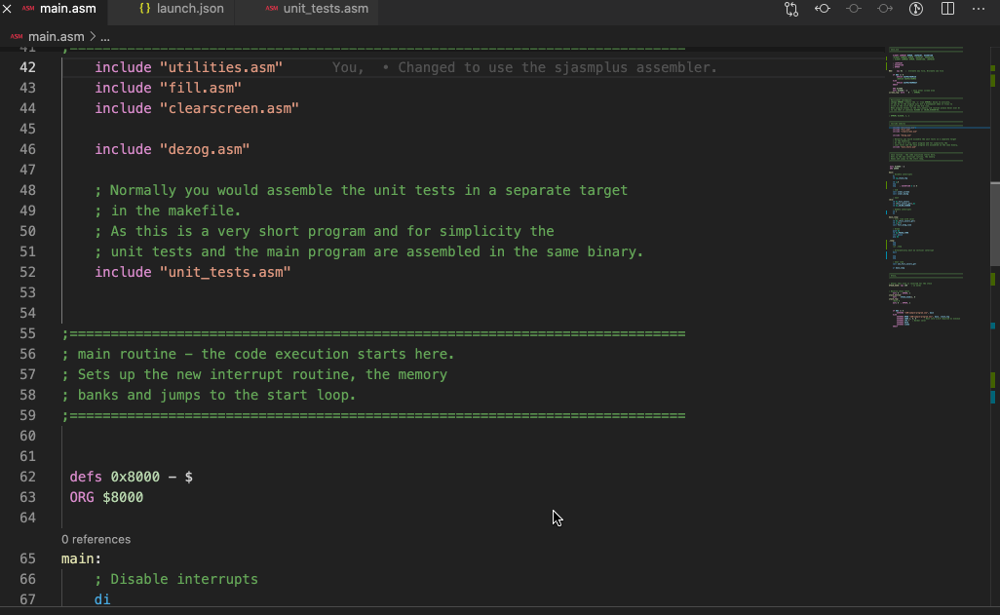

# DeZog — TRS-80 Edition (`trszog`)

> **A source-level Z80 debugger for the TRS-80 Model I/III, inside Visual Studio Code.**

`trszog` ([TechPrototyper/trszog](https://github.com/TechPrototyper/trszog)) is a fork of [maziac/DeZog](https://github.com/maziac/DeZog) that adds first-class **TRS-80** support — a **built-in in-process TRS-80 simulator** (`remoteType: "trs80sim"`, based on [Lawrence Kesteloot's](https://github.com/lkesteloot/trs80) open-source TypeScript emulator) and the [zmac](http://48k.ca/zmac.html) assembler, with upcoming FPGA hardware debugging and experimental [trs80gp](http://48k.ca/trs80gp.html) support — while leaving every existing DeZog remote (ZEsarUX, CSpect, MAME, internal simulator) fully intact. Full credit for the underlying debugger goes to Thomas Busse (maziac); see [Acknowledgements](#acknowledgements).

## Status: Release Candidate

**You can debug TRS-80 assembly in VS Code today — with zero external tools.** The built-in `trs80sim` simulator ships inside the extension: install, press F5, and you are stepping through your Z80 source with breakpoints, watchpoints, live registers and the TRS-80 screen right next to your code.



*A real trszog session: a homebrew [TRS-80 Space Invaders](https://github.com/TechPrototyper/trs80-space-invaders) halted at a source-level breakpoint in its main loop (`CALL UpdateFormation`), with the full Z80 register set — label-resolved, e.g. `IX = CUR_TMPL`, `PC = MainLoop+6` — the call stack, and the running game on the built-in TRS-80 screen at right. No external emulator, no socket: everything you see is inside the extension. Every TRS-80 screen in this README is real, rendered with the authentic TRS-80 character set.*

The debugging paths:

- **`trs80sim` — the built-in simulator.** Available now, works out of the box. Based on Lawrence Kesteloot's superb open-source TypeScript TRS-80 emulator (details below).
- **Real Hardware FPGA Debugging (`trs80-rev-z`) — coming very soon!** Hardware debugging via a dedicated virtual debug dongle core in FPGA, enabling live Z80 source-level debugging on physical silicon directly from VS Code (read below for full details on what's coming).
- **`trs80gp` (Experimental).** George Phillips' [trs80gp](http://48k.ca/trs80gp.html) is the gold standard of TRS-80 emulation; experimental protocol support is included in `trszog`.

### Built-in TRS-80 simulator (`trs80sim`) — works out of the box

`remoteType: "trs80sim"` embeds [Lawrence Kesteloot's TypeScript TRS-80 emulator](https://github.com/lkesteloot/trs80) (MIT) in-process in the extension host — the same architecture as DeZog's internal `zsim` simulator. No install, no socket, no external process, no ROM hunting: everything needed is inside the extension.

| Capability | Status |
|---|---|
| Load a `.cmd` program natively (deterministic: ROM boot pre-run, then direct load) | ✅ works |
| Source-mapped breakpoints from zmac `.bds` files, conditional + logpoints + assertions | ✅ works |
| Step into / over / out, continue, pause — instruction-precise | ✅ works |
| Register view & **edit**, memory view & **edit** | ✅ works |
| Callstack, watches, hover, disassembly | ✅ works (inherited from DeZog) |
| Inline TRS-80 screen in a VS Code panel + keyboard input | ✅ works (authentic Kesteloot canvas renderer) |
| Memory watchpoints (DeZog `WPMEM`, read & write) | ✅ works — a first for the TRS-80 remotes |
| Model III (`"trs80sim": {"model": 3}`) | ✅ works (2.03 MHz, own ROM) |

<p>


</p>

*The TRS-80 screen panel next to your code: a homebrew [TRS-80 Space Invaders](https://github.com/TechPrototyper/trs80-space-invaders) running in the built-in simulator — full invader formation, bunkers, player cannon (left), and its title screen (right). Both are live in a VS Code debug session; click the panel and your keystrokes go straight to the emulated machine.*

Example `launch.json` configuration:

```json
{
    "type": "dezog",
    "request": "launch",
    "name": "TRS-80 (built-in simulator)",
    "remoteType": "trs80sim",
    "trs80sim": {
        "model": 1
    },
    "zmac": [
        {
            "path": "zout/hello.bds"
        }
    ],
    "load": "zout/hello.cmd",
    "topOfStack": "0x8000",
    "rootFolder": "${workspaceFolder}",
    "startAutomatically": false
}
```

On launch the simulator boots the Level II ROM briefly (so system vectors exist, mirroring what a real machine would have done), loads the `.cmd` blocks directly into memory, sets PC to the transfer address and SP from `topOfStack`, and stops at the entry point.

### Real Hardware Debugging: TRS-80 Rev Z (FPGA) — Teaser & Coming Soon!

Beyond software emulation, `trszog` provides first-class support for **debugging on real FPGA hardware**.

Coming soon, an FPGA-based TRS-80 Model 1 [TRS-80 Rev Z](https://github.com/TechPrototyper/trs80-rev-z) (Cat. No. 26-2026 — *"The last revision of the Model 1. The one Tandy never built"*) brings an open, fully expanded TRS-80 Model I rebuild to the FPGA, starting with the [ULX3S](https://radiona.org/ulx3s/) based on the Lattice ECP5 and the Open Source Toolchain which became possible through Project Trellis.

**What's coming soon:**
- **Full Setup Real Hardware**: An authentic Model I architecture featuring 48 KB RAM, Level II BASIC 1.3, Expansion Interface, and a dual-controller (WD1771/1791) FDC supporting mixed-density floppy disk drives — booting TRSDOS 2.3 and NEWDOS/80 2.0 directly from SD card with HDMI output and USB keyboard support.
- **Virtual Debug Co-Core / Dongle**: Incorporates a RISC-V softcore running alongside the Z80 CPU as a dedicated virtual debug co-processor. This co-core acts as an embedded hardware debug adapter, providing hardware breakpoints, single-stepping, memory/register inspection without halting the target system, and cycle-exact bus tracing.
- **Direct `trszog` Integration**: Press **F5 in Visual Studio Code** to halt, single-step, and inspect your Z80 assembly code directly on physical FPGA silicon!

In `trszog`, an FPGA target is seamlessly handled as another remote type, keeping the developer experience identical between local in-process simulation and real FPGA hardware.

### Reference Emulator: `trs80gp` (Experimental)

George Phillips' [trs80gp](http://48k.ca/trs80gp.html) is universally recognized as the gold standard of TRS-80 emulation — cycle-exact, covering the entire model family. An experimental protocol for remote debugging `trs80gp` is included in `trszog`, yet this has not been released by George and perhaps won't be. As the whole idea of a modern toolchain sprang from integrating VS Code with zmac and trs80gp, this reference is mandatory; however, possibly not available for users for the time being.

---

# Support

If you like DeZog please consider supporting it.

<a href="https://github.com/sponsors/maziac" title="Github sponsor">
	
</a>
&nbsp;&nbsp;
<a href="https://www.paypal.com/donate/?hosted_button_id=K6NNLZCTN3UV4&locale.x=en_DE&Z3JncnB0=" title="PayPal">
	
</a>

<!-- References -->

[ASM Code Lens]: https://github.com/maziac/asm-code-lens
[Z80 Instruction Set]: https://github.com/maziac/z80-instruction-set
[Hex Hover Converter]: https://github.com/maziac/hex-hover-converter
[ZX SNA File Viewer]: https://github.com/maziac/sna-fileviewer
[ZX NEX File Viewer]: https://github.com/maziac/nex-fileviewer
[ZX81 BASIC to P-File Converter and P-File Viewer]: https://github.com/maziac/zx81-bastop

[z80-sample-program]: https://github.com/maziac/z80-sample-program
[zx81-sample-program]: https://github.com/maziac/zx81-sample-program
[z80-peripherals-sample]: https://github.com/maziac/z80-peripherals-sample
[dezogif]: https://github.com/maziac/dezogif
[DZRP]: https://github.com/maziac/DeZog/blob/master/design/DeZogProtocol.md

[zesarux]: https://github.com/chernandezba/zesarux
[cspect]: http://www.cspect.org
[mame]: https://www.mamedev.org
[sjasmplus]: https://github.com/z00m128/sjasmplus
[savannah-z80asm]: https://savannah.nongnu.org/projects/z80asm/
[z88dk-z80asm]: https://github.com/z88dk/z88dk
[NEX File Format]: https://wiki.specnext.dev/NEX_file_format
[ZX Spectrum Next]: https://www.specnext.com
[zx next]: https://www.specnext.com
[zxnext]: https://www.specnext.com


# TRS-80 Quickstart

## Quickstart 1: built-in simulator (`trs80sim`) — nothing to install

The only tool you need besides this extension is George Phillips' [zmac](http://48k.ca/zmac.html) assembler: `zmac -j myprog.asm` produces both the executable (`zout/myprog.cmd`) and the debug file with source mapping (`zout/myprog.bds`).

1. Assemble: `zmac -j myprog.asm`
2. Add a `launch.json` configuration (see the [trs80sim example above](#built-in-trs-80-simulator-trs80sim--works-out-of-the-box)) pointing `zmac` at the `.bds` and `load` at the `.cmd`.
3. Set breakpoints in your `.asm`, press **F5**. The debugger stops at your entry point, and the "TRS-80 Model I" panel opens next to your code — click it and your keystrokes go to the emulated machine.

Tip: with a `preLaunchTask` that runs `zmac -j ${file}` and `${fileBasenameNoExtension}` in the `zmac`/`load` paths, F5 on whatever `.asm` file is open becomes the complete edit–assemble–debug cycle.

## Quickstart 2: Real Hardware FPGA Debugging (`remoteType: "revz"`) — coming soon

When debugging on actual FPGA hardware (such as the upcoming [TRS-80 Rev Z](https://github.com/TechPrototyper/trs80-rev-z) on the ULX3S), `trszog` uses `remoteType: "revz"`. It connects directly to the virtual debug dongle running in the FPGA via a serial bridge or network transport.

Example `launch.json` configuration for FPGA hardware debugging:

```json
{
    "type": "dezog",
    "request": "launch",
    "name": "TRS-80 Rev Z (FPGA Hardware)",
    "remoteType": "revz",
    "revz": {
        "target": "fpga",
        "dongle": "fpga",
        "transport": {
            "kind": "python",
            "serial": "/dev/cu.usbserial-1420",
            "bridge": "${workspaceFolder}/tools/trszog_bridge.py",
            "autoStart": true
        }
    },
    "zmac": [
        {
            "path": "zout/hello.bds"
        }
    ],
    "load": "zout/hello.cmd",
    "topOfStack": "0x8000",
    "rootFolder": "${workspaceFolder}",
    "startAutomatically": false
}
```

On launch, `trszog` automatically brings up the debug transport bridge, connects to the debug co-core in the FPGA, loads the `.cmd` executable and `.bds` symbols, and halts the live Z80 CPU at your entry point — allowing hardware breakpoints, live register edits, and single-stepping directly on real silicon!

### A real debugging session: [TRS-80 Space Invaders](https://github.com/TechPrototyper/trs80-space-invaders)

Here is what an actual session against the game looks like using source-mapped debugging in `trszog` (concrete addresses vary from build to build, since zmac re-lays-out the binary on each assembly; the point is the *mechanism*):

1. **Stop at the entry point.** `trszog` reads the transfer/entry address out of the `.cmd` file (e.g. `0x5200`) and arms a breakpoint there *before* the program is launched. The CPU halts on the first instruction of your code, and VS Code opens `space_invaders.asm` at that line — not a raw disassembly. Source mapping is live from instruction zero.
2. **Set a source breakpoint.** Click the gutter next to, say, the formation-update routine (`UpdateFormation`). `trszog` resolves the label through the zmac `.bds` file to its long address and arms it. Press **Continue**; the game boots into its title screen.
3. **Trigger it.** The title screen waits for the SPACE key; the game starts, and the moment the alien formation advances, the breakpoint fires. VS Code shows the halted PC on the exact source line, the full Z80 register set, the callstack, and any watches.
4. **Inspect and step.** Hover `HL` to see the pointer and its label; open a memory view over the sprite buffer; single-step (`stepInto` / `stepOver`) instruction-by-instruction and watch the R register increment and registers change in real time. Poke a value with the memory editor and continue.

---


The objective of this project is to provide a development environment for Z80 assembler programs that offers similar features to those found in high-level programming languages, such as Eclipse, Visual Studio, or XCode.

This includes functionalities like
- easy stepping/navigation through source files with step-over, step-into and step-out capabilities
- data representation through memory views and data watches
- easy data access through hover-over information
- data display in structures
- a unit test framework

Additionally it offers some ZX Next specific capabilities like displaying sprites.

DeZog facilitates the debugging of Z80 assembler programs using Visual Studio Code (vscode) as the development environment. This tool can be used to build programs, step through sources, use labels, watches, memory views, and other useful features. Additionally, it can be used to reverse engineer old Z80 programs, such as ZX Spectrum, ZX81 or MAME arcade games, by debugging and creating commented list files of the program.

DeZog needs a "[Remote](documentation/Usage.md#remote-types)" to  execute the Z80 binaries. You can either use the built-in Z80/ZX simulator or connect to [ZEsarUX], [CSpect] or [MAME] via a socket connection for more advanced projects.

Note: DeZog itself does not include any support for building from assembler sources. For this you need a build task and an assembler. For example projects, see:
- [trs80-space-invaders](https://github.com/TechPrototyper/trs80-space-invaders) (TRS-80 Model I/III Z80 assembly)
- [z80-sample-program] (ZXSpectrum)
- [zx81-sample-program]


## Gallery

### Sprites

- Display of sprites with register indices and position
- Display of all patterns with indices




### Execution time




### Unit tests


## Features

- supports the [ZEsarUX] emulator
- supports the [CSpect] emulator
- supports [MAME]
- can be used with the internal simulator (does not require ZEsarUX, CSpect, ...)
- reads .list and .sld files
	- supports stepping through source code
	- either in .list file or in .asm files
- step-over, step-in, step-out, continue, pause
- [reverse debugging](documentation/Usage.md#reverse-debugging) via step back and reverse continue
- [code coverage](documentation/Usage.md#code-coverage) visualization
- [state save/restore](documentation/Usage.md#state-saverestore)
- breakpoints (and breakpoints with conditions)
- display of
	- disassembly
	- Z80 registers
	- stack
	- callstack
	- data
	- tbblue sprites and patterns
- changing of Z80 registers from vscode
- labels
	- number-label resolution, i.e. along with numbers also the corresponding label is displayed
- hovering
	- registers: reveals its contents and associated label
	- labels: reveals their value
- [watches](documentation/Usage.md#watches) of labels
- formatting registers
	- customizable formatting for registers, e.g. format as hex and/or decimal and/or label etc.
	- different formatting for registers while hovering
- [memory viewer](documentation/Usage.md#memory-dumps) / editor
- automatic display of memory that is pointed to by HL, DE, etc.
- [change of program counter](documentation/Usage.md#change-the-program-counter) through menu
- display of ZXNext [sprites and sprite patterns](documentation/Usage.md#sprites--patterns)
- supports banking (['long addresses'](documentation/Usage.md#long-addresses-explanation))
- support for Z80 [unit tests](documentation/UnitTests.md)
- [custom extensions](documentation/zsimPeripherals.md) to the internal simulator to simulate peripherals.
- [custom memory models](documentation/Usage.md#custommemory)

## Installation

### Prerequisites

In order to use DeZog you need at least vscode (Linux, macOS or Windows).

If you are writing pure Z80 programs, simple ZX Spectrum or ZX81 programs this might already be sufficient as you can use the [internal Z80 Simulator](documentation/Usage.md#the-internal-z80-simulator). **For TRS-80 programs the same is true out of the box: the built-in `trs80sim` simulator needs nothing but this extension and the [zmac](http://48k.ca/zmac.html) assembler.**

For more demanding projects you have the choice to install a real emulator.

These are the options:

- the [CSpect](http://www.cspect.org) emulator (known to be interoperable is version 3.0.15.2)
- the [ZEsarUX](https://github.com/chernandezba/zesarux) emulator (known to be interoperable is version 12.1. Versions older than 10.3 are not compatible.)
- [MAME](https://www.mamedev.org/release.html) (known to be interoperable is version 0.242)

Note: The version numbers given here are versions that I have used myself. Newer versions probably also work.

The different DeZog/emulator configurations have different advantages.
But which one you choose mainly depends on your personal preference.
The table [here](documentation/Usage.md#remote-capabilities-comparison) shows a comparison of the features.

If you own a ZX Next you also have the option to debug your SW directly on the Next.


### DeZog
To use DeZog in Visual Studio Code, simply install the "DeZog" extension (maziac.dezog) from the Visual Studio Code Marketplace. Although not required, there are several other helpful extensions available, including:

- [ASM Code Lens], which provides syntax highlighting for Z80 assembler, as well as completions, references, jump to label, and renaming functionality.
- [Z80 Instruction Set], which displays opcode, affected flags, and a description when hovering over a Z80 instruction.
- [Hex Hover Converter], which converts numbers to decimal, hexadecimal, and binary formats when hovering over them.
- [ZX SNA File Viewer]/[ZX NEX File Viewer], which allow viewing of ZX Spectrum snapshot (.sna) and ZX Spectrum Next (.nex) files (search for "snafile" and "nexfile" in the Marketplace).
- [ZX81 BASIC to P-File Converter and P-File Viewer], which converts ZX81 P-Files (.p) to ZX81 BASIC (.bas) and vice versa.

All of these extensions can be easily installed directly from the marketplace.

## Usage

Please refer to the ['Usage of DeZog'](documentation/Usage.md) documentation.

You can also access the documentation from within vscode/DeZog.
Enter "dezog: Show the DeZog Help page" in the command palette (F1 key) or reveal the "DeZog Help" from the debugging sidebar.




## Contribution

If you would like to help extending the DeZog functionality in one of the following areas you are very welcome:

- Add **new assembler** parsers: The process of writing a parser is described in detail here: [AddingNewAssemblers.md](design/AddingNewAssemblers.md)
Shouldn't be to hard.
- Adding other Remotes (emulators): See [AddingNewRemotes.md](design/AddingNewRemotes.md).
[S0urceror has done so for OpenMSX](https://www.youtube.com/watch?v=cf4nPzoosAw&feature=youtu.be), so it is doable.


You can create a pull request so I can add your sources to the official release. Most probably I will first move them to a new feature branch for testing.
Please note that all your contributions/sources should be under MIT license.

If you would like to contact me beforehand you can create a new issue in github and we can discuss.


## Licenses


- DeZog, [MIT license](https://github.com/maziac/dezog/blob/master/LICENSE.txt)
- ZX81 ROM Copyright © 1981 Nine Tiles - Included with the permission of Nine Tiles
- ZX Spectrum ROM, "Amstrad have kindly given their permission for the redistribution of their copyrighted material but retain that copyright". See [Amstrad ROM permissions](documentation/amstrad-rom-permissions.txt).
- [Z80.js](https://bitbucket.org/DrGoldfire/z80.js/src/master/) (Z80 CPU simulator), Molly Howell, MIT license.
- [lkesteloot/trs80](https://github.com/lkesteloot/trs80) (`trs80-emulator`, `z80-emulator`, `z80-base`, `trs80-base` — the TRS-80 emulator powering the built-in `trs80sim` remote, including the TRS-80 ROMs it ships), Lawrence Kesteloot, MIT license.
- [vscode-whats-new](https://github.com/alefragnani/vscode-whats-new), Alessandro Fragnani aka [alefragni](https://github.com/alefragnani), MIT license.
- For the other included SW see the 'dependencies' section in [package.json](https://github.com/maziac/DeZog/blob/main/package.json)


## Acknowledgements

### Standing on the shoulders of three giants (TRS-80 Edition)

This fork exists because three people built extraordinary things and shared them:

- **[Thomas Busse (maziac)](https://github.com/maziac)** created **DeZog** — and it cannot be overstated what that means for anyone writing Z80 assembly. Source-level stepping that lands on the exact instruction; conditional breakpoints, logpoints and `ASSERTION`s; memory watchpoints; live register and memory views you can *edit* while stopped; call stacks reconstructed from raw stack memory; hover evaluation; smart disassembly; flow charts and call graphs at the cursor; a unit-test framework for assembler, of all things. This is IDE-grade tooling of a quality the 8-bit world simply did not have — and every bit of it now works for TRS-80 programmers, unchanged, because DeZog's architecture made "just add another remote" possible. Thomas: we hope seeing Tandy machines join the ZX family in your debugger is as delightful for you as building on your work was for us.
- **[George Phillips](http://48k.ca)** is the author of **trs80gp**, the reference emulator of the TRS-80 world — cycle-exact, covering the entire model line, and the standard against which everything else (including our simulator path) is measured — and of **zmac**, the assembler whose `.bds` output provides the source mapping this whole debugging experience hangs on. Every breakpoint you set in a `.asm` line resolves through George's toolchain. We are deeply grateful for his contributions and toolchain excellence.
- **[Lawrence Kesteloot](https://github.com/lkesteloot)** wrote the **TypeScript TRS-80 emulator** ([lkesteloot/trs80](https://github.com/lkesteloot/trs80)) that powers the built-in `trs80sim` remote — a beautifully engineered, MIT-licensed machine: clean HAL architecture, inline ROMs, an instruction-precise CPU core, and the authentic screen renderer you see in the screenshots above. We embedded it **without changing a single line of its code** — the highest compliment an architecture can receive. If you enjoy the zero-setup debugging in this fork, you are enjoying Lawrence's emulator.

Two of these names — George and Lawrence — are among the most important in the TRS-80 preservation and retro scene. This fork is meant as a tribute to their work, not a replacement for it: go use trs80gp, go explore [trs80.dev](https://www.trs80.dev), and if trszog brings a few more people to Tandy assembly programming, it has done its job.

### From the upstream DeZog README

I would like to express my gratitude to the following individuals for their invaluable support:

- [Cesar Hernandez Bano](https://github.com/chernandezba) for developing the great [ZEsarUX] emulator which very early offered the possibility to remotely connect to it. And for being patient with all my request for the ZRCP protocol. Without ZEsarUX I wouldn't have started DeZog at all. So, if you like DeZog thank Cesar.
- Mike Dailly for the wonderful [CSpect] emulator, for opening the debug interface to plugins and for giving support to use it properly.
- [Molly Howell/DrGoldfire](https://bitbucket.org/DrGoldfire/z80.js/src/main/) for the Z80 CPU simulation code.
- [Kris Borowinski](https://github.com/kborowinski) for his tireless efforts testing DeZog.
- [Peter Ped Helcmanovsky](https://github.com/ped7g) for his support to get the display of the relative-sprites correct and for the changes he implemented for DeZog in [sjasmplus] in the SLD format.
- Cesar Wagener Moriana, [Dean Belfield](https://github.com/breakintoprogram), [Daren May](https://github.com/darenm), [Patricia Curtis](https://luckyredfish.com/who-am-i/) and [A MAN IN HIS TECHNO SHED](https://amaninhistechnoshed.com/a-man-in-his-technoshed/) for writing tutorials.
- [Luciano Martorella](https://github.com/lmartorella) for his contribution of the custom memory model.
- [Sebastien Andrivet](https://github.com/andrivet) for help with the ZX81 simulator and the ZX81 and ZX Spectrum keyboard svg files. Great work. Both are included under the [CC BY-SA 4.0](https://creativecommons.org/licenses/by-sa/4.0/?ref=chooser-v1) license.
- [Paul Farrow](http://www.fruitcake.plus.com/) for the help on the ZX81 graphics modes.
- [Víctor Morilla](https://github.com/vmorilla) for the z88dk addition to label parsing, enabling setting of breakpoints and stepping through C source code.


# Tutorials

Please note that the tutorials listed here are normally not updated when a new DeZog version arrives.
Especially for changes in the 'launch.json' it might happen that some properties (names) have changed/removed/added.

If you are writing a tutorial please let me know, I'm happy to list it here. **Any contributions are very welcome.**

The tutorials that I'm aware of are listed here by date.

## A Man in his Techno Shed

Date: Apr-2022, DeZog 2.7, ZX Next

The most recent and only tutorial[tutorial](https://amaninhistechnoshed.com/a-man-in-his-technoshed/coding) for DeZog 2.x, by [A MAN IN HIS TECHNO SHED](https://amaninhistechnoshed.com/a-man-in-his-technoshed/).
It shows debugging with a ZX Next and DeZog.


## Patricia Curtis

Date: Sep-2020, DeZog 1.4, CSpect

A great [tutorial](https://luckyredfish.com/coding-for-the-spectrum-next-emulator-cspect/) by [Patricia Curtis](https://luckyredfish.com/who-am-i/) describing the setup with sjasmplus, CSpect and DeZog.


## Retro Coder TV

Date: Sep-2020, DeZog 1.4, Internal Z80 Simulator, ZEsarUX, CSpect

A quite lengthy tutorial. But as a YouTube [video](https://www.youtube.com/watch?v=a16PG2YOqIg&t=4904s) it shows a 'live' DeZog setup.
By [Retro Coder TV](https://www.twitch.tv/retrocodertv).


## L BREAK into program, 0:1

Date: Aug-2020, DeZog 1.4 (with a few updates for 2.0), ZEsarUX

And here is another shorter **tutorial by Dean Belfield** ([L BREAK into program, 0:1](http://www.breakintoprogram.co.uk/programming/assembly-language/z80/z80-development-toolchain)).


## Daren May

Date: May-2020, DeZog v1.2, CSpect

An excellent tutorial by [Daren May](https://github.com/darenm) which shows how to setup [DeZog with CSpect](https://github.com/darenm/SpectrumNextTutorials/blob/master/DeZog%20Setup%20Tutorial.md) on Windows.
Although it was made for Windows you can easily apply it to macOS or Linux.

Please note: Daren creates an SD card image that is loaded when CSpect is started. For many projects this is not necessary as you can transfer .nex and .sna files directly from DeZog to CSpect.


## Cesar Wagener Moriana

Date: Dec-2019, DeZog 0.9 (Z80 Debug), ZEsarUX

Here is an older (but still great) **tutorial from Cesar Wagener Moriana**.
He documented how he put all things together. It describes how to setup an integrated development environment for ZEsarUX with DeZog.
It deals with setting up
- sjasmplus
- ZEsarUX and the
- DeZog

and is available in English, Spain and German [here](documentation/extras/Tutorial_ZEsarUX_sjasmplus_z80-debug/).

Please note: The tutorial is a bit outdated, it uses 'z80-debug'. This was the former name of the project. It has been renamed to 'dezog'. This means especially that in the launch.json files you need to change 'z80-debug' to 'dezog'.

Nevertheless Cesar (W. M.) also shows how to setup the system under Windows and explains a few features of z80-debug/DeZog so that it is a great advice to get you started.

# Fork

The [ZX81 Debugger](https://github.com/andrivet/ZX81-Debugger) by [Sebastien Andrivet](https://github.com/andrivet) is a specialized version of DeZog for the ZX81.
Since v3.5 DeZog is capable to support ZX81 development in the internal simulator as well.
However, Sebastien's DeZog fork in general is easier to setup as it contains the complete development environment for the ZX81 (assembler, syntax highlighting, sample code).


# What else

DeZog also allows to start ZX Spectrum (.sna) and ZX81 (.p) binaries directly.
In vscode's file explorer use a right click and select "Run with DeZog".
This will start the ZX Spectrum / ZX81 simulator right away.
But please note: this only **runs** the binary, all debugging features like breakpoints and stepping are disabled in this mode.

The feature can be used by other extensions.
For example the [ZX81 BASIC to P-File Converter and P-File Viewer] starts a ZX81 BASIC program inside DeZog's simulator.