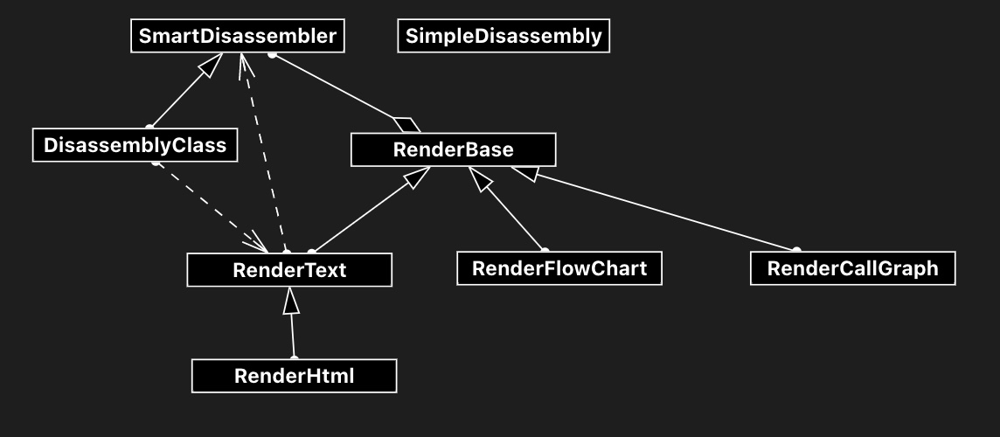
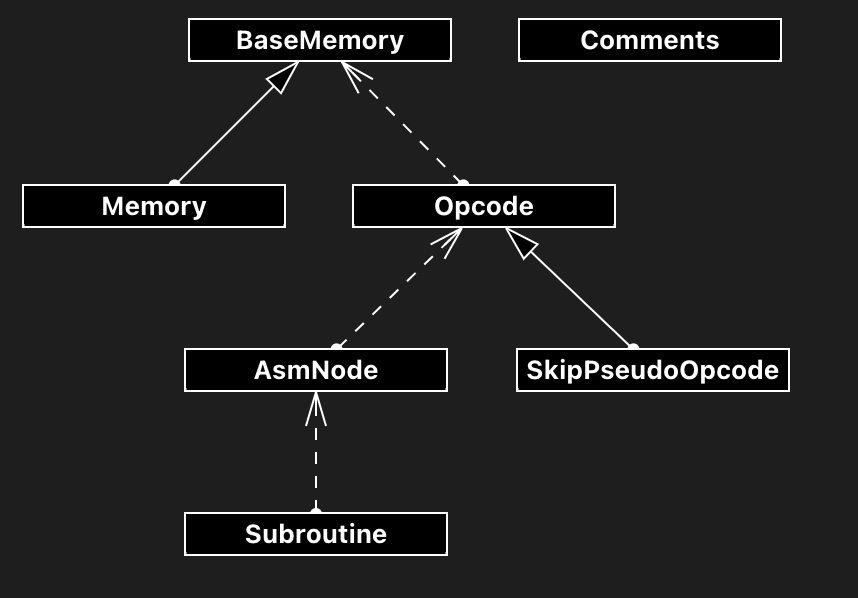

# Disassembly

The disassembly used in Dezog is derived from the [z80dismblr](https://github.com/maziac/z80dismblr) project.
DeZog uses 2 kinds of disassemblies:
1. The SimpleDisassembly: a brute force disassembly used in the VARIABLEs pane and for the 'dasm' command.
It is "brute force" because it disassembles a small amount (about 10) of instructions and just converts the opcodes into instructions no matter if this is really code. E.g. also a data area would be disassembled to code.
2. A more intelligent i.e. "smart" disassembly (SmartDisassembler) which follows the execution path to distinguish code labels from data labels and allows also a flow chart and call graph generation.

This document discusses the 2nd (smart) disassembly.

# Glossary

| Name | Description |
|------|-------------|
| reverse engineered list file (rev-eng.list) | The list file maintained by the user. Code that the user has reverse engineered and understood is out here. Normally the user will copy part of the disassembly here, change the labels to meaningful names and add comments. |

# Disassembler Main Dependencies

Main dependencies:


Core classes dependencies:


# Analysis

The different types of analysis are discussed here:
Flowchart, call graph, smart disassembly and parameter.


## Smart Disassembly

Basically the disassembler works on own 'memory', a 64k address block.
The memory can have attributes attached to each address.
When nothing is known yet about the memory all is UNKNOWN (0).
But as soon as something gets known more flags are added.
If anything (what ever) is known at least the ASSIGNED flag is set.
If it gets known that the memory location is used for code it gets the CODE flag.
If it is the first byte of an opcode additionally it receives the CODE_FIRST flag.
If it is data it gets the DATA flag.

Note: as these are flags combinations are possible. E.g. an address with could have attributes CODE, CODE_FIRST, ASSIGNED and FLOW_ANALYZED set.

When starting a disassembly the former stepped addresses are used as entry points into the disassembly.

The disassembly takes a little time, not much but too much to do it on every step.

The disassembly works on the complete 64k memory space.
At start the 64k memory is fetched from the remote and disassembled.
A new fetch is done if either the slots change, if the memory at the current PC has changed or if the user presses the refresh button.
A new disassembly is done if the memory is refreshed or if there are new addresses to disassemble.
If the disassembly is not recent the refresh button is enabled for indication.

The last PC values are stored because these values are known to be code locations and are used for the disassembly.
A special handling is done for the callstack: The caller of the current subroutine cannot be determined to 100%.

I.e. the stack might be misinterpreted.
Therefore the stack addresses are stored in a different array. This array is cleared when the refresh button is pressed.
I.e. if something looks strange the user can reload the disassembly.

(On a reload only the call stack history is cleared but the current call stack is used for disassembly.)

The disassembly is aware of memory banks. It uses the memory model to know which memory banks exist.
If a call is made from one bank into another the call is only followed if the slot is single banked.
I.e. if the bank for that slot is not ambiguous or in other words that slot can handle only one bank.
Otherwise the flow analysis stops here with a comment.


### General Approach

Before the actual opcode-to-text conversion is done an analysis is done.
Goal is to find blocks of opcodes that belong together and to find subroutines.
The blocks are used mainly for assigning labels.

A block and a subroutine are often, but not always the same.

Normally all instructions that jump to addresses in the same subroutine without any "holes" in it are marked to belong to the same block.
The block a specific address belongs to is found in 'blocks' and set up in 'partitionBlocks()'.
A new block also starts if there is a starting node ('isStartingNode') found, even if there is no hole.
This allows to deal with subroutines that e.g. loop to addresses lower than the actual subroutine start address.
These nodes belong to the same subroutine but are located in different blocks.
This is required because it is otherwise not possible to deal with local labels.

A node does not need to belong to one subroutine only. It is possible that part (the end) of a subroutine is shared between 2 or more subroutines.

The system is not perfect and cannot be perfect because in assembler (e.g. compared to C) there is no clear entry or exit point of subroutines.


Here are the general steps taken to do a complete disassembly:

1. **createNodes()**: Creates all nodes that are present in the this.nodes map.
The nodes at this point only contain the start address.
2. **this.createNodesForLabels(labels)**: Creates nodes for already existing labels. But only if instructions exist on these addresses.
3. **fillNodes()**: The nodes are filled with info (e.g. callees, callers, predecessors, successors, ...). Additional nodes are created for 'bank border' calls. I.e. calls that would cross a bank to a multi-bank slot.
4. **markSubroutines()**: nodes are searched to find nodes with RET, RET CC, RET or RETN. These nodes and their predecessor nodes are marked as a subroutine.
All node that are called by another node are marked as 'isStartingNode'.
5. **partitionBlocks()**: All nodes are searched (from low address to high). All recursive branches of that node are added to the same block if they do not include a "hole" or are not a new stating node.
6. **assignNodeLabels()**: Assigns labels to block starts and the recursive local labels. The prefix for a subroutine is determined by '(isSubroutine && isStartingNode) == true)'.
7. **assignOpcodeReferenceLabels()**: The labels for the jumps and calls have been analyzed already. But there are still data references (e.g. "LD A,(nn)") that could point to code, e.g. for self modifying code. These are assigned 'otherLabels' here.

Afterwards it depends if a disassembly, a flow chart or a call graph should b rendered.

- disassembly:
1. **disassembleNodes()**: Disassembles all instructions inside the nodes into text.
2. **renderText()**: Creates the disassembly text. Code and data parts.

- flow chart:
1. **disassembleNodes()**: Same as above.
2. **renderFlowChart()**: Generates the flowchart.

- flow chart:
1. **renderCallGraph()**: Generates the call graph.
Note: No disassembly is required here.


### Special Problems

There are a few special problems to solve in the disassembly and sometimes no real solution exists.

#### RST

The RST instruction is often used such that it is followed by one or more bytes that re ready by the RST sub routine.
The disassembler cannot analyze this. For one it would require a dynamic analysis and furthermore it can also be unclear which RST sub routine is used in case several ROMs can be page in.

For now the disassembly simply goes on after the RST instruction. This could lead into a wrong disassembly, e.g. a (1 byte) instruction is decoded that is not existing or, even more problematic), e.g. a non-existing 3 byte instruction is decoded so that also the following instruction is wrongly decoded.

Therefore it is possible to use some pseudo commands in the rev-eng.list file:
'SKIP' or 'SKIPWORD'.
It makes the disassembler skip a certain byte during disassembly and not interprete it as new opcode.
See ['SKIP' or 'SKIPWORD'](../documentation/ReverseEngineeringUsage.md#skip-or-skipword).


#### Branching into Paged Banks

If there is a branch from a slot A into slot B and slot B is shared between 2 or more banks then it is not clear to which bank the branch will take us.

Example:
There are 2 slots.
Slot A is 0x0000-0xBFFF and slot B is 0xC000-0xFFFF.
Slot A is not paged i.e. always points to bank 0.
Slot B can point to bank 1 or bank 2.

Now suppose the following program:
~~~asm
				...
				... ; Some bank switching code
0x4100			call 0xC000
				...

0xC000.B1	SUB_BANK1:
0xC000.B1		ld a,5
0xC002.B1		ret

0xC000.B2	SUB_BANK2:
0xC000.B2		ld hl,0x0000
0xC002.B2		ret
~~~

At the time of disassembly it is unknown if the code at 0x4100 will jump to SUB_BANK1 or SUB_BANK2.
Even if, at the time of disassembly, bank 1 is paged in, it could happen that bank 2 will be paged in when 0x4100 is executed somewhere in the future.

To overcome this problem the disassembler will follow the execution flow only
- as long as the branch address is in the same slot
- or the slot of the branch address is not shared between several banks

Therefore the disassembler has to get the information about the used memory model, i.e. the usage of the slots.

Note: Branching will not only stop on CALLs but also on all other branches like JP/JR.
In case of a call graph the graph will simply stop at that point.


### Grammar

The disassembly list file requires a button. Therefore it requires to have an own language ID ("disassembly").
This is a different ID then "asm-collection". Therefore "ASM Code Lense" cannot be used for syntax coloring.

So DeZog also adds an own grammar, where it includes the grammar from "ASM Code Lens".
If "ASM Code Lense" is not installed this is silently ignored and no syntax highlighting is done.

The involved files are:
- package.json: "grammars"
- grammar/asm_disassembly.json


## Smart Disassembly - disasm.list

The smart disassembly done via right click and the smart disassembly done for disassembling code areas without source file (disasm.list) use the same concept but the rendering is slightly different.

The first one renders html that also allows some highlighting and links to source code. This html code is not syntax highlighted by asm-code-lens.

The disasm.list is rendered to text.


## Flow Chart Analysis

The flow chart analysis is based on the smart disassembly.
Analysis is always done in depth = 1 only, i.e. the calls are not followed.
It uses dot language and a dot to svg converter to display the flow chart.
Involved functions are: 'renderFlowChart' and 'getFlowChart'.

## Call Graph Analysis

The call graph analysis is based on the smart disassembly.
Analysis is always done first with highest depth to calculate the actual used depth.
Then for each depth a call graph is created and put in a webview.
The user can switch the depth via a slider.

It uses dot language and a dot to svg converter to display the flow chart.
Involved functions are: 'renderCallGraph', 'getGraphLabels' and 'getCallGraph'.


# Much simplified parameter analysis

The parameter analysis with symbolic execution is difficult and, without loops, is also quite limited especially when it comes to stack manipulations.

On the other hand, for sub routines that follow a certain pattern the analysis can be simplified.
The assumed pattern is that saved registered are saved via PUSH at the beginning of the function. Then the registers are restored via POP at the end of the sub routine.
PUSH and POP are not expected in loops. This would make the algorithm fail.

An example would look like:
~~~asm
	; SAVING
	PUSH AF
	PUSH HL
	PUSH DE

	; Do something
	LD A,...
	; Branching etc.
	JR Z,...

	; RESTORING
	POP DE
	POP HL
	POP AF
	RET
~~~

The SAVING phase where PUSH/POP are analyzed lasts until the first branch.
Each PUSH writes the register equivalent on a symbolic stack. (Each POP removes one).
After the SAVING phase each POP (PUSH) is written to another symbolic stack. When a branch occurs the stack is thrown away.
But when a RET is found (also RET cc) the stack is compared with the stack from the SAVING phase.
Each restored register is marked as unchanged.
As there might be several RETs in a subroutine this has to be done a few times. Hopefully always with the same result. If not the lowest common denominator is used.

The **input parameters** are simply determined by the instructions.
If e.g. a ```LD A,B``` is used but B was not assigned beforehand then B is an input.


An output could look like:
~~~asm
	; Input registers: B
	; Used registers: HL, A, B
	; Assigned registers: HL, A
	; Unchanged registers: HL, B
	PUSH HL
	INC HL
	LD A,B
	INC A
	LD (HL),A
	POP HL
	RET
~~~

Note: Special instructions to consider:
~~~ASM
	EXX
	EX DE,HL
	EX AF,AF'
	JP (HL)
	LD SP,nnnn
	LD SP,HL
~~~


# Classes

~~~
┌─────────────────────┐           ┌─────────────────────┐
│  SmartDisassembler  │           │  SimpleDisassembly  │
└─────────────────────┘           └─────────────────────┘
           ▲
           │
           │
           │
┌─────────────────────┐
│  DisassemblyClass   │
└─────────────────────┘
~~~

The SmartDisassembler is the base class which is directly used when rendering into html, a call graph or a flowchart.
DisassemblyClass is derived to specialize on the disassembly required while stepping through the code, if no *.asm fie is available.

SimpleDisassembly has no conjunction with the SmartDisassembler it is just used for brute force disassembly e.g. in the VARIABLES pane.

