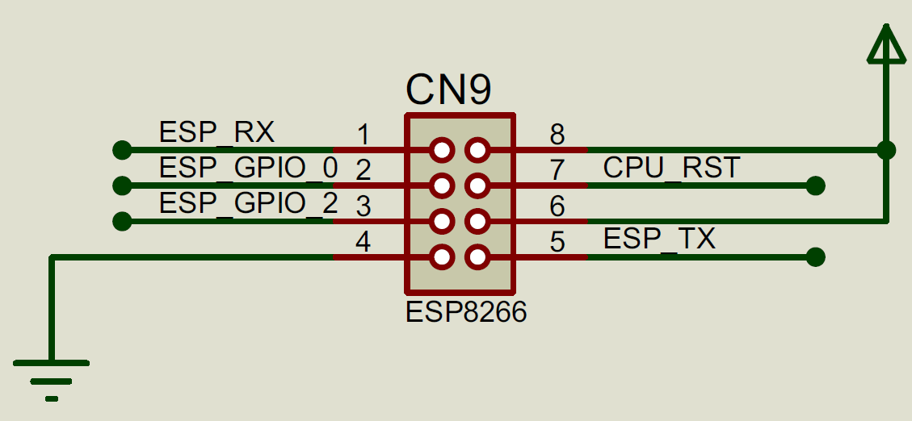

# ZX Next Interface

Here I collect first ideas to connect DeZog remotely with a real ZX Next Spectrum.

It basically has to communicate with the ZX Next similarly as with ZEsarUX, but there are, of course, specific problems.

Certain commands are not working at all because the ZX Next has no special debugging HW.
E.g. I can't get any cpu history/trace information. So reverse debugging is not possible at all.

Breakpoints don't have HW support so I need to deal with it in SW.

The document deals with the main problems/solutions.


# Communication

The ZX Next has a UART, e.g. to connect to Wifi.
It is available at the WIFI connector CN9.


It is possible to connect a serial/USB adapter cable to it.
The UART can be programmed via port registers 0x133B and 0x143B.
The baudrate is connected to the video timing. This needs to be taken into account when setting the baudrate.
Unfortunately there is **no interrupt connected to the UART**. I.e. it is required to poll it.

Nowadays it is also possible to put the UART on pins 7 (Tx) and 9 (Rx) of the joystick port. I.e. no need for soldering or even to open the case.

When a joy port is used for UART the problem is the conflict with the joystick.
A game would usually initialize the use as joyport, i.e. cutting off the communication with the PC.
When this happens the ZX Next transmits endless zeroes to the PC.
Therefore the DZRP protocal was extended by one byte which is sent as first byte of a message (only in direction from ZX Next to PC).
This is the MESSAGE_START_BYTE (0xA5). DeZog will wait on this byte before it recognizes messages coming from the Next.


# Break

If the PC would like to do "break" a running program it is necessary that the ZX Next program cooperates.
This can be done by checking the UART Rx status in the main loop or by checking it from the IM1 (vert. interrupt).

Another possibility is to use DIVMMC. The DIVMMC will switch in a RAM bank for the ROM bank if certain addresses are executed or if the NMI button is pressed.

So instead of a pressing "break" in the IDE (on the PC) the user could press the NMI button. The DIVMMC SW would then check transmit the status to the PC so that the PC knows the user "breaked".

There are other possibilities:

**Cooperation**: The debugged program checks the (RX) UART in the main loop or from an interrupt.
Whenever something is received a special routine is called which stops the running program and communicates with the PC until the next "run" command is received.

**DIVMMC interrupt**: When an interrupt (38h) is executed the DIVMMC swaps in the DICMMC memory. At address 38h it would first check the (RX) UART state and if something has been received wait until the next command from the PC.
If nothing has been received it would then continue with the normal (user) interrupt routine.
Problem here:
a) The interrupt routine takes a little bit longer.
b) If the debugged program does not use any IM1 interrupt (38h) then the UART is never checked.

So apart form the NMI button there is no method that would always work.


# ZX Next SW

The ZX Next requires a program to be executed on the Next to communicate with the PC with DeZog.
The SW has the following main tasks:
- communication with DeZog
- read/write registers
- break the execution
- set SW breakpoints


There is another project [NDS-NextDevSystem](https://github.com/Ckirby101/NDS-NextDevSystem) by Chris Kirby which also aims at the same goal.
So I guess I can get some inspiration from it.

However, from what I have seen so far there are a few challenges for use for my purposes:

- There are only 10 breakpoints available. I probably need to increase this (100?)
- A breakpoint is cleared when hit. I need to "re-install" the breakpoint after execution. This sounds simpler than it is (!)
- 38h IM1 interrupt is turned off. So not usable with running interrupts (breakpoints use RST 38h).
- No conditional breakpoint. Not a real problem as this can be handled inside DeZog nowadays.


# DZRPN - DeZog Remote Protocol Next


# SW Breakpoints

When a breakpoint is set the opcode at the breakpoint address is saved and instead a one byte opcode RST is added.
Chris uses RST 38h which makes the interrupts unusable but if the ROM is exchanged then it should be possible to use also other values.
If DIVMMC is used it depends on what addresses it reacts on.

So, at the RST position there is code located which jumps into the debug-program and the program informs DeZog via UART, then waits on input from DeZog.

This is the easy part.

Then, if DeZog sends a 'continue' command the original breakpoint location is re-stored with the original opcode and the debug-program jumps here.

Now it becomes hairy. Normal program execution would work but what if the program passes the same location again. It should stop there again but instead it does nothing because the breakpoint (the RST opcode) was not restored.

So we need a way to execute the one instruction at the breakpoint location and afterwards restore the breakpoint.

Current idea is to get support from DeZog. For each breakpoint DeZog should add additional info. This info contains:
- length of the opcode
- an optional branch address

The 'length' is used to set an artificial breakpoint right after the instruction and is used for all instruction. For non-branching isntructions this would already do.
For the branching (and conditional branching) instruction we need also the branch location.

Now the debug-program adds 2 artificial breakpoints. One at the breakpoint address + len and one at the branch address.

So, after our original breakpoint was hit the debug-program restores the original opcode and then adds the 2 temporary artificial breakpoints.
The debug-program then jumps to the breakpoint location and after the instruction is executed immediately the next RST is done (because of the artificial breakpoints.
Now the debug-program removes the artificial breakpoints and restores the original breakpoints and then continues.

Seems complicated but doable.

The data structure for one breakpoint needs the following fields:
- instruction length
- original opcode at breakpoint address
- breakpoint address (to identify the breakpoint)
- the branch address

I.e. 6 bytes in total.


## More complex

In order to reduce complexity on the ZX Next SW side  many of the breakpoint functionality is moved to DeZog.

This reduces the need especially for memory at the ZX next part.
following functionality is done by DeZog:
- Calculation of the length of the instruction
- Storing of the original opcode
- Taking care of artificial (temporary) breakpoints
- State management to decide if a breakpoint was hit and if we need to restore the original breakpoint and later restore the breakpoint itself.

No memory for tables or code is required on ZX side to:
- calculate the length of an instruction
- store any breakpoints, i.e. there are up to 655356 (-3) breakpoints possible

Here is a sequence hart which helps to explain:

~~~puml
hide footbox
title Continue
participant dezog as "DeZog"
participant zxnext as "ZXNext"

== Add breakpoint ==

note over dezog: add breakpoint\nto list
note over zxnext: No communication with ZXNext
'dezog -> zxnext: CMD_READ_MEM(bp_address)
'dezog <-- zxnext
'note over dezog: Store opcode along\nbreakpoint
'dezog -> zxnext: CMD_ADD_BREAKPOINT(bp_address)
'note over zxnext: Overwrite opcode with RST
...

== Continue ==
	note over dezog: Set all breakpoints
	dezog -> zxnext: CMD_SET_BREAKPOINTS(bp_addresses)
	note over zxnext: Set a RST for every address
	dezog <-- zxnext: List of opcodes
	note over dezog: Store the opcodes\nalong with the addresses

	note over dezog: Calculate two bp\naddresses for stepping
	dezog -> zxnext: CMD_CONTINUE(tmp_bp_addr1, tmp_bp_addr2)
	note over zxnext: Exchange the opcodes at\nthe both addresses\nand store them
	dezog <-- zxnext: Response
	note over zxnext: Breakpoint hit:\nRestore the 2 opcodes
	dezog <- zxnext: NTF_PAUSE(address)

	note over dezog: Recall addresses\nand opcodes
	dezog -> zxnext: CMD_RESTORE_MEM(addresses, opcodes)
	note over zxnext: Restores the memory
	dezog <-- zxnext
...

== Stop at breakpoint (generally) ==
dezog <- zxnext: NTF_PAUSE(bp_address)
note over dezog: If BREAK_REASON==HIT then\nset breakedAddress
...

== Continue (from breakpoint) ==

alt oldBreakedAddress != undefined
	note over dezog: Create list of bp addresses\nwithout the breakedAddress
	dezog -> zxnext: CMD_SET_BREAKPOINTS(bp_addresses)
	note over zxnext: Overwrites the\nRST (breakpoint),\ni.e. restores the opcode
	dezog <-- zxnext: List of opcodes

	note over dezog: Calculate two bp\naddresses for stepping
	dezog -> zxnext: CMD_CONTINUE(tmp_bp_addr1, tmp_bp_addr2)
	note over zxnext: Exchange the opcodes at\nthe both addresses\nand store them
	dezog <-- zxnext
	note over zxnext: Breakpoint hit:\nRestore the 2 opcodes
	dezog <- zxnext: NTF_PAUSE(address)

	dezog -> zxnext: CMD_SET_BREAKPOINTS(breakedAddress)
	note over zxnext: Restores the one\nmemory location
end

dezog -> zxnext: CMD_CONTINUE(next_bp_addr1, next_bp_addr2)
dezog <-- zxnext
~~~


## Even more complex - DZRPN

To save even more memory on ZX Next side and furthermore be much more flexible with the exchange data and protocol the idea is to use DZRPN.

DZRPN is the "DeZog Remote Protocol Next" and it does not define any commands anymore like DZRP.
Instead only a wrapper format is defined which carries arbitrary data.
On ZX Next side the data is written into code memory **and executed**.

I.e. DeZog send sort machine code program to the ZX Next whcih the ZX Next executes.

These short machine code programs do very much what the DZRP Command would do but are, of course, much more flexible.
I.e. if I would need to define another parameter with DZRP I can just change the Z80 program  at DeZog. The protocol does not need any change and also the ZX Next program does not need any change.

The ZX Next program basically just does the communication and the basic breakpoint handling (RST).
Everything else is done by DeZog.

Of course, this drastic change need major changes in DeZog:
- ZXNextRemote and ZXNextSocketRemote cannot be derived from DZRP anymore.
- CSpectRemote cannot be derived from ZxNextRemote
- The build process of DeZog need to include (sjasmplus) compilation of the small assembler programs.
- DeZog needs to read the assembler programs labels to inject parameters (e.g. the breakpoint addresses) in the machine code directly.

Other problems involve:
- Debugging the assembler source is more difficult. This is only possible at menmonic level, no source code debugging.
- To see/log the message flow it is necessary to identify each sent block with a number. Otherwise it's completely invisible what is sent. Anyhow, parameters that are sent are mainly invisible at all. But on the other hand it is also not possible to misinterpret them on remote side.

The aproach is complex, demanding, very flexible and interesting.
I think I shoudl do it but first I need to investigate more on the real serial interfacing with the ZX Next:
This interface usually needs to send more data per command as DZRP.
E.g. ADD_BREAKPOINT requires about 30 bytes as program and about only 5 (additional) bytes as DZRP.

At a baudrate of 230400 about 20 bytes can be transferred in a ms.
I.e. it requires about 1 ms more per message.
I suspect that not the baudrate but the communication latencies are main repsonsible for the usage speed but anyhow it is most probably wise to test it before I do such significant changes.

I.e. I need to test the serial connection with a real ZX Next and then insert e.g. an extra DZRP message to each message just to slow it down and to see if it affects usage speed.


## Breakpoint conditions

After a breakpoint is hit it needs to be checked if the condition is true.

Conditions like
```(A > 3) AND (PEEKW(SP) != PC)```
should be allowed.

I don'T need to take care inside the Z80 program. Nowadays DeZog can take care of the conditions without help of the remote.


# Reverse Debugging

Real reverse debugging, i.e. collecting a trace of instruction on the ZX Next, is not possible because this would run far too slow.

But still the lite history will work in DeZog.


# Code Coverage

Similar to trace history. Is not possible or would be far to slow in SW.

So code coverage is not available.


# ROM vs. DivMMC

Putting the debug code into the ROM area is straightforward.
The other way is to use DivMMC which can automatically be paged in if e.g. a RST, i.e. address 0x0000 is executed. (Unfortunately delayed after the next instruction!)
If ROM would be used a special code would be required at 0x0000 which switches the banks.
I.e. at address 0x0000 about 20 bytes of code would be unusable for the debugged program.
With DivMMC this area can be used by the debugged program.
Only restrictions (but this is true for ROM as well), the debugged program is not allowed to
- do a RST (this is reserved for breakpoints)
- do a CALL 0x0000 (same reason)

Furthermore using DivMMC has the advantage that no memory bank is used, just the one for DivMMC. Obviously no DivMMC program could be debugged.

I guess I start with a ROM version without banking and later add the DivMMC version.


References:
https://velesoft.speccy.cz/zx/divide/divide-memory.htm
https://velesoft.speccy.cz/zx/divide/doc/pgm_model-en.txt
https://gitlab.com/SpectrumNext/ZX_Spectrum_Next_FPGA/-/blob/master/cores/zxnext/ports.txt#L370


# ROM


| Range         | Slot | Debugged program | Debugger active                           |
|---------------|------|------------------|-------------------------------------------|
| 0x0000-0x1FFF | 0    | USED_ROM0_BANK*  | USED_MAIN_SLOT  |
| 0x2000-0xBFFF | 1-5  | -                | - |
| 0xC000-0xDFFF | 6 (SWAP_SLOT) | -       | X |
| 0xE000-0xFFFF | 7    | -                | - |

Notes:
- USED_ROM0_BANK:
  - The debugged program uses USED_ROM0_BANK at address 0x0000. USED_ROM0_BANK is modified to work with the debugger.
  - Alternatively the debugged program might page in any other page with similar modifications.
- SWAP_SLOT: This slot is used by the debugger temporarily to page in other banks, normally the bank at slot 0 that is used by the debugged program. E.g. in case a memory read/write to that bank is required.

When the debugger is active in occupies slot 0 with is program code and data.
When the debugger is entered the currently active bank in slot 0 is saved (slot_backup.slot0).
When the debugger is left this slot is restored.
All other slots are the same as the ones form the debugged program.
SWAP_SLOT is only used temporarily, i.e. within a cmd_... after any command is executed the SWAP_SLOT is restored.

Commands that deal with memory will handle range 0x0000-0x1FFFF (slot 0) especially. All other memory is directly read/set. But for range 0x0000-0x1FFF the slot (slot_backup.slot0) is instead paged into SWAP_SLOT temporarily.
The commands are:
cmd_read_mem, cmd_write_mem, cmd_set_breakpoints, cmd_restore_mem.

The cmd_write_bank makes use of SWAP_SLOT, too.

cmd_get_slots will read the banks for slots 1-7 from the ZX Next registers. slot 0 is simply read from the slot_backup.slot0.

cmd_set_slot will set the banks for slots 1-7 directly to the ZX Next registers. slot 0 is simply written to slot_backup.slot0.


# DivMMC

See also https://velesoft.speccy.cz/zx/divide/divide-memory.htm .

**Does not work (as of core v3.1.5): The automapping does not work, seems that mapping only works for the NMI button.**
**There is another problem with DivMMC: It is required that no interrupt occurs while the divmmc memory is swapped in. Therefore the interrupt recognition has to take place beforehand. I.e. the automapping should not occur at address 0x0000. Instead at address 0x0000 the interrupt recognition takes place and then a jump to another entrypoint is required. Furthermore the DivMMC requires 2 banks (1 program, 1 data) compared to the ROM solution. So I think I stick to ROM.**

RST is used for breakpoints. With divMMC a trap can be enabled at address 0x0000.
I.e. once a breakpoint is hit the DivMMC memory will be enabled automatically.
Unfortunately this does not happen immediately but only after one instruction fetch from the original memory paged into slot 0 (normally the ROM).
If the debugged program has put in here something else than the ROM the instruction could be everything.
But even with the ROM the first instruction would be "DI", giving me no chance to check the interrupt enable state to restore it later.

I.e. it is necessary to occupy at least a few bytes in the slot 0 area.

The pseudo code would be something like this:
~~~asm
	ORG 0x0000
	Store current interrupt state (e.g. LD A,I)
	DI
	Jump to main
~~~
~~~asm
	ORG 0x000?-0x3FFF (somewhere in the DivMMC or ROM area)
main:
	Store the registers
	Setup stack
.loop:
	Wait on command
	Execute command
	Jump to .loop
~~~

Whenever a CMD_CONTINUE is executed:
~~~asm
cmd_continue:
	Restore registers
	Restore interrupt state
	RET  ; return from RST
~~~

I.e. the debugged program must make sure that a few bytes are occupied in slot 0 at address 0.
E.g.
~~~
	ORG 0x0000
	push af
	ld a,i
    jp pe,go_on     ; IFF was 1 (interrupts enabled)

	; if P/V read "0", try a 2nd time
    ld a,i

go_on:
	di
    push af	; Store P/V flag
	jp main
~~~


Problem:
- The original idea was to use RST for the breakpoints. In the original ROM there is a DI located at 0x0000. Unfortunately I think I need to keep it there because programs may use it as relative backwards jump when using IM2. On the other hand I cannot execute DI first because I need to know the state of the interrupt beforehand.
Also if I would use nextreg 0x22 to disable the interrupts, I cannot leave DI at 0x0000 because I wouldn't know how to restore it.
So either a different RST address or disallow this special interrupt usage.


## Initializing the DivMMC - Memory Map

When paged in the memory area 0x0000-0x1FFF cannot be written.
Only 0x2000-0x3FFF can be written.
DivMMC bank 3 is used for the program. It is first switch with conmem set to area 0x2000-0x3FFF. Then the program is copied there.
Afterwards the memory area is paged in with mapram at address 0x0000-0x1FFF.
As this area is not writable all data needs to located at 0x2000-0x3FFF.


| Range         | Slot | Debugged program | Debugger active                           | NEX file |
|---------------|------|------------------|-------------------------------------------|----------|
| 0x0000-0x1FFF | 0    | USED_ROM0_BANK*  | DivMMC Bank 3 (read-only), debugger code  |
| 0x2000-0x3FFF | 1    | -                | DivMMC Bank 0 (read/write), debugger data |
| 0x4000-0x5FFF | 2    | -                | - |
| 0x6000-0x7FFF | 3    | -                | - |
| 0x8000-0x9FFF | 4    | -                | - |
| 0xA000-0xBFFF | 5    | - | - | Prequel code, i.e. copies the debug program to the right banks/DivMMC memory. |
| 0xC000-0xDFFF | 6 (SWAP_SLOT0) | -  | Used to page in the bank of slot 0 for read/write |
| 0xE000-0xFFFF | 7 (SWAP_SLOT1) | -  | Used to page in the bank of slot 1 for read/write |
Notes:
- The USED_ROM0_BANK is a copy of the ROM at address 0x0000-0x1FFF. The only change is that the memory around address 0x0000 and 0x0066 is modified to cooperate with the code in the DivMMC memory.
- The debugged program may switch in a another bank here if the bank contains the same code (as for the modifications above).


dezogif NEX-file bank usage:
| Bank             | Compiled for  | Description   | Destination   |
|------------------|---------------|---------------|---------------|
| LOADED_BANK (92) | 0x0000-0x1FFF | Debugger code | DivMMC Bank 3 |
| -                | 0x2000-0x3FFF | Debugger data | DivMMC Bank 0 |
| 5 (standard)     | 0xA000-0xBFFF | Prequel code, i.e. copies the debug program to the right banks/DivMMC memory. | Not used after initialization. |


# Memory Bank Switching - DivMMC

The used DivMMC memory is paged in either if the CONMEM bit is set or if CONMEM is off and MAPRAM is set, if automapping occurs.
Automapping is the memory switching if an instruction fetch occurs on certain addresses (e.g. 0x0000 or 0x0066).

So CONMEM is used only during initialization. Afterwards only automapping is used.
Returning from automapping is also not straight forward. It is done by executing an instruction in the so-called **off-area** 0x1FF8-0x1FFF.

I.e. the debugger is entered by jump (RST) to address 0x0000 (or by DRIVE button, jump to 0x0066) and it is left when it jumps to 0x1FF8.

These code areas are existing 2 times: Once in DivMMC bank 3 and once in the bank switched to slot 0.
(Note: at least the first byte of each entry point needs to exist twice.)


Note: As long as automapping is not supported in the ZX Next core the idea is to manual map in the DivMMC memory.
I.e. CONMEM is set once the debugger is entered (at address 0x0000) and is reset when the debugger is left.
As CONMEM maps in EPROM at 0x0000-0x1FFF it is required that in slot 0/0x000 there is a JP 0x2000.
And the actual CONMEM switching takes place at 0x2000-0x3FFF as this is RAM.
Program code and data will reside here.

If using slot/bank paging one memory bank would have to be used but the advantage is that only one slot has to be occupied (i.e. only around 0x0000 instead of 0x0000 and 0x2000).


# Multiface

Another possibility for serving the NMI interrupt is to use the [Multiface](https://k1.spdns.de/Vintage/Sinclair/82/Peripherals/Multiface%20I%2C%20128%2C%20and%20%2B3%20(Romantic%20Robot)/).
On pressing the NMI button the Multiface memory is swapped in and the NMI at 0x0066 is executed.
It can be swapped out with
~~~
IN A,($bf): pages the MF ROM/RAM out
IN A,($3f): pages the MF ROM/RAM back in
OUT ($3f),A : IN A,($bf): The MF is again hidden and can only be paged back by pressing the NMI button.
~~~

MF is not used before the NMI button is used and cannot be accessed otherwise than giving control to MF via the NMI button.
I.e. the Multiface ROM/RAM cannot be written by a program. The code need to be included in the MF file on SD card, so it is read during boot (enNextMf.rom).

The MF M1 button has to be reactivated before the NMI ISR is left by paging out (or hiding) the MF. (I.e. an NMI cannot interrupt an NMI becaue the button is deactivated.)

So the plan is:
1. Put NMI and all dezog debugger code in enNextMf.rom
2. To activate user has to press NMI button
3. The SW will copy itself from MF ROM to a memory bank
4. The SW is continued in the memory bank and can accept a debugged program through UART
5. From here normal execution
6. If the NMI button is pressed again the NMI code will branch into the bank memory and send a pause notification.

If something goes stuck I could also implement that a long NMI press goes back to 3.

MF ROM is 0x0000-0x1FFF. MF RAM is 0x2000-0x3FFF.
MF RAM is paged in/out by writing to address $2000 while MF ROM is paged in.


Note: Need to find out how the Multiface can read/write from different MMU slots.


# Memory Bank Switching - Multiface

The table below shows the bank switching in case a breakpoint is hit:

|Slot/L2| Running | BP hit | Enter  | Enter  | Dbg loop | Dbg exec | Dbg loop | Exit    | Running |
|:------|:--------|:-------|:-------|:-------|:---------|:---------|:---------|:--------|:--------|
| 0     | **XM**  |**MAIN**|**MAIN**|**MAIN**| XM       | XM       | XM       |**XM**   | **XM**  |
| 1     | **X**   | X      | X      | X      | X        | X        | X        | X       | **X**   |
| 2-5   | **X**   | X      | X      | X      | X        | X        | X        | X       | **X**   |
| 6     | **X**   | X      | X      | X      | X        | SWAP     | X        | X       | **X**   |
| 7     | **X**   | X      | X      |**MAIN**|**MAIN**  |**MAIN**  |**MAIN**  |**MAIN** | **X**   |
| L2 RW | 0/1     | 0/1    | 0      | 0      | 0        | 0        | 0        | 0/1     | 0/1     |
| PC    | 0-7     | 0      | 0      | 0->7   | 7        | 7        | 7        | 7->0    | 0-7     |
| M1 enabled | 1  | 1->0   | 0      | 0      | 0        | 0        | 0        | 0->1    | 0-7     |

Slot/Banks/L2:
X = The bank used by the debugged program
XM = The modified (alt) ROM or the (modified) bank of the debugged program for slot 0
MAIN = The main debugger program
SWAP = Temporary swap space for the debugger program. Used e.g. to page in a different bank to read/Write the memory.
L2 RW = Layer 2 read/write enable.
PC = Slot used for program execution. (Also bold)
M1 enabled = 1 if the M1 key is enabled. I.e. the NMI is only allowed during debugged program execution. While the debugger is runnign it is disabled.

States:
Running = The debugged program being run.
BP hit = A breakpoint is hit. The program in M switches bank in slot 0 to MAIN.
Enter = Transition into the debug loop.
Dbg loop = The debugger loop. The debugger waits for commands from DeZog.
Dbg exec = The debugger executes a command from DeZog.
Exit = The debugger is left.

Notes:
- The SP of the debugged program can only be used in the code running in M. The SP might be placed inside M so it is not safe to access it while MAIN is paged in slot 0. It can also not be accessed from MAIN being paged in to slot 7 as SP might be in slot 7.
- The data of MAIN can be accessed from either slot: slot 0 or slot 7. If accessed from slot 0 than the addresses need to be subtracted by 0xE000.
- It's not posisble to directly switch from M into Main/slot 7 because the subroutine would become too large by a few bytes. The code would reach into area 0x0074 which (for the ROM) is occupied by used ROM code.


This table shows the bank switching in case th M1 MF NMI (yellow) button is pressed:

|Slot/L2| Running | NMI/M1   | Enter    | RETN   | Dbg loop | Dbg exec | Dbg loop | Exit    | Running |
|:------|:--------|:---------|:---------|:-------|:---------|:---------|:---------|:--------|:--------|
| 0     | **XM**  |**MF ROM**|**MF ROM**| XM     | XM       | XM       | XM       |**XM**   | **XM**  |
| 1     | **X**   | MF RAM   | MF RAM   | X      | X        | X        | X        | X       | **X**   |
| 2-5   | **X**   | X        | X        | X      | X        | X        | X        | X       | **X**   |
| 6     | **X**   | X        | X        | X      | X        | SWAP     | X        | X       | **X**   |
| 7     | **X**   | X        | **MAIN** |**MAIN**|**MAIN**  |**MAIN**  |**MAIN**  |**MAIN** | **X**   |
| L2 RW | 0/1     | 0/1      | 0        | 0      | 0        | 0        | 0        | 0/1     | 0/1     |
| PC    | 0-7     | 0        | 0->7     | 7      | 7        | 7        | 7        | 7->0    | 0-7     |
| M1 enabled | 1  | 1->0     | 0        | 0      | 0        | 0        | 0        | 0->1    | 0-7     |

The debug loop primarily executes the CMD_PAUSE and then stays in the debug loop until DeZog sends a CMD_CONTINUE.


## SP

When entering the debugger the SP can point to any memory location.
E.g. even slot7 or slot 0.
If the SP points to memory in the same area as the debugger code is running the wrong values could be pushed/popped.

So, to access the debugged programs stack it is necessary to map the memory area around SP into an unused bank and get/set the values there.

Actually 2 banks/slots are required as the stack could reach over 2 slots. Even one SP address could be on the border so that the low byte is in slot X and the high byte is in slot x+1.


# AltROM

See https://gitlab.com/SpectrumNext/ZX_Spectrum_Next_FPGA/-/blob/master/cores/zxnext/nextreg.txt#L777 .

The Alternate ROM could be used so I don't need to copy the ROM, modify/copy it to another bank.
I could instead copy/modify the ROM to the AltROM (at least 0x0000-0x1FFF).

The advantage is that the ROM is switched in via bank 0xFF like the normal ROM.

From Discord - z80-hardcore, 18.6.2020:

] Maziac: And how do I write the alternate rom?
[23:02] AA: The details are on nextreg 0x8c
[23:02] AA: https://gitlab.com/SpectrumNext/ZX_Spectrum_Next_FPGA/-/blob/master/cores/zxnext/nextreg.txt#L777
GitLab
cores/zxnext/nextreg.txt · master · SpecNext Ltd / ZX_Spectrum_Next...
Official ZX Spectrum Next FPGA Cores Repository

[23:03] AA: What you do is write 64 (sollte 192 sein) to the register to make the altrom visible during memory writes to the bottom 16k.  Then if you write the bottom 16k, it changes the altrom.
[23:04] AA: When you are done writing the altrom, get it to replace the regular rom by writing 128 to the register.
[23:05] AA: There is a 48K and 128K rom just like on the 128K machines and which is placed is controlled by port 0x7ffd as usual.  You can also lock one or the other rom in place so the 48K altrom is always there no matter what the paging says.


# Setting Breakpoints

The debugger program resides in the ROM area at 0x0000-0x3FFF (or maybe 0x1FFF).
If a breakpoint should be set in this area it would be set in the debugger program.
Setting a breakpoint involves to exchange the opcode at the breakpoint address with RST opcode. I.e. a memory read and write.

To do this the debugged program memory bank need to be paged in another slot (slot 2-7). Then the memory is read and set. Afterwards the original bank paging is restored.


# Reading/Writing Memory

The problem is the same as for breakpoints. It's a little bit more tricky because whole memory areas are involved that can also overlap the 0x1/3FFF and 0x0000 boundaries. So the memory reading/writing need to be partitioned.
But the principle is the same.


# Stack

As soon as the Z80 debugger program gets control the maskable interrupts are disabled and restored when the debugged program gets back control.
I.e. the normal (maskable) interrupt cannot change the stack.

This is different for NMI. An NMI can occur anytime and is "non-maskable" from Z80 perspective.
But on the ZX Next it is possible to disable the root cause: the M1 button press via register 0x06.
I.e. the debugger program will also disable the M1 button (NMI) when it gets control.

Here is an example what could happen if the NMI wouldn't be disabled:
~~~
	push bc
	inc sp
	inc sp
	do something
	dec sp
	dec sp
	pop bc
~~~
If an NMI occurs during or after increasing the SP the PC is written to the stack, overwriting the previous value:
~~~
	push bc
	inc sp
	inc sp
NMI--> pushes the PC onto the stack
	do something
	dec sp
	dec sp
	pop bc
~~~
In the example above the pushed BC value is lost and exchanged with the PC value.

This is true for the debugged program aswell: If an NMI occurs during stack manipulation the program might malfunction. Here there is nothing that can be done about it in the debugger.

For the debugged program this also applies
- for maskable interrupts if the interrupts are not disabled (but this is a general failure of the program)
- for SW breakpoints

For SW breakpoints a RST is used. I.e. when a breakpoint is "hit" the PC is also placed on the stack.
Thus, if a breakpoint is placed at a location where the SP has been manipulated the stack is corrupted as well.
~~~
		push bc
		inc sp
BP->	inc sp
BP->	do something
BP->	...
BP->	...
BP->	dec sp
BP->	dec sp
	pop bc
~~~
Placing a BP at any of the above locations will destroy the pushed BC value if the BP is hit.

The user has to take care not to place breakpoints at these locations.


# Measurements

I did a few measurements through the Joystick UART interface.

Loopback without ZXNext (directly at the USB serial device) and with ZXNext.

Adafruit Part Number 954, Joy 2:

| baud      | packet size | Bytes/ms wo ZXN | Bytes/ms with ZXN |
|-----------|-------------|-----------------|-------------------|
| 230400    | 2000        | 21              | 21                |
| 230400    | 200         | 16.5            | 15.9              |
| 230400    | 20          | 4.79            | 4.68              |
| 230400    | 10          | 2.71            | 2.65              |
| 460800    | 2000        | 40              | 40                |
| 460800    | 200         | 25.4            | 25.2              |
| 460800    | 20          | 5.51            | 5.42              |
| 460800    | 10          | 2.935           | 2.915             |
| 614400    | 2000        | 52              | 51                |
| 614400    | 200         | 30.1            | 29.7              |
| 614400    | 20          | 5.72            | 5.63              |
| 614400    | 10          | 3.025           | 2.955             |
| 921600    | 2000        | 67              | 66                |
| 921600    | 200         | 34.8            | 34.2              |
| 921600    | 20          | 5.9             | 5.81              |
| 921600    | 10          | 3.08            | 3.05              |
| 1228800   | 2000        | 83              | -                 |
| 1228800   | 200         | 38.6            | -                 |
| 1228800   | 20          | 5.87            | -                 |
| 1228800   | 10          | 3.125           | -                 |
| 1958400   | 2000        | 140             | -                 |
| 1958400   | 200         | 48.5            | -                 |
| 1958400   | 20          | 6.26            | -                 |
| 1958400   | 10          | 3.2             | -                 |


FTDI chip, Joy 2:

| baud      | packet size | Bytes/ms wo ZXN | Bytes/ms with ZXN |
|-----------|-------------|-----------------|-------------------|
| 921600    | 2000        | 52.99           | -                 |
| 921600    | 1500        | 45.9            | 38.65             |
| 921600    | 200         | 11              | 10.59             |
| 921600    | 20          | 1.25            | 1.25              |
| 921600    | 10          | 0.625           | 0.63              |
| 2000000   | 2000        | 76.99           | -                 |
| 2000000   | 200         | 11.79           | -                 |
| 2000000   | 20          | 1.25            | -                 |
| 2000000   | 10          | 0.625           | -                 |


## Direct comparison:

Adafruit:
| baud      | packet size | Bytes/ms direct loopback |
|-----------|-------------|-----------------|
| 921600    | 2000        | 67              |
| 921600    | 200         | 34.8            |
| 921600    | 20          | 5.9             |
| 921600    | 10          | 3.08            |

FTDI-Chip:
| baud      | packet size | Bytes/ms direct loopback |
|-----------|-------------|-----------------|
| 921600    | 2000        | 52.99           |
| 921600    | 200         | 11              |
| 921600    | 20          | 1.25            |
| 921600    | 10          | 0.625           |
| 2000000   | 2000        | 76.99           |
| 2000000   | 200         | 11.79           |
| 2000000   | 20          | 1.25            |
| 2000000   | 10          | 0.625           |

FTDI slower for small packet sizes.
