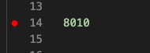
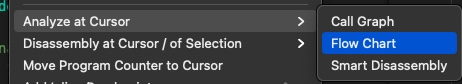
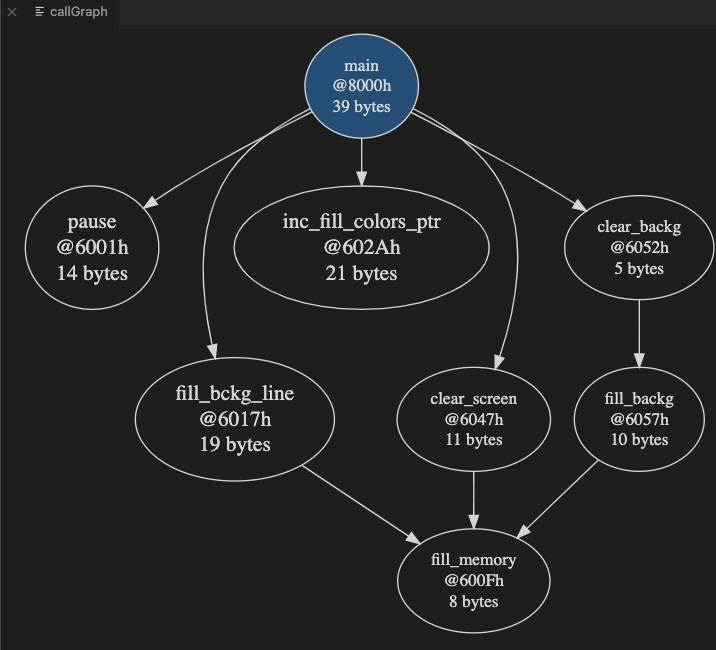
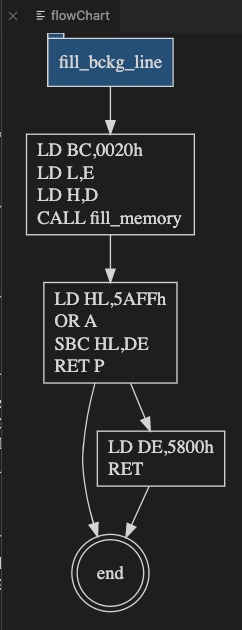
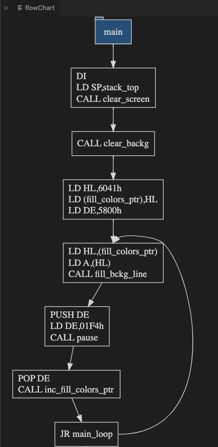
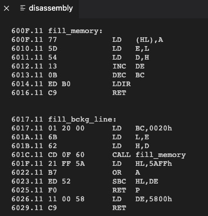

# Reverse Engineering with DeZog

Up to version 2.x DeZog's primary goal was to develop **new** Z80 SW and debug it.

Beginning with version 3 another way to use DeZog is for reverse engineering of existing SW.


When reverse engineering existing SW the whole object code already exists whereas the source code, i.e. the commented assembler sources normally do not exist.
The goal of reverse engineering is to discover the purpose of the binary code by disassembling and debugging it.
Once a sub routine has been understood it can be commented, labels can be renamed to more meaningful names and the disassembly can be saved.

These commented disassembly is reloaded and taken as source for the further stepping. Also the new labels are used.

The more of the binary is understood the more complete the list file becomes until at the end hopefully all code is commented and understood.


To make it more clear: there are 2 main differences to developing a new program with an assembler.
- Instead of running the assembler on your .asm file(s) you have to write the reverse engineered assembler file, **a list file**, yourself. DeZog supports you by providing a disassembly of the source code portion that you are currently investigating. This disassembly can be copied to your list file together with comments and renamed labels to make it human readable.
- While the debug session is running you can re-read the list file and it's labels. I.e. as soon as you have commented the disassembly or renamed labels they are immediately taken into use. This improves the turn-around cycle a lot.


# Exemplary Process

The process is shown here with MAME as an example.

This example assumes that MAME is started manually or in a while loop with a ROM (pacman in this case).
~~~bash
while true; do ./mame pacman -window -debugger gdbstub -debug -debugger_port 12000 -verbose ; sleep 2 ; done
~~~


The launch.json for DeZog is:
~~~json
{
    "version": "0.2.0",
    "configurations": [
        {
            "type": "dezog",
            "request": "launch",
            "name": "MAME",
            "remoteType": "mame",
            "mame": {
                "port": 12000
            },
            "startAutomatically": false,
            "revEng": [
                {
                    "path": "pacman.list"
                }
            ],
            "rootFolder": "${workspaceFolder}"
        }
    ]
}
~~~


Start with an empty pacman.list file.

1. Start MAME (while loop)
2. Start a DeZog debug session
3. Step, understand code
4. Copy understood code from disasm.list to pacman.list
5. Work on the code in pacman.list
	- Comment the code
	- Exchange label names with more meaningful names.
6. Save pacman.list
7. Reload the list file. In the command palette type: ```DeZog: reload the list file(s).```
At that point DeZog will re-read the symbols and also do a new disassembly: The code from the pacman.list is removed from the disassembly. So, when stepping the pacman.list is used whenever the PC points to code in that file.
The rest of the disassembly will also use the new labels.
7. Goto 3

Notes:
- The re-load of the list file takes place while the debug session is still active. I.e. you can simply continue with the debugging.
- Instead of reloading manually it is alos possible to add ```"reloadOnSave": true```to "revEng". In this case the labels will be reloaded automatically on each save of "pacman.list".


# Disassembly

The disassembly shows only part of the code: I.e. the disassembly around the current PC and also disassembly from the addresses on the call stack.

If one of these addresses is not associated with a file (either a list file or an asm source) then a disassembly is done.

The disassembly contains only the addresses where no association to another file exists.


# Breakpoints

Breakpoints can be set via the vscode editor as normal.
Breakpoints can be set either in the disassembly or in the list file.

Breakpoints will "survive" in the disassembly even if the file is created anew.

If you need to set a breakpoint to some location that does not exist in either the disassembly or the list file then you can do the following:
1. In the list file just type in the address (in hex) at a start of a line.
2. In the command palette type: ```DeZog: reload the list file(s).```
3. Set a breakpoint at the line of the address. The picture shows this for a breakpoint at address 0x8000:



# WPMEM, ASSERTION, LOGPOINT

These all work the same as in other list files.
E.g. to add a permanent watchpoint to some memory location use:
~~~asm
9000 00 00 00  data:    ; WPMEM
~~~

This will watch memory at location 9000h to 9002h.

Please note that you can add temporary watchpoints also via the debug command "-wpadd addr ...".


# Analysis

The inclusion of the [z80dismblr](https://github.com/maziac/z80dismblr) makes it possible to use some of it's analysing features, namely flowcharts, call graphs and smart disassembly.

For all of these features:
Start Dezog, place the cursor at the source code at some instruction and do a right click for "Analze at Cursor":


The examples below use the [z80-sample-program](https://github.com/maziac/z80-sample-program).


## Call Graph

The following subroutine
~~~asm
fill_bckg_line:
    ld bc,BCKG_LINE_SIZE
    ld l,e
    ld h,d
    call fill_memory
    ; check that destination address is still in screen background
    ld hl,COLOR_SCREEN+COLOR_SCREEN_SIZE-1
    or a    ; clear carry
    sbc hl,de ; compare
    ret p
    ; ld start address
    ld de,COLOR_SCREEN
    ret
~~~

will result into this call graph:


I.e. it is indicated by an arrow that *fill_bckg_line* calls *fill_memory*.
Furthermore in the bubbles you'll find the start address and the size of the sub routine in bytes.

Here is a more advanced call graph from the main routine:
.


## Flow Chart

Here is the flow chart for the same subroutine:


And here another flowchart of the main routine:



## Smart Disassembly

This makes sense only for unknown code. Compared to the "normal" disassembly that is done on object code that has o association with a source (asm) file the smart disassembly will dig into each found subroutine and disassemble that as well.
I.e. the smart disassembly analyzes the opcodes and follows all branches.

A smart disassembly of the above *fill_bckg_line* looks like this:


I.e. you will automatically find also the *fill_memory* disassembled because it it referenced in *fill_bckg_line*.

If you'd do the same for the *main* routine you'd get a disassembly of the whole program.

If labels already exist those names are re-used. If labels do not exist yet the will be "invented".

