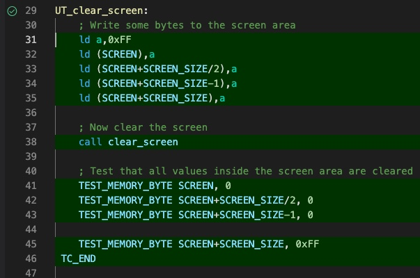
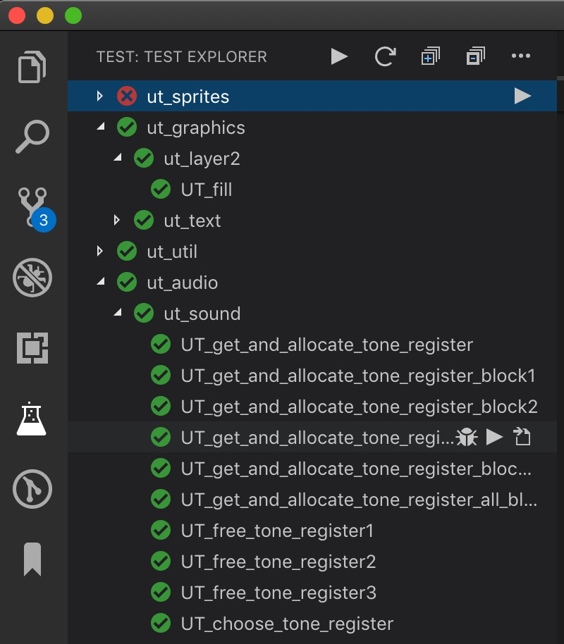

# Unit Tests

DeZog offers the possibility to  execute unit tests.
You can directly run the unit tests or use the [z80-unit-tests](https://github.com/maziac/z80-unit-tests) extension to execute the tests from a test explorer UI.

A good example for the use of unit tests can be found in the [z80-sample-program](https://github.com/maziac/z80-sample-program).

# Prerequisites

It is recommended to use the sjasmplus assembler but you can also use other assemblers that support macros.

The [unit_tests.inc](unit_tests.inc) file provides macros in sjasmplus syntax.

For other assemblers you most probably need an .inc file in a different format. Here is a [unit_tests_savannah.inc]](unit_tests_savannah.inc) in a format that e.g. Savannah's z80asm would understand. Maybe this can be used for other assemblers as well.

Note: the z88dk z80asm is not supported as it lacks native support for macros.

# Usage

In order to use unit tests you must:
1. include the unit_tests.inc file to your sources
2. create the unit tests
3. provide an initialization routine
4. assemble the binary
5. setup the launch.json
6. start the unit tests

## Include unit_tests.inc

Download unit_tests.inc and put
~~~
include "unit_tests.inc"
~~~
to your sources.

## Create Unit Tests

Creating a unit test is easy. A subroutine with a label that start with the prefix "UT_" is recognized as unit test case.
The unit test case ends by using the macro TC_END.

If you use the sjasmplus feature to have hierarchical labels the last part need to start with "UT_".

Here are a few examples of valid unit test label names.
~~~
UT_test1:
	...
	TC_END

Module1.UT_test2:  ; sjasmplus specific
	...
	TC_END

  MODULE Mod2  ; sjasmplus specific
UT_test3:
	...
	TC_END

UT_test4:
	...
	TC_END
  ENDMODULE
~~~

If you use hierarchical labels you can structure the the tests in test suites and unit tests.
E.g. the example above would result in 2 test suites: "Module1" and "Mod":
~~~
|- UT_test1
|- Module1
|   |- UT_test2
|- Mod2
    |- UT_test3
    |- UT_test4
~~~

### Test Macros

Inside the unit test you should use the provided unit test macros to test for failures [^1].
[^1]: This is very similar to the assertions used in other languages.

There are macros available for various purposes, e.g. to test the registers for specific values or a memory location.

Here is the complete list:
- TEST_MEMORY_BYTE addr, value: (addr) == value
- TEST_MEMORY_WORD addr, value: (addr) == value
- TEST_A value: A == value
- TEST_A_UNEQUAL value: A != value
- TEST_REG reg, value: reg == value, with reg = B|C|D|E|H|L
- TEST_REG_UNEQUAL reg, value: reg != value, with reg = B|C|D|E|H|L
- TEST_DREG dreg, value: dreg == value, with dreg = BC|DE|HL|IX|IY
- TEST_DREG_UNEQUAL dreg, value: dreg != value, with dreg = BC|DE|HL|IX|IY
- TEST_DREGS dreg1, dreg2: dreg1 == dreg2, with dreg1/2 = BC|DE|HL|IX|IY
- TEST_DREGS_UNEQUAL dreg1, dreg2: dreg1 != dreg2, with dreg1/2 = BC|DE|HL|IX|IY
- TEST_STRING addr, string, term0: Compares 2 strings (addr and string)
- TEST_STRING_PTR addr1, addr2: Compares 2 null-terminated strings strings (addr1 and addr2)
- TEST_MEM_CMP addr1, addr2, count: Compares to memory area on equality.
- TEST_FLAG_Z: Z flag is set
- TEST_FLAG_NZ: Z flag is not set

If the code in the macro is executed and the condition would fail the whole unit test is aborted and failed.
If the condition is fulfilled the code execution carries on after the macro and you can test further conditions.

Example:
~~~
UT_mytest2:
	ld a,5
	call multiply_a_by_3
	TEST_REG C, 15

	ld a,0
	call multiply_a_by_3
	TEST_REG C, 0

	TC_END
~~~
This simple example test the subroutine 'multiply_a_by_3' which hypothetically takes A, multiplies it by 3 and returns the result in C. If A is 5 it should result in 15 and if A is 0 it should be 0.

Please note that if you run a unit test case in debug mode the debugger will stop execution at exactly the macro that failed.

### Special Test Macros

There exist a few more macros for special usage.

The macro DEFAULT_REGS stores some predefined values into all main registers (A, BC, DE, HL).
In conjunction with the TEST_UNCHANGED_... macro this can be used to check if a certain register has not changed its value.
I.e. you can test that the tested subroutine has no side-effect and doesn't change some register by accident.

Here is an example:
~~~
UT_mytest2:
	DEFAULT_REGS
	ld hl,mylabel
	call my_subroutine
    TEST_UNCHANGED_BC_DE
	...
	TC_END
~~~
It check that 'my_subroutine' does not change the values of B, C, D, and E.
It however doesn't care about changing A or HL.

There are a few macros defined for testing:
- TEST_UNCHANGED_BC
- TEST_UNCHANGED_DE
- TEST_UNCHANGED_HL
- TEST_UNCHANGED_BC_DE
- TEST_UNCHANGED_BC_DE_HL
- TEST_UNCHANGED_A
- TEST_UNCHANGED_B
- TEST_UNCHANGED_C
- TEST_UNCHANGED_D
- TEST_UNCHANGED_E
- TEST_UNCHANGED_H
- TEST_UNCHANGED_L

Furthermore the macro USE_ALL_REGS fills all registers with predefined values A, BC, DE, HL, IX, IY and the shadow registers. (USE_ALL_REGS2 is the same with different values.)
THis macro can be used in conditions that you want to test that your subroutine does not use one of the registers by accident. Or in other words: with using this macro you make sure that no register has any meaningful value by accident.

## Provide Initialization Routine

You provide the initialization routine via the macro UNITTEST_INITIALIZE.
Directly after the macro write your initialization code.
Note that you don't need to provide a stack for the unit tests it is setup automatically inside the UNITTEST_INITIALIZE macro.
Furthermore during execution of all unit test cases the interrupts are disabled. If, for some reason, you need interrupts active then you have to enable them ('ei') at the start of each unit test case.

Your initialization code may look like.
~~~
    UNITTEST_INITIALIZE
    ; Start of unit test initialization.
    ; E.g. maybe you need to initialize some memory area or you need to load some code...
    ...
    ret
~~~

You need to end your initialization with a 'ret'.

Please note that the code is executed only once for each unit test run. I.e. not before each unit test case.
If you need to initialize something at the start of your unit test then please add the code to the unit test.

## Setup the launch.json

You need to create a special configuration in side the launch.json for the unit tests.
At best you copy a working configuration, change its name (to e.g. "Unit Tests") and change/add a few properties:
- the property 'unitTests' need to be added and set to true. Note that only one configuration is allowed to have this property set to true.
- the property 'topOfStack' is not required and ignored if set. Instead an own stack (with default size of 50 words) is used.
- 'startAutomatically': The default is false for unit tests. I.e. if you run a unit test in debug mode it will automatically break at the start of the tests. I.e. it will stop at the start of the first test.
If you like you can set this set this to true, but then you need to set a breakpoint inside your unit test if you debug it otherwise the unit test will be finished before you can see anything in the debugger.
- You must remove any occurrence of 'execAddr' because it is superfluous. For unit tests the addresses of the labels are calculated automatically and the PC (program counter) is set accordingly.

## Start the Unit Tests

Make sure ZEsarUX is running and has remote control enabled (just like in a normal debugging session).
Make sure that no debug session is currently running.

Press F1 for the command palette to appear.
Enter "dezog: Run all unit tests".

DeZog will connect ZEsarUX and execute the unit tests.
At the end you get a summary like this (in the vscode "OUTPUT" panel channel "DeZog Unit Tests"):
~~~
+-------------------------------------------------
UNITTEST SUMMARY:
Date: Wed Jun 12 2019 19:10:43 GMT+0200 (CEST)

ut_sprites.UT_get_hl_from_a (0x8182):	Fail
ut_sprites.UT_get_ix_from_a (0x822a):	OK
ut_sprites.UT_get_x_from_ix (0x82df):	OK
ut_sprites.UT_get_y_from_ix (0x833c):	OK
ut_sprites.UT_add_3_sprites (0x83e1):	OK
ut_sprites.UT_add_sprite_index_255 (0x8508):	OK
...
ut_audio.ut_sound.UT_get_and_allocate_tone_register_block3 (0xadb0):	OK
ut_audio.ut_sound.UT_get_and_allocate_tone_register_block_two (0xae9f):	OK
ut_audio.ut_sound.UT_get_and_allocate_tone_register_all_blocked (0xaf17):	OK
ut_audio.ut_sound.UT_free_tone_register1 (0xaf54):	OK
ut_audio.ut_sound.UT_free_tone_register2 (0xafa8):	OK
ut_audio.ut_sound.UT_free_tone_register3 (0xb00e):	OK
ut_audio.ut_sound.UT_choose_tone_register (0xb08b):	OK

Total test cases: 65
Passed test cases: 64
Failed test cases: 1
98% passed.

+-------------------------------------------------
~~~

You will notice that the executed lines in the sources have turned to a green background.

See [Code Coverage](#code-coverage).

If you find that a test case has failed you can also start the unit tests in debug mode:
Press F1 and enter "dezog: Run all unit tests in debug mode".

The debugger is started and will stop at the failing test. E.g.

The PC stops at the test because A is obviously not 0.

# When Does a Test Case Fail

Obviously a unit test case fails if the checked condition (the TEST_... macros) fails.
But there are a few other cases when a test case fails:
- unitTestTimeout: If the test case does not return within this time the test case has failed. Default is 1 sec (unit is secs). If this is not enough you can change the value (for all test cases) in the launch configuration.
- breakpoint hit: When a breakpoint is hit the test case has failed. This will happen if you for example have memory guard (WPMEM) and the unit test has e.g. written into a guarded memory area. This can also happen if you an ASSERT fails somewhere. If in debug mode the test case will also be counted as failed but the code execution also stops at the particular line of code. So you can directly investigate what happened.

# Code Coverage

When the unit tests have been run you can see the code coverage. The covered lines get a green background color.
You can easily see what instructions have been covered by a test and which not.
The coverage decoration is also available when running the unit tests in debug mode.
It is reset whenever you start a new debug session or a new unit test.
If you need to clear the coverage decoration at some other point go tp the command palette and enter "dezog: Clear the current code coverage decoration"

# What Else

## Test Explorer

Use another extension, [z80-unit-tests](https://github.com/maziac/z80-unit-tests), to execute the unit tests not via the command palette but via the Test Explorer UI.

From that UI it is also possible to execute specific unit tests without executing the rest.

Example:

# Caveats

If you use a .sna file the inherited start address is simply ignored.
You can use .sna and plain .obj files for unit tests. .tap files will not work as the loading is emulated.

