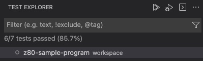
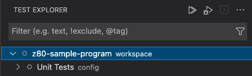
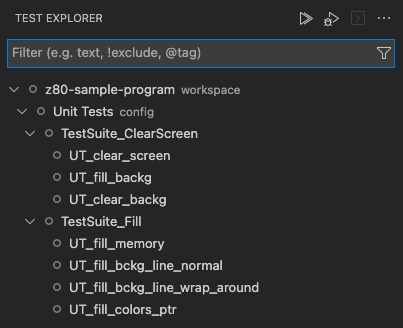
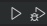
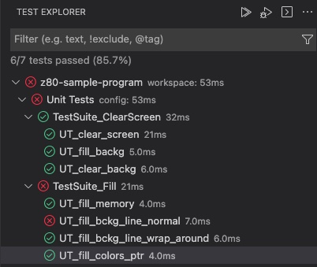

# Unit Tests

DeZog offers the possibility to  execute unit tests.
You can directly run the unit tests or use the [z80-unit-tests](https://github.com/maziac/z80-unit-tests) extension to execute the tests from a test explorer UI.

A good example for the use of unit tests can be found in the [z80-sample-program](https://github.com/maziac/z80-sample-program).


# Prerequisites

It is recommended to use the sjasmplus assembler but you can also use other assemblers that support macros.

The [unit_tests.inc](unit_tests.inc) file provides macros in sjasmplus syntax.

For other assemblers you most probably need an .inc file in a different format. Here is a [unit_tests_savannah.inc](unit_tests_savannah.inc) in a format that e.g. Savannah's z80asm would understand. Maybe this can be used for other assemblers as well. (Note: it has less macros defined as the sjasmplus inc file but you can extend on your own.)

Note: the z88dk z80asm is not supported as it lacks native support for macros.


# Usage

In order to use unit tests you must:
1. include the unit_tests.inc file to your sources
2. create the unit tests
3. provide an initialization routine
4. assemble the binary
5. setup the launch.json
6. start the unit tests


## Include unit_tests.inc

Download unit_tests.inc and put
~~~
include "unit_tests.inc"
~~~
to your sources.

## Create Unit Tests

Creating a unit test is easy. A subroutine with a label that start with the prefix "UT_" is recognized as unit test case.
The unit test case ends by using the macro TC_END.

If you use the sjasmplus feature to have hierarchical labels the last part need to start with "UT_".

Here are a few examples of valid unit test label names.
~~~
UT_test1:
	...
	TC_END

Module1.UT_test2:  ; sjasmplus specific
	...
	TC_END

  MODULE Mod2  ; sjasmplus specific
UT_test3:
	...
	TC_END

UT_test4:
	...
	TC_END
  ENDMODULE
~~~

If you use hierarchical labels you can structure the the tests in test suites and unit tests.
E.g. the example above would result in 2 test suites: "Module1" and "Mod":
~~~
|- UT_test1
|- Module1
|   |- UT_test2
|- Mod2
    |- UT_test3
    |- UT_test4
~~~


### Test Macros / ASSERTION

During unit testing WPMEM, LOGPOINTs and ASSERTIONs are automatically turned on, even if you don't enable them in 'commandsAfterLaunch'.
The ASSERTION is especially required because you use it to test your assertions.

E.g. write
~~~
	nop ; ASSERTION A == 6
~~~

to test that A is 6. DeZog will break here, failing the unit test, if A is not 6.
Note the nop. It is not required but is used for clarity. If not used the break will happen on the next line. And, if you use several ASSERTION right after the other any assertion would result in any break on the same line.
Therefore it's more clear to use the ```nop```.

Inside the assertion you can use register and label names and a little math.
You e.g. cannot test memory contains with the ASSERTs.

Examples:
~~~
	nop ; ASSERTION A == 6
	nop ; ASSERTION BC == COUNT+1
	nop ; ASSERTION A == L
	nop ; ASSERTION HL > LABEL_X
~~~

For testing memory contents and some other tasks there are a few predefined test macros available.

Here are some of the available macros for sjasmplus:
- TEST_MEMORY_BYTE addr, value: (addr) == value
- TEST_MEMORY_WORD addr, value: (addr) == value
- TEST_STRING addr, string, term0: Compares 2 strings (addr and string)
- TEST_STRING_PTR addr1, addr2: Compares 2 null-terminated strings strings (addr1 and addr2)
- TEST_MEM_CMP addr1, addr2, count: Compares to memory area on equality.
- TEST_FLAG_Z: Z flag is set
- TEST_FLAG_NZ: Z flag is not set

If the code in the macro is executed and the condition would fail the whole unit test is aborted and failed.
If the condition is fulfilled the code execution carries on after the macro and you can test further conditions.

Example:
~~~
result:	defb 0

multiply_a_by_3:
	add a
	add a
	add a
	ld (result),a
	ret


UT_mytest2:
	ld a,5
	call multiply_a_by_3
	TEST_MEMORY_BYTE result, 15

	ld a,0
	call multiply_a_by_3
	TEST_MEMORY_BYTE result, 0

	TC_END
~~~
This simple example test the subroutine 'multiply_a_by_3' which takes A, multiplies it by 3 and stores the result. If A is 5 it should result in 15 and if A is 0 it should be 0.

Please note that if you run a unit test case in debug mode the debugger will stop execution at exactly the macro that failed.


### Special Test Macros

There exist a few more macros for special usage.

The macro DEFAULT_REGS stores some predefined values into all main registers (A, BC, DE, HL).
In conjunction with the TEST_UNCHANGED_... macro this can be used to check if a certain register has not changed its value.
I.e. you can test that the tested subroutine has no side-effect and doesn't change some register by accident.

Here is an example:
~~~
UT_mytest2:
	DEFAULT_REGS
	ld hl,mylabel
	call my_subroutine
    TEST_UNCHANGED_BC_DE
	...
	TC_END
~~~
It checks that 'my_subroutine' does not change the values of B, C, D, and E.
It however doesn't care about changing A or HL.

There are a few macros defined for testing:
- TEST_UNCHANGED_BC
- TEST_UNCHANGED_DE
- TEST_UNCHANGED_HL
- TEST_UNCHANGED_BC_DE
- TEST_UNCHANGED_BC_DE_HL
- TEST_UNCHANGED_A
- TEST_UNCHANGED_B
- TEST_UNCHANGED_C
- TEST_UNCHANGED_D
- TEST_UNCHANGED_E
- TEST_UNCHANGED_H
- TEST_UNCHANGED_L

Furthermore the macro USE_ALL_REGS fills all registers with predefined values for A, BC, DE, HL, IX, IY and the shadow registers.
This macro can be used in conditions that you want to test that your subroutine does not use one of the registers by accident. Or in other words: with using this macro you make sure that no register has any meaningful value by accident.


## Provide Initialization Routine

You provide the initialization routine via the macro UNITTEST_INITIALIZE.
Directly after the macro write your initialization code.
Note that you don't need to provide a stack for the unit tests it is setup automatically inside the UNITTEST_INITIALIZE macro and SP is set to it. The stack's size is 50 words. If you need more you can change it inside the macro.
Furthermore during execution of all unit test cases the interrupts are disabled. If, for some reason, you need interrupts active then you have to enable them ('ei') at the start of each unit test case.

Your initialization code may look like.
~~~
    UNITTEST_INITIALIZE
    ; Start of unit test initialization.
    ; E.g. maybe you need to initialize some memory area or you need to load some code...
    ...
    ret
~~~

You need to end your initialization with a 'ret'. If you don't have any needs for additional initialization just put the ```ret```after the UNITTEST_INITIALIZE macro.

Please note that the code is executed again for each unit test run.


## Setup the launch.json

You need to create a special configuration in side the launch.json for the unit tests.
At best you copy a working configuration, change its name (to e.g. "Unit Tests") and change/add a few properties:
- the property 'unitTests' need to be added and set to true. If you like you can have several unit test configurations in one launch.json.
- the property 'topOfStack' is not required and ignored if set. Instead an own stack (with default size of 50 words) is used.
- 'startAutomatically': The default is false for unit tests. I.e. if you run a unit test in debug mode it will automatically break at the start of each test.
If you like you can set this set this to true, but then you need to set a breakpoint inside your unit test if you debug it otherwise the unit test will be finished before you can see anything in the debugger.
- You need not enable WPMEM, ASSERTION or LOGPOINT. They are automatically enabled for unit tests.
- You must remove any occurrence of 'execAddr' because it is superfluous. For unit tests the addresses of the labels are calculated automatically and the PC (program counter) is set accordingly.


## Start the Unit Tests

For most unit tests you shouldn't need much (ZX) HW, ie. you could run them in the internal Z80 simulator (zsim).
If you need more sophisticated HW emulation use ZEsarUX or CSpect.
The internal simulator and ZEsarUX support memory breakpoints which can be an advantage if you make use of WPMEM in your sources.
If you use ZEsarUX or CSpect first make sure your normal debug setup is working (i.e. you are able to run a normal debugging session).

DeZog discovers unit tests in the sources automatically. If it finds a unit test configuration in the launch.json it will appear under the test panel.
You find it by pressing the vscode's test icon in the side bar.

Without any unit test configuration only the name of your project will appear here.

If you add a unit test configuration that will appear here as well.


Once you add unit tests with corresponding labels (i.e. labels that starts with "UT_") and assemble your code the unit tests will appear:



To run or debug the test cases press one of the buttons:


After the run you see the passed and failed test cases:


You will notice that the executed lines in the sources have turned to a green background.

See [Code Coverage](#code-coverage).


If you find that a test case has failed you can also start the unit tests in debug mode:
Press F1 and enter "dezog: Run all unit tests in debug mode".

The debugger is started and will stop at the failing test. E.g.

The PC stops at the test because A is obviously not 0.


# When Does a Test Case Fail

Obviously a unit test case fails if the checked condition (the TEST_... macros or the ASSERTION statements) fails.
But there are a few other cases when a test case fails:
- unitTestTimeout: If the test case does not return within this time the test case has failed. Default is 1 sec (unit is secs). If this is not enough you can change the value (for all test cases) in the launch configuration. During debugging the timeout is not used.
- breakpoint hit: When a breakpoint is hit the test case has failed. This will happen if you for example have memory guard (WPMEM) and the unit test has e.g. written into a guarded memory area. This can also happen if an ASSERTION fails somewhere else in the code. If in debug mode the code execution also stops at the particular line of code. So you can directly investigate what happened. If not in debug mode you can click on the red failed button and vscode will take you to the place in the code where the assertion happened. You will also see the values used in the ASSERTION so you can directly see what went wrong.


# Code Coverage

When the unit tests have been run you can see the code coverage. The covered lines get a green background color.
You can easily see what instructions have been covered by a test and which not.
The coverage decoration is also available when running the unit tests in debug mode.
It is reset whenever you start a new debug session or a new unit test.
If you need to clear the coverage decoration at some other point go tp the command palette and enter "dezog: Clear the current code coverage decoration"

Note: Code coverage is only rudimentary supported in "cspect" or "zxnext".


# A note about banking

Wherever you place the UNITTEST_INITIALIZE macro this is also the place where the unit test stack is created.
If you are testing in a system with banked memory you can still place it in any slot you like. But you need to be aware that the unit test stack is also created in the same bank. I.e. the bank should be accessible all the time as long as the stack is being used.
Of course, you can switch to another stack. But make sure that before you call TC_END the bank is again accessible.

The memory test macros like TEST_MEMORY_BYTE etc. do work with 64k addresses. I.e. they don't do any changes to the used banks.
So, if you want to test memory of some other bank then make sure that you page it in before.


# Supported file types

For unit testing you can use .sna, .nex and plain .obj files.
.tap files will not work.


# Caveats

CSpect:
As already mentioned watchpoints are not supported with CSpect. The unit tests use watchpoints to check if there is a stack overflow. So, with CSpect the stack is not checked.

ZEsarUX:
There is a special oddity that ASSERTIONs are not shown when stepping. If you let it run the program will stop at any not met ASSERTION but not if you step over (or into).

