# Usage of DeZog - the VS Code Z80 Debugger


This document outlines the functionalities of DeZog and provides instructions on how to utilize them.

If watched inside vscode you can use "CTRL-F" to search for certain topics.


## Support

If you like DeZog please consider supporting it.

<a href="https://github.com/sponsors/maziac" title="Github sponsor">
	
</a>
&nbsp;&nbsp;
<a href="https://www.paypal.com/donate/?hosted_button_id=K6NNLZCTN3UV4&locale.x=en_DE&Z3JncnB0=" title="PayPal">
	
</a>


If you would like to contribute, e.g. by adding a new assembler or adding other remotes/emulators, see "Contribution" [here](https://github.com/maziac/DeZog/blob/master/README.md#contribution).


## References

<!-- When reference, upper or lower case can be used -->

[z80-sample-program]: https://github.com/maziac/z80-sample-program
[zx81-sample-program]: https://github.com/maziac/zx81-sample-program
[z80-peripherals-sample]: https://github.com/maziac/z80-peripherals-sample
[dezogif]: https://github.com/maziac/dezogif
[DZRP]: https://github.com/maziac/DeZog/blob/master/design/DeZogProtocol.md

[zesarux]: https://github.com/chernandezba/zesarux
[cspect]: http://www.cspect.org
[mame]: https://www.mamedev.org
[sjasmplus]: https://github.com/z00m128/sjasmplus
[savannah-z80asm]: https://savannah.nongnu.org/projects/z80asm/
[z88dk-z80asm]: https://github.com/z88dk/z88dk
[NEX File Format]: https://wiki.specnext.dev/NEX_file_format
[ZX Spectrum Next]: https://www.specnext.com
[ZX81 Debugging]: https://github.com/maziac/DeZog/blob/main/documentation/zx81/zx81-zsim.md
[zxnext]: https://www.specnext.com

[SpecBong Fork]: https://github.com/maziac/SpecBong

- [Z80-Sample-Program]
- [ZX81-Sample-Program]
- [Z80-Peripherals-Sample]
- [DeZogIf]
- [CSpect]
- [ZEsarUX]
- [MAME]
- [sjasmplus]
- [Savannah-z80asm]
- [z88dk-z80asm]
- [ZX Spectrum Next]
- [ZX81 Debugging]
- [NEX File Format]
- [SpecBong Fork]


## Migration from a previous DeZog version

If you migrate from an older version of DeZog you can find [here](https://github.com/maziac/DeZog/blob/master/documentation/Migration.md) a few helpful tips.


## Supported Assemblers

- [sjasmplus] maintained by [Peter Ped Helcmanovsky](https://github.com/ped7g)
- [Savannah-z80asm] (or z80asm) by Bas Wijnen
- [z88dk-z80asm] (or z88dk)

Furthermore, if you like to use the [fasmg](https://flatassembler.net) assembler, although it is not supported out-of-the-box, you find a description how to use it [here](https://sinclairzxworld.com/viewtopic.php?f=6&t=4572) (by [stevexyz](https://github.com/stevexyz)).


## General Usage

Beginning with version DeZog 3.0 there are 2 basic usage scenarios:
- Developing a new assembler program, e.g. a game, or
- Reverse Engineer an existing machine code program.


## Develop a new Program

A typical debug session with DeZog will look like:
1. Create a binary of your assembler program together with a list or SLD file for DeZog
2. Start DeZog (therefore you need a working launch.json config file)
3. Debug, i.e. set breakpoints, run, step through your code, evaluate registers and memory
4. Stop DeZog
5. Loop to 1

When using the internal Z80 simulator "zsim" that's basically it.

When using an external [remote](#what-is-a-remote), i.e. an emulator or the ZX Next, you need to start that as well.

I have noticed that this part, the interaction between DeZog and the emulator, often confuses people.
So I would like to sketch out the intended/main usage scenario.

Many people try to start the emulator while starting DeZog and close it when stopping the DeZog debug session.
This is **not required**.
If you work with an emulator you would start the emulator once and then let it running.
When you start a debug session DeZog will connect to it, **transfer the program to the emulator** and start the program.
When you stop the debug session DeZog will disconnect from the emulator.
(Disconnecting from the emulator may have the effect of keeping the program running in the emulator. This is simply because the emulator now continues execution.)

I.e. your workflow is as follows:
1. Start vscode
2. Start the emulator (or even several emulators/remotes)
3. Create a binary of your assembler program
4. Start DeZog
5. Debug
6. Stop DeZog
7. Loop to 3

You normally need to re-start the emulator only if it behaves weird, does not connect to DeZog anymore or crashes.


## Reverse Engineer an Existing Machine Code Program

While reverse engineering you will normally not use an assembler but instead DeZog will provide a disassembly that can be used as a starting point to create a list file manually.

The whole process is described is an own [Reverse Engineering](https://github.com/maziac/DeZog/blob/master/documentation/ReverseEngineeringUsage.md) document.

Reverse engineering can be generally be done with all remotes although for the ZX Spectrum the internal 'zsim' is probably the best choice.

For Z80 arcade games MAME can be used.


## Main Areas

The picture below shows the main areas that you will see when debugging a program, in this case the [sample program](#sample-program).

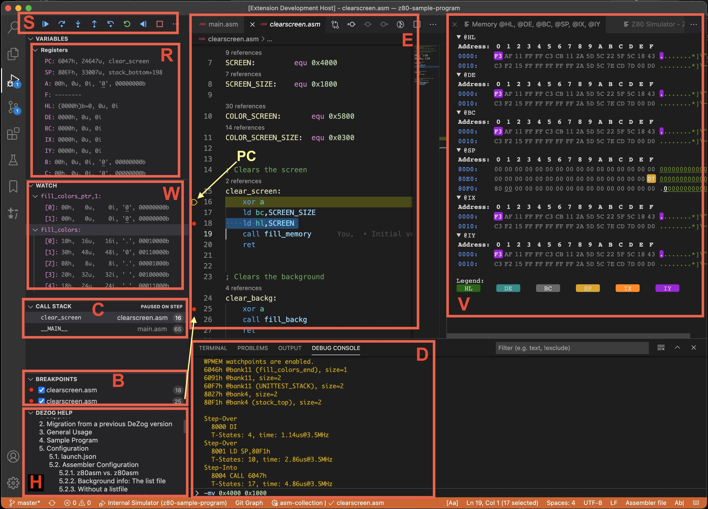

**S** - After starting the debugger you can use the buttons to step through your source code. Note: Depending on your settings this might be floating bar.

**R** - The [Z80 registers](#registers) are shown here. It contains also other information like the memory banking, the local stack or the disassembly of the current PC location.

**W** - The [WATCH](#watches) area contains labels that you put in here for observation.

**B** - [Breakpoints](#vscode-breakpoint) that you set in the editor are collected here.

**H** - DeZog Sidebar Help: Click on a topic for help. (Hint: CTRL-F in the opened view allows searching.)

**E** - The source code editor. DeZog will jump to the right file while stepping. You can set breakpoints and hover over labels and registers to see the contents.

**D** - The [debug console](#debug-console) shows the executed instructions and other infos. You can also setup additional commands (like ```-mv 0x4000 0x1000``` to view the memory contents 0x4000-0x4FFFF).

**V** - Other views like the [memory viewer](#memory-viewer), the sprites view or the simulator view.


## Sample Program

With DeZog a simple assembler program is provided to demonstrate the features of DeZog.

You can find it here:
https://github.com/maziac/z80-sample-program

It includes the sources and the binaries (.list, .sna files). So, if you don't want to change the sources, you can try debugging even without building from the sources.


## Configuration
### launch.json

After installing you need to add the configuration for "DeZog".

A typical configuration looks like this:

~~~json
    "configurations": [
        {
            "type": "dezog",
            "request": "launch",
            "name": "DeZog",
            "remoteType": "zsim",
            "zsim": {
            },
            "sjasmplus": [
                {
                    "path": "z80-sample-program.list",
                }
            ],
            "startAutomatically": false,
            "history": {
                "reverseDebugInstructionCount": 10000,
                "codeCoverageEnabled": true
            },
            "commandsAfterLaunch": [
                //"-sprites",
                //"-patterns"
            ],
            "disassemblerArgs": {
        		"numberOfLines": 20
            },
            "smartDisassemblerArgs": {
                "lowerCase": false
            },
            "rootFolder": "${workspaceFolder}",
            "topOfStack": "stack_top",
            "load": "z80-sample-program.sna",
            "smallValuesMaximum": 513,
            "tmpDir": ".tmp"
       }
~~~

- name: The (human readable) name of DeZog as it appears in vscode.
- unitTests: Only required if the configuration contains unit tests. Leave empty if you don't provide unit tests. Only one configuration can have this attribute set to true.
- remoteType: For DeZog to work it is necessary to connect it to some 'Remote'. This can be an emulator like ZEsarUX, the internal Z80 simulator or real ZX Next HW connected via serial interface.
    - "zsim": Use the internal simulator. See [Internal Z80 Simulator](#the-internal-z80-simulator).
    - "zrcp": Use ZEsarUX through the ZRCP (ZEsarUX Remote Control Protocol) via a socket. See [ZEsarUX](#zesarux).
    - "cspect": Use of CSpect emulator with the DeZog plugin. See [CSpect](#cspect).
    - "zxnext": Use a (USB-) serial connection connected to the UART of the ZX Next. See [ZX Next / Serial Interface](#zx-next--serial-interface).
- [sjasmplus] (or z80asm or z88dk): The assembled configuration. An array of list files. Typically it includes only one. But if you e.g. have a
list file also for the ROM area you can add it here.
Please have a look at the [Assembler Configuration](#assembler-configuration) section.
- startAutomatically: If true the program is started directly after loading. If false the program stops after launch. (Default=true). Please note: If this is set to true and a .tap file is loaded it will stop at address 0x0000 as this is where ZEsarUX tape load emulation starts.
- reverseDebugInstructionCount: The number of lines you can step back during reverse debug. Use 0 to disable.
- codeCoverageEnabled: If enabled code coverage information is displayed. I.e. all source codes lines that have been executed are highlighted in green. You can clear the code coverage display with the command palette "dezog: Clear current code coverage decoration". Defaults to false for 'cspect' and 'mame' otherwise true.
- commandsAfterLaunch: Here you can enter commands that are executed right after the launch and connection of the debugger. These commands are the same as you can enter in the debug console. E.g. you can use "-sprites" to show all sprites in case of a ZX Next program. See [Debug Console](#debug-console).
- disassemblerArgs: Arguments that are be passed to the internal disassembly that is displayed in the VARIABLES pane.
    - numberOfLines: The number of lines displayed in the disassembly.
- smartDisassemblerArgs: Arguments that are be passed to the smart disassembler used in "Analyze". I.e. the call graph, flow chart and smart (text) disassembly.
    - lowerCase: true = use lower case for the instructions, false = use upper case. Default is 'true'.
- rootFolder: Typically = workspaceFolder. All other file paths are relative to this path.
- topOfStack: This is an important parameter to make the callstack display convenient to use. Please add here the label of the top of the stack. Without this information DeZog does not know where the stack ends and may show useless/misleading/wrong information. In order to use this correctly first you need a label that indicates the top of your stack. Here is an example how this may look like:
Your assembler file:
    ~~~assembly
    stack_bottom:   ; 100 bytes of stack
        defs    100, 0
    stack_top:
    ~~~
    In your launch.json:
    ~~~json
    "topOfStack": "stack_top"
    ~~~

    In the SNA and NEX file format you can also set the stack address if you use sjasmplus.
    If you omit the stack address some defaults are used that you can set "topOfStack" to:
    - SNA: 0x5D58 (Note/sjasmplus: If you add the RAMTOP to your DEVICE entry then it seems the stack is RAMTOP-3. For both, ZXSPECTRUM48 and ZXSPECTRUM128.)
    - NEX: 0xFFFE

    The "topOfStack" is a string so that you can put a label name inside. But you can also set a number (in parenthesis) directly or even a calculation, e.g. "label-2".

- topOfStack: instead of a label you can also use a fixed number.
- load: Load of a .nex, .sna (or .tap) file. See [launch.json - load](#launchjson---load)
Note: you can also omit this. In that case DeZog attaches to the emulator without loading a program. Breakpoints and the list/assembler files can still be set.
- loadObjs: Instead of a .nex, .sna or .tap file you can also directly load binary object files. You can load several object files and you have to give path and start address for each file, e.g.:
~~~json
"loadObjs": [
    { "path": "out/main.bin", "start": "0x6000" },
    { "path": "out/graphics.bin", "start": "0x8000" }
],
~~~
- execAddress: for object files you can set the PC (program counter) start address. I.e. after loading the program will start at this address.
- smallValuesMaximum: DeZog format numbers (labels, constants) basically in 2 ways depending on their size: 'small values' and 'big values'. Small values are typically constants like the maximum number of something you defined in your asm file.
Big values are typically addresses. Here you can give the boundary between these 2 groups. bigValues usually also show their contents, i.e. the value at the address along the address itself. Usually 512 is a good boundary value.
- tmpDir: A temporary directory used for files created during the debugging. This is e.g. used for the file to show the disassembly PC reaches areas without any associated assembler listing or for the save states.
- memoryViewer: The following properties configure the memory viewer (used to show memory dumps).
	- addressColor: The first column shows the address. You can change the color here.
	- asciiColor: You can change the color of the ascii field here.
	- addressHoverFormat: Format for the address when hovering.
	- valueHoverFormat: Format for the value when hovering.
	- registerPointerColors: An array with register/color pairs. All selected register will appear with the correspondent color in the memory view. Registers not chosen will not appear. E.g. ["HL", "darkgreen", "DE", "darkcyan", "BC", "darkgray" ]
	- registersMemoryView: An array of register to show in the register memory view. This view is automatically opened at startup and shows the memory the registers point to. E.g. select [ 'HL', 'DE', 'IX' ].
- unitTestTimeout: the timeout for each unit test. Default is 1s. Change this only if one of your unit test lasts longer.


Some pre-defined launch.json debug configuration exist as configuration snippets and can be chosen by starting to type 'dezog' inside the launch.json or by using the "Add Configuration..." button:
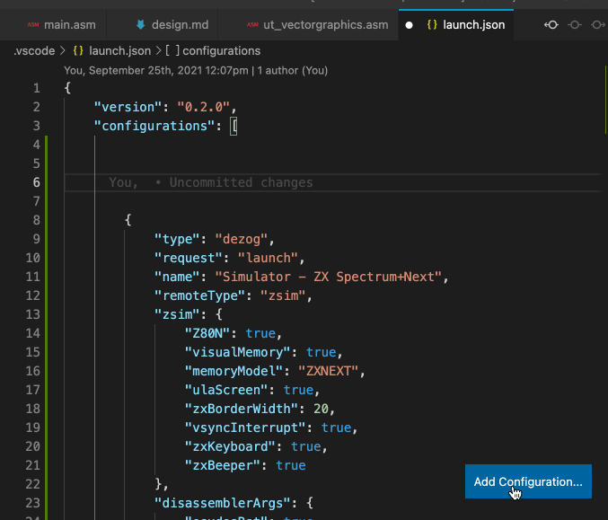

#### launch.json - load

In launch.json use
~~~
    "load": "<filename.ext>"
~~~

to either load a .nex, .sna, .p (or .tap) file. On start of the debug session the file is loaded into the emulator.
.tap is only supported on ZEsarUX.
On ZEsarUX the .nex, .sna, .p or .tap file is loaded via ZEsarUX's "smartload" command.
This will give the best emulation for .nex (and .tap) loading as the nex loading can be emulated as well.

For all other remotes (cspect, zsim, mame and zxnext) the .nex, .sna or .p file loading is mainly copying the data into the emulators memory, setting a few registers and starting it.
For the .sna file (apart from ZEsarUX) only zsim will set the port 0x7FFD and the IFF2 register (interrupt enabled) correctly.

For the .nex file there can be some missing initializations.
Most important to note are:
- The loading screens are not displayed
- The 'file handle address' (140) is ignored completely.

In fact, only these action are executed by DeZog on .nex file loading:
- The data is written to the right banks
- The border color is set
- The PC and SP are set according to the .nex file
- The .nex file's 'entry bank' is set. I.e. the 16k slots are set to the banks ROM, 0, 5 and 'entry bank'.

On the other hand, as nex file loading is mainly a copy into the emulator's memory, it does not require any ZX Next OS. I.e. this can simplify the overall emulator setup.

For a full description of the .nex file format see:
[NEX File Format](https://wiki.specnext.dev/NEX_file_format)


### Assembler Configuration

Depending on your assembler you use different configuration names:
- 'sjasmplus' for [sjasmplus]
- 'z80asm' for the [Savannah-z80asm]
- 'z88dk' for [z88dk-z80asm]
- 'revEng' for reverse engineering

You basically define which listfile is used (or several list files) and depending on the assembler you may need to add certain parameters.

Note tht it is valid to specify several assembler configurations. E.g. if part of the code was written with sjasmplus and some other with z80asm.


#### z80asm vs. z80asm

z80asm was and is still a very popular name for a Z80 assembler. There are especially 2 of them that I have used in the past and despite the name doesn't share very much.
To distinguish them I will call them
a) the **Savannah-z80asm** (or z80asm) from Bas Wijnen, see https://savannah.nongnu.org/projects/z80asm/ and the
b) the **z88dk-z80asm** (or z88dk) hosted here https://github.com/z88dk/z88dk (Note: on the site they host even another z80asm project which is a respawn of the original one.)

DeZog supports the list file formats of both of them and additionally the sjasmplus [SLD format](https://z00m128.github.io/sjasmplus/documentation.html#c_sld_data).


#### Background info: The list file

The most important configuration to do is the *.list file (or *.sld file). The list file contains
all the information required by DeZog. While reading this file DeZog
- associates addresses with line numbers
- associates addresses with files
- reads in labels and constants

An example how this works:
When you do a 'step-over' in the debugger, DeZog request the new PC (program counter) value from the emulator, e.g. ZEsarUX.
The address of the PC is looked up to find the line in the list file.
Now depending on the value of 'srcDirs'
- []: Empty array. The corresponding line in the list file is shown or
- otherwise: The originating asm-file is searched together with the associated line and the asm-file is shown at the right line.


**sjasmplus configuration:**

Note: sjasmplus can generate a list file but since DeZog version 2.0.0 DeZog does not use the sjasmplus list file anymore but the SLD file. You need sjasmplus >= 1.18.0 for DeZog to parse the SLD file correctly.

SLD stands for "Source Level Debugging" and is an format with similar information as the list file.
List files are meant to be read by humans whereas the SLD file format is optimized for reading by a machine, i.e. DeZog, which makes parsing much easier.
Apart from that the list file is lacking information about ['long addresses'](#long-addresses-explanation). I.e. addresses that not only include the address it self (0-0xFFFF) but also information about the paging/banking.
With this information DeZog is able to correctly associate files that are assembled for the same address but for different memory banks. It is also possible to place breakpoints correctly as not only the 64k address of a breakpoint is checked but also it's bank.

In order to let sjasmplus create an SLD file you need to set the following option on the command line:
~~~bash
--sld=your-program.sld
E.g.:
sjasmplus --sld=main.sld --fullpath main.asm
~~~

Note: the ```--fullpath``` does not change the sld output but shows the full path in case of errors.

Inside one of your asm files you need to set a few more options:
- Use ```DEVICE something``` to set a device. Otherwise the SLD file will be empty. You can e.g. use ```ZXSPECTRUM48```, ```ZXSPECTRUM128```, ```ZXSPECTRUMNEXT```.
- If you use a non ZX Spectrum like device, e.g. a pure Z80 system without any banking, then you need to choose: **```NOSLOT64K```** If you would not set any device it will default to NONE which will let sjasmplus not create any data in the sld file.
- Add a line ```SLDOPT COMMENT WPMEM, LOGPOINT, ASSERTION``` to use DeZog's WPMEM, LOGPOINT and ASSERTION features. If ```SLDOPT ...``` is omitted sjasmplus will remove the info from the SLD file.

E.g. you could start your main.asm with:
~~~asm
    DEVICE ZXSPECTRUMNEXT
    SLDOPT COMMENT WPMEM, LOGPOINT, ASSERTION
~~~

or
~~~asm
    DEVICE NOSLOTDEVICE
    SLDOPT COMMENT WPMEM, LOGPOINT, ASSERTION
~~~

Then for the launch.json file you simply have to set the path to the SLD file. E.g.:
~~~json
"sjasmplus": [{
    "path": "z80-sample-program.sld"
}]
~~~

Note: You normally shouldn't require ```srcDirs```for sjasmplus as the sld file uses unique paths for all files.


**Savannah-z80asm configuration:**

Same as sjasmplus but use: ```z80asm```, e.g.:
~~~json
"z80asm": [{
    "path": "z80-sample-program.list",
    "srcDirs": [""],
    "excludeFiles": [ "some_folder/*" ]
}]
~~~

- path: The path to the list file. Can also include globbing, e.g. "*.list".
- srcDirs (default=[""]):
    - [] = Empty array or undefined. Use .list file directly for stepping and setting of breakpoints.
    - array of strings = Non-empty. Use the (original source) files mentioned in the .list file. I.e. this allows you to step through .asm source files. The sources are located in the directories given here. They are relative to the 'rootFolder'. Several sources directories can be given here. All are tried. If you don't arrange your files in sub-folders just use '[""]' here or omit the parameter to use the default.
    - If you build your .list files from .asm files then use 'srcDirs' parameter. If you just own the .list file and not the corresponding .asm files don't use it.
- excludeFiles (default=[]): an array of glob patterns with filenames to exclude. The filenames (from the 'include' statement) that do match will not be associated with executed addresses. I.e. those source files are not shown during stepping. You normally only need this if you have multiple source files that share the same addresses. In that case one of the source files is shown. If that is the wrong one you can exclude it here. In the example above all files from "some_folder" are excluded.


**z88dk-z80asm configuration:**

~~~json
"z88dkv2": [{
    "path": "currah_uspeech_tests.lis",
    "srcDirs": [""],
    "mapFile": "currah_uspeech_tests.map",
    "excludeFiles": [ "some_folder/*" ]
}]
~~~

For 'path', 'srcDirs' and 'excludeFiles' see z80asm configuration.

- 'mapFile': The map file is required to correctly parse the label values and to get correct file/line to address associations.

Since version 2 (z88dkv2) the .lis file format has changed for z88dk.
You can easily distinguish the 2 versions. The newer format does start with the sources file name.
In the example below 'main.asm:':
~~~list
main.asm:
     1
     2
     3                          label_equ1:		equ 100
...
~~~

If you are still on an older version, DeZog can parse these as well:
~~~json
"z88dk": [{
    "path": "currah_uspeech_tests.lis",
    "srcDirs": [""],
    "mapFile": "currah_uspeech_tests.map",
    "mainFile": "currah_uspeech_tests.asm",
    "excludeFiles": [ "some_folder/*" ]
}]
~~~

But it requires an additional file:
- 'mainFile': The relative path of the file used to create the list file.


**z88dk-zcc configuration:**

Beginning with v3.6 DeZog is now able to work partly with C-code.
You can:
- set breakpoints
- step through C-files, step-over, step-in, step-out
- 'watch' global C-variables

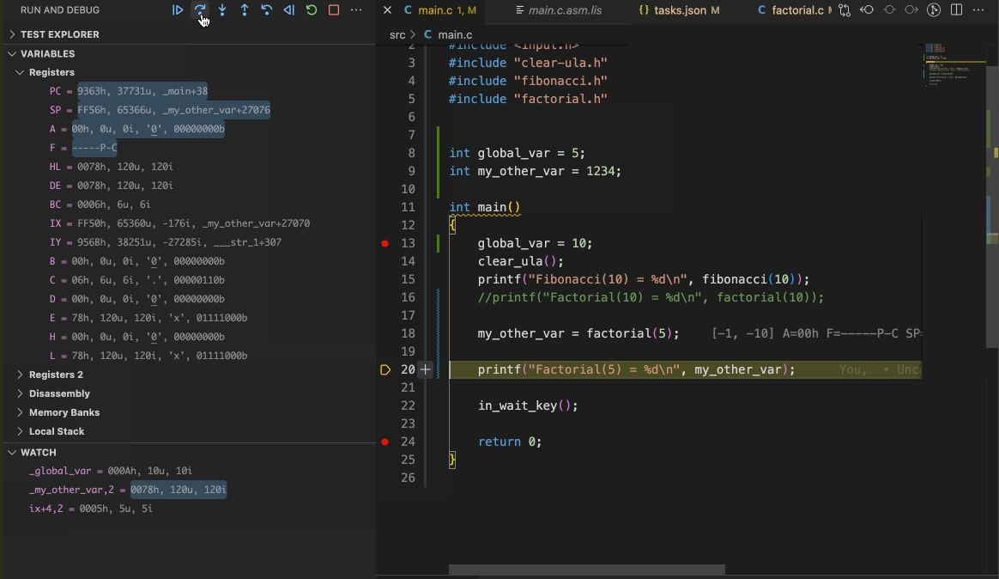

For this to work you need to pass `--c-code-in-asm` to `zcc` so that the *.lis file will also contain references to the C-file.
Furthermore `--lstcwd` is helpful if you are working with sub-directories.

An example for a full commandline is e.g.:
~~~
zcc +zxn -subtype=nex -vn --list -m --c-code-in-asm -clib=sdcc_iy -Cz"--clean" -startup=0 factorial.c fibonacci.c main.c clear-ula.asm -create-app -o ../build/main.nex
~~~

~~~json
"z88dkv2": [
    {
        "path": "src/*.lis",
        "srcDirs": [
            "src"
        ],
        "mapFile": "build/main.map",
        "excludeFiles": []
    }
]
~~~

## Top of stack
In launch.json you can set the `topOfStack` to the z88dk label `__register_sp` to set the stack for evaluation in DeZog.
~~~json
"topOfStack": "__register_sp",
~~~


You can find a sample project that uses the zcc c-compiler here:
https://github.com/vmorilla/vscode-z88dk-next-sample-project

For 'watching' C-variables you need to prefix the variable with a "_".
E.g. for `my_global_var` in C you would need to enter `_my_global_var` in the WATCH window.
If the size of the variable is not recognized correctly you can append it after the variable name, e.g. `_my_global_var,2` for a word-sized variable.
Arrays can be viewed by appending the number of elements.
`my_global_var,2,10` for example would show 10 elements, each word-sized.

Notes:
- C-support only works for "z88dkv2" not for "z88dk"
- For the "path" you can use globbing
- Top of stack:
    In launch.json you can set the `topOfStack` to the z88dk label `__register_sp` to set the stack for evaluation in DeZog.
    ~~~json
    "topOfStack": "__register_sp",
    ~~~


**Reverse Engineering configuration**

This is a special configuration in the sense that you can specify a list file here (like in the other configurations), but the list file has not been created by an assembler but by yourself.
See [ReverseEngineeringUsage.md](https://github.com/maziac/DeZog/blob/master/documentation/ReverseEngineeringUsage.md) for more info.


~~~json
"revEng": [{
    "path": "pacman.list",
    "reloadOnSave": true
}]
~~~

- path: The path to the .list file.
- reloadOnSave: If true all list files (and labels) will be automatically re-loaded if this list file has been changed. Otherwise the reload has to be done manually through the command palette (```DeZog: reload the list file(s).```). Default is false.


**Other assemblers:**

If you use an assembler which produces a different file format you may convert it via a script to the one of the supported formats.
But this makes sense only if the format is very similar.

It is a better choice either to switch the assembler (e.g. I recommend sjasmplus) or write a new parser for the assembler and add it to Dezog.

The process of writing a parser is described in detail here: [AddingNewAssemblers.md](https://github.com/maziac/DeZog/blob/master/design/AddingNewAssemblers.md)

You can create a pull request so I can add it to the official release.


#### Without a listfile

If you don't setup any list file or any assembler configuration then you can still start DeZog and it will work.
The internal disassembler [z80dismblr](https://github.com/maziac/z80dismblr) will be used for an on-the-fly disassembly.
Whenever the program is stopped or after each step it checks if a disassembly (or asm/list source) at the current PC already exists.
If not a short amount of memory is added to the disassembly.
Hence the disassembly will grow the more you step through the code.
For performance reasons a new disassembly is only done if the memory at the PC is unknown or if a few bytes that follow the PC value have changed.
I.e. the disassembly at the current PC is always correct while an older disassembly (at a different address) might be outdated. This may happen in case a memory bank has been switched or the code was modified meanwhile (self modifying code).


#### Assemblers and Labels

The following table lists the differences of the different assemblers in respect to the labels:

| Feature                                       | Savannah/z80asm | z88dk/z80asm | sjasmplus                               |
| :-------------------------------------------- | :-------------- | :----------- | :-------------------------------------- |
| Local labels                                  | no              | no           | yes                                     |
| Needs a ':'                                   | yes             | yes          | no                                      |
| Dots (.) are allowed (also at start of label) | no              | no           | yes                                     |
| Misc                                          |                 |              | @ for global labels, numbers for labels |

sjasmplus:

- local labels: start with a dot. Are prefixed by the previous non-local label.
- "global" labels, e.g. @label
- dot notation, e.g. main.sub.label1
- "global" labels: @label or @label.sublabel
- modules definition: automatically prefixes the labels with the modules name.
- Labels may end with or without ":"
- temporary labels, e.g. labels that are just called "1" or "2".

DeZog supports most of them but with some restrictions:

- local labels: when hovering above a (local) label the current program counter is used to dissolve the context. I.e. the shown value is only correct if the PC is lower than the associated previous non-local label and no other non-local label is between the PC and the hover location.
- dot-notation: You have to hover over the last part of the dot notation to dissolve the complete label.
- temporary (number) labels: are not supported.
- sjasmplus: labels inside macros are not supported.


<!--
## Formatting

In the launch.json you can use another property to control the formatting of the registers done in the VARIABLES area.

~~~json
"formatting": [
    "AF", "AF: ${hex}h, F: ${flags}",
    "AF'", "AF': ${hex}h, F': ${flags}",
    "PC", "${hex}h, ${unsigned}u${, :labelsplus|, }",
    "SP", "${hex}h, ${unsigned}u${, :labelsplus|, }",
    "IM", "${unsigned}u",
    "..", "${hex}h, ${unsigned}u, ${signed}i${, :labelsplus|, }",
    "F", "${flags}",
    "R", "${unsigned}u",
    "I", "${hex}h",
    ".", "${hex}h, ${unsigned}u, ${signed}i, '${char}', ${bits}"
]
~~~

Defines the formatting of the registers when displayed in the VARIABLES area. E.g. as hex value or as integer. Also allows to display labels and various other formats. Use:\n${name} = the name of the register, e.g. HL\n${hex} = value as hex, e.g. A9F5\n${dhex} = value as hex with space between bytes, e.g. A9 F5\n${unsigned} = value as unsigned, e.g. 1234\n$(signed) = value as signed, e.g. -59\n$(bits) = value as bits , e.g. 10011011\n$(flags) = value interpreted as status flags (only useful for F and F'), e.g. ZNC\n${labels} = value as label (or several labels)\n{labelsplus} = value as label (or several labels) plus an index/offset\n${pre:labels:join} = value as label (or several labels). If no label is found nothing is printed. If at least 1 label is found the 'pre' string is printed followed by the label(s). If more than 1 label is found they are concatenated with the 'join' string.\n${b@:...} = This prefix to hex, unsigned, signed or bits allows to show the memory content of the value, i.e. it uses the value as address and shows it's contents. E.g. you can use ${b@:bits} to show the memory contents of the address the register is pointing at as a bit value. Note: this is not available in the VARIABLES section for speed reasons.",
-->


## Remote Types

With DeZog you have the option to use different remotes.
They are distinguished via the "remoteType":
- "zsim": Internal Z80 Simulator
- "zrcp": ZEsarUX emulator
- "cspect": CSpect emulator
- "zxnext": ZX Next connected via serial cable.
- "mame": MAME emulator.


### What is a 'Remote'?

A Remote is normally an external emulator that is running independently of DeZog.
ZEsarUX e.g is such a Remote.
It is connected via some interface (for ZEsarUX this is a socket) and a protocol (for ZEsarUX ZRCP - ZEsarUX Remote Communication Protocol).

But a Remote could also be real HW. E.g. real ZX Next hardware.
The ZX Next can be connected via a serial interface to the PC.
Via a USB-to-Serial Interface the serial data is available e.g. at /dev/tty.usbserial (macOS).


### Remote Capabilities Comparison

The different Remotes have different capabilities in conjunction with DeZog.
The following table gives an overview.

|                                        | Internal Z80 Simulator | ZEsarUX | ZX Next | CSpect | MAME   |
| :------------------------------------- | :--------------------- | :------ | :------ | :----- | :----- |
| State                                  | stable                 | stable  | stable  | stable | stable |
| Breakpoints                            | yes                    | yes     | yes     | yes    | yes    |
| Break reason output                    | yes                    | no      | yes     | yes    | yes    |
| Conditional Breakpoints                | yes                    | yes     | yes 6)  | yes 6) | yes 6) |
| ASSERTION support                      | yes                    | yes     | yes 6)  | yes 6) | yes 6) |
| WPMEM (Watchpoints) support            | yes                    | yes 2)  | no      | no     | yes    |
| LOGPOINT support                       | yes                    | no      | yes 6)  | yes 6) | yes 6) |
| Long addresses/breakpoints             | yes                    | yes     | yes     | yes    | yes    |
| Extended callstack                     | no                     | yes     | no      | no     | no     |
| Code coverage                          | yes                    | yes 1)  | no      | no     | no     |
| Reverse debugging                      | true                   | true    | lite    | lite   | lite   |
| ZX Next capable                        | no                     | yes     | yes     | yes    | no     |
| Save/restore the state                 | yes                    | yes     | no      | no     | no     |
| Output of T-States                     | yes                    | yes     | no      | no     | no     |
| Display of sprite attributes/patterns  | yes                    | yes     | no      | yes    | no     |
| Load .sna/.nex/.obj file through DeZog | yes                    | yes     | yes     | yes    | yes 7) |
| Load .tap file through DeZog           | no                     | yes     | no      | no     | no     |
| Run Z80 Unit Tests                     | yes                    | yes     | no 4)   | yes 3) | yes 5) |

Notes:
- State:
    - stable: Works reliable
    - experimental: may or may not work
    - started: Development has started but is not ready, i.e. not usable.
    - planned: Development has not yet started.
- slow/fast: "slow" means that the evaluation is done by DeZog. This involves stopping the emulator (the remote) at a break point and evaluating the breakpoint in DeZog. If the condition is false the emulator is 'continued'. "fast" means that the evaluation is done by the remote (the emulator) itself. Thus no communication with DeZog is involved and therefore it is much faster.
- 1 ) ZEsarUX code coverage uses 16 bit addresses only. I.e. if slots are changed during execution the shown info might be wrong. But in most cases the output will be just fine.
- 2 ) ZEsarUX memory breakpoints use 16bit only. I.e. no support for long addresses. You may experience that a memory breakpoint is hit in a wrong bank if banking is used.
- 3 ) Z80 Unit tests do work but watchpoints (WPMEM) are not supported.
- 4 ) Basically unit tests do work on the ZX Next. But they are not so convenient to use because you may need to manually stop the ZX Next between tests.
- 5 ) There is nothing preventing you from using unit tests, but for a reverse engineering environment there is little sense in doing unit tests.
- 6 ) Conditions, ASSERTION and LOGPOINT are evaluated in DeZog, not by the Remote. If used heavily or in a loop this may lead to a slower performance.
- 7 ) For .sna files only the 48k SNA file loading is supported. Furthermore "loadObjs" is supported. But both do work only if the target memory area is RAM. I.e. you can not overwrite the program in ROM.


### The Internal Z80 Simulator


This is a special remote type ('zsim') as it is not really 'remote' but the simulator is included in Dezog and thus doesn't need to be connected via sockets or what ever.
It's the easiest setup. You just need DeZog (and vscode):

~~~
┌───────────────┐              ┌────────────────────┐
│               │              │DeZog               │
│               │              │                    │
│               │              │       ┌───────────┐│
│    vscode     │              │       │           ││
│               │◀────────────▶│       │ Internal  ││
│               │              │       │ Simulator ││
│               │              │       │           ││
│               │              │       └───────────┘│
└───────────────┘              └────────────────────┘
~~~

'zsim' is a very simple Z80/ZX Spectrum simulator.
It allows to test programs that does not make use of special HW features like the [z80-sample-program].


'zsim' is basically just a Z80 simulator. But you can add a few ZX Spectrum, ZX81 or ZXNext related features so that it is possible to use for debugging ZX81 and ZX Spectrum 48/128 programs, as well as a few ZXNext features.

'zsim' supports:
- Display of the ZX Spectrum ULA screen
- Display of the ZX81 ULA screen (standard or hires)
- The ports of the keyboard
- The ZX128 memory banks
- Loading of .p (.o, .p81), .sna and .nex files
- Custom memory models

It specifically does not support:
- ZX Next HW (other than memory bank switching)
- Loading of .tap/.tzx files


Performance:
- Simulation speed: On a decent system the simulation will achieve the speed of a ZX 48K or even higher.

One thing to mention that can be an advantage during development:

Emulators (like ZEsarUX) normally try to accurately emulate the exact behavior.
This means: if you step through your assembly code and e.g. write to the screen an emulator would normally show the result after the ray-beam has passed the position on the screen. I.e. you normally don't see directly what's happening on the screen.
The zsim simulator on the other hand can immediately display any change to the screen while stepping. This can be a big advantage during debugging.
(Note: this is true for "ulaScreen" equal to "spectrum" or "zx81" if the hires option is set to false.)

Example launch.json configuration:
~~~json
    "remoteType": "zsim",
    "zsim": {
        "Z80N": true,
        "zxKeyboard": true,
	    "ulaScreen": "spectrum",
	    "visualMemory": true,
        "cpuLoad": 10,
        "cpuFrequency": 3500000.0,
        "memoryModel": "RAM",
        "customCode": {
            "debug": true,
            "jsPath": "myPeripheral.js",
            "uiPath": "myUi.html",
            "timeStep": 1000
        }
    }
~~~

With all options disabled zsim behaves just as a Z80 CPU with 64k RAM without any ZX Spectrum features.

If you need to define a ZX Spectrum 48K machine you could use
~~~json
    "zsim": {
        "zxKeyboard": "spectrum",
	    "ulaScreen": "spectrum",
	    "visualMemory": true,
        "memoryModel": "ZX48K"
    }
~~~

For a ZX Spectrum 128K:
~~~json
    "zsim": {
        "zxKeyboard": "spectrum",
	    "ulaScreen": "spectrum",
	    "visualMemory": true,
        "memoryModel": "ZX128K"
    }
~~~

For a ZX81 (16K):
~~~json
    "zsim": {
        "zxKeyboard": "zx81",
	    "ulaScreen": "zx81",
	    "visualMemory": true,
        "memoryModel": "ZX81-1K"
    }
~~~

For a ZX Next like system (note: this simulates only the Next's memory paging):
~~~json
    "zsim": {
        "Z80N": true,
        "zxKeyboard": "spectrum",
	    "ulaScreen": true,
	    "visualMemory": true,
        "memoryModel": "ZXNEXT"
    }
~~~

Here is the explanations of all the options:
- "preset": Either "spectrum", "zx81" or "none" (default). It will set the default values for a 48k Spectrum or a 56k ZX81. You can override these settings. If you e.g. set the 'memoryModel' explicitly.
- "Z80N": true/false. Defaults to false. Enables the Z80N (ZX Next) instruction set. See https://wiki.specnext.dev/Extended_Z80_instruction_set .
- "zxKeyboard": Either "spectrum", "zx81" or "none" (default). If enabled the simulator shows a keyboard to simulate keypresses.

- "zxInterface2Joy": true/false. Defaults to false. If enabled the simulator shows 2 joystick controls to simulate ZX Interface 2 joysticks.
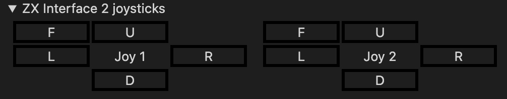
You can either click on the buttons to simulate the joysticks or attach a gamepad. The gamepad support is very limited. If e.g. xbox controllers do not work try simple USB controllers.
- "kempstonJoy": true/false. Defaults to false. If enabled the simulator shows a pad to simulate the Kempston joystick at port 0x1F.

- "customJoy": Is an object in which you can customize the ports and bits to use for each direction or button press of the joystick.
    ~~~json
    "customJoy": {
        "fire": {
            "portMask": string, // E.g. "0x00FF", optional, defaults to 0xFFFF
            "port": string,     // E.g. "0xDF", required
            "bit": string,      // E.g. "0x10", required
            "lowActive": boolean    // defaults to true
        },
        "fire2": { .... },
        "fire3": { .... },
        "up": { .... },
        "left": { .... },
        "right": { .... },
        "down": { .... }
    }
    ~~~
  all buttons /directions are optional. If defined you can set
    - the "portMask" and "port": The address is ANDed with "portMask" and afterwards checked for equality with "port". If equal the "bit is set.
    - "bit": The bit to return if the right port address is read. Is a bitmask. E.g. "0x10" would be the 4th bit (i.e. 0b0001_0000).
    - "lowActive": true for a low active bit. I.e. if the button is pressed the "bit" would become low, if not pressed it is high. Vice versa if "lowActive" is false.
  Here are a few examples:
  ~~~json
    "customJoy": {
        // Cursor joystick with 0 (fire)
        "left": {   // 5
            "port": "0xF7FE",
            "bit": "0x10"
        },
        "down": {   // 6
            "port": "0xEFFE",
            "bit": "0x10"
        },
        "up": {    // 7
            "port": "0xEFFE",
            "bit": "0x08"
        },
        "right": {  // 8
            "port": "0xEFFE",
            "bit": "0x04"
        },
        "fire": { // 0
            "port": "0xEFFE",
            "bit": "0x01"
        }
    }
    ~~~

    ~~~json
    "customJoy": {
        // ZX81: Battlestar Galactica
        "down": { // 6
            "portMask": "0x0801",
            "port": "0x00",
            "bit": "0x10"
        },
        "up": { // 7
            "portMask": "0x0801",
            "port": "0x00",
            "bit": "0x08"
        },
        "fire": { // 0
            "portMask": "0x0801",
            "port": "0x00",
            "bit": "0x01"
        },
        "fire2": { // 9
            "portMask": "0x0801",
            "port": "0x00",
            "bit": "0x02"
        }
    }
    ~~~

    ~~~json
    "customJoy": {
        // ZX81: Zebra Joystick
        "left": {
            "portMask": "0x00FF",
            "port": "0x1D",
            "bit": "0x04"
        },
        "down": {
            "portMask": "0x00FF",
            "port": "0x1D",
            "bit": "0x02"
        },
        "up": {
            "portMask": "0x00FF",
            "port": "0x1D",
            "bit": "0x01"
        },
        "right": {
            "portMask": "0x00FF",
            "port": "0x1D",
            "bit": "0x08"
        },
        "fire": {
            "portMask": "0x00FF",
            "port": "0x1D",
            "bit": "0x10"
        }
    }
    ~~~
- "visualMemory": If true the simulator shows the access to the memory (0-0xFFFF) visually while the program is running. Default is true.

- "memoryModel": The used memory model (defaults to "RAM"), i.e.
    - "RAM": One memory area of 64K RAM, no banks.
	- "ZX16K": ROM and RAM as of the ZX Spectrum 16K.
	- "ZX48K": ROM and RAM as of the ZX Spectrum 48K.
	- "ZX128K": Paged memory as of the ZX Spectrum 128K (16k slots/banks). Banks R0, R1, 0-7.
	- "ZXNEXT": Paged memory as of the ZX Next (8k slots/banks). Banks R0a, R0b, R1a, R1b, 0-223. R0a/b and R1a/b is R0 or R1 but sliced in 8k chunks.
    - "COLECOVISION": Memory map for the Coleco Vision (8k slots, no banking).
    - "CUSTOM": For a custom memory layout. See [customMemory](#custommemory).
- "ulaScreen": "spectrum" | "zx81". If enabled it shows the contents of the ZX Spectrum screen or that of a ZX81.

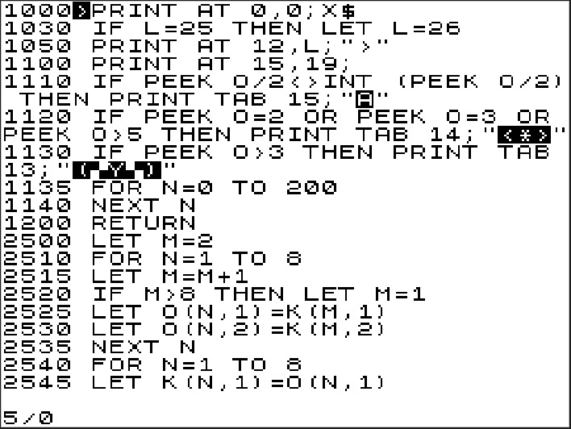
- "ulaOptions":
  ~~~json
  {
    "hires": true,
    "borderSize": 10,
    "screenArea": {
        "firstX": 54,
        "lastX": 330,
        "firstY": 46,
        "lastY": 258
    },
    "lines": [
        {
            "x1": 0,
            "x2": 1000,
            "y1": 55,
            "y2": 55,
            "color": "green"
        }
    ],
    "showStandardLines": true,
    "chroma81": {
        "available": true,
        "enabled": false,
        "mode": 0,
        "borderColor": 15,
        "colourizationFile": ""
    },
    "debug": false
  }
  ~~~
  The values:
    - "hires": If true the generation of the screen output by the cpu is simulated. This allows to display hires programs. If false the ZX81 dfile is converted directly into screen graphics. This can be an advantage when debugging a non-hires game.
    - "borderSize": Defaults to 10.
    - "screenArea": Similar to "borderSize" but more fine-grained control.
      Either use "borderSize" or "screenArea", not both.
    - "lines": Used to define lines that are drawn on the screen area for orientation.
    - "showStandardLines": Defaults to false. In some modes (e.g. zx81/hires) this shows some lines over the display for the borders or the start of the HSYNC pulse.
    - "debug": If true a gray background is shown for the screen areas without output. Makes a difference for collapsed dfiles, i.e. only for ZX81 with 1-2k memory. If "chroma81" is selected it also initialized the chroma81 RAM (0xC000-0xFFFF) to 2 colors. Otherwise you might not see anything if ink and paper color are equal.
    - "chroma81": Supports the chroma81 (see [Chroma 81 Interface](http://www.fruitcake.plus.com/Sinclair/ZX81/Chroma/ChromaInterface.htm)).
      - "available": Attach the chroma81. Now it can be enabled/disabled via port 0x7FEF.
      - "enabled": The initial state of the chroma81.
      - "mode": The initial color mode (0/1) of the chroma81.
      - "borderColor": The border color: 0-15 (like spectrum colors).
      - "colourizationFile": You can enter here the file path of your colourization file. You can get a lot of colourization files [here](http://www.fruitcake.plus.com/Sinclair/ZX81/Chroma/ChromaInterface_Software_ColourisationDefinitions.htm).
- "zx81LoadOverlay": true/false. Simulates loading from tape by loading from a file.
- "zxBorderWidth": The displayed border width in pixels. If set to 0 then no border is displayed. Works only for ulaScreen equal to "spectrum".
- "cpuLoad": The Z80 CPU load is calculated by the number of executed HALT tStates vs all tStates. You can disable the display with a 0. 1 will exactly count till the next occurrence of a HALT. Higher numbers will average over more HALT instructions and lead to a more stable display. Practical values are around 10 (the default).
  Additionally the simulation speed is indicated by the color. If the display turns to yellow the simulation speed is not fast enough to cope with the set cpuFrequency. (If you e.g. set a ZX81 or ZX Spectrum to 35Mhz the display will probably turn to yellow.)

- "defaultPortIn": The default value that is read if the read port is unused. Allowed is 255 or 0. 255 also sets the port as 'Open Collector', all triggered ports would be ANDed. Default to 0xFF.
- "zxBeeper": true/false. Defaults to false. If enabled the ZX Beeper audio output is simulated. The generated audio has a noticeable delay. The output is visualized with a "0" or "1":

If the output keeps changing you'll see this:

Don't expect high quality sound. This is not an emulation. The simulator speed is only very roughly synchronized with the host system's time. Therefore there will be lost frames or gaps.
Note also that audio is not available before you interact with the simulator view.
- "zxnDMA": true/false. Defaults to false. If enabled the zxnDMA is available at port $xx6B. All internal register can be viewed:
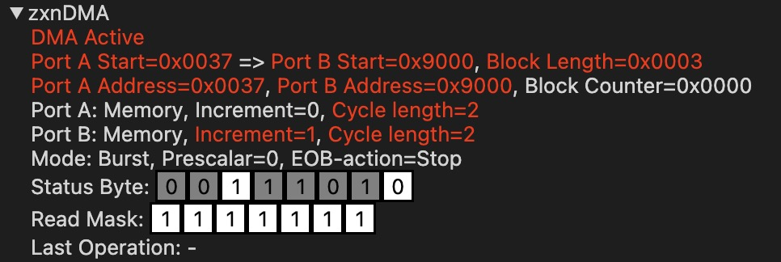
What just has been changed is highlighted in red.
At the bottom you can see the last DMA copy operation.
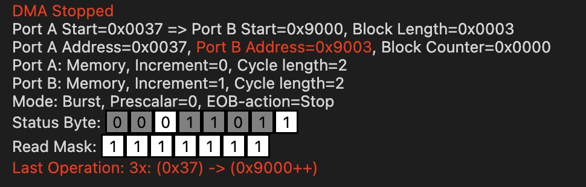
Notes:
    - when DMA is active it uses t-states. I.e. while CPU stepping the DMA operation is executed just before the next CPU instructions.
So, if you see a higher t-state number than expected it is probably because of a DMA activity in the background.
    - The zxnDMA supports all modes: continuous, burst and also the prescalar.
    - The DMA activity (setting of the registers) is additionally logged into the "OUTPUT" tab of vscode.
    You can activate it by selecting "DeZog zsim: Hardware".
- "cpuFrequency": The used CPU frequency. If "limitSpeed" is enabled (default) the simulation speed is throttled to simulate the correct frequency. The CPU frequency is also used printout of the correspondent time when t-states are printed.
- "limitSpeed": If enabled the simulated CPU performance is throttled to fit the given CPU frequency. Is enabled by default. If disabled the CPU will be simulated as fast as possible.
- "updateFrequency": The update frequency of the simulator view in Hz. Defaults to 10Hz. Possible range is 5 to 100 Hz.
- "customCode": This enables custom code to run inside the simulator, e.g. to simulate additional ports. See [zsimPeripherals.md](https://github.com/maziac/DeZog/blob/master/documentation/zsimPeripherals.md) for more details.
- "customMemory": see [customMemory](#custommemory)


#### customMemory

Only evaluated if 'memoryModel' is set to 'CUSTOM'. Chooses the banks and their memory types. E.g.

~~~json
	"customMemory": {
		"slots": [
			{
				"range": [ "0x0000", "0xBFFF"
				],
				"banks": [
					{
						"index": 0
					}
				]
			},
			{
				"name": "slotC000",
				"range": [
					"0xC000",
					"0xFFFF"
				],
				"banks": [
					{
						"index": [
							1,
							4
						],
                        "name": "RAM${index}",
                        "shortName": "R${index}"
					}
				],
                "initialBank": 3
			},
		],
		"ioMmu": [
			"if(portAddress == 0x100) {",
			"  bank = portValue;",
			"  slotC000 = bank;",
			"}"
		]
	}
~~~

- 'slots': An array with slots. A slot describes an address range for a bank.
If more than one bank is defined for a slot then the banks are switchable.
    - "name": An optional name for the slot.
    - "range": An array with 2 numbers or hex strings that define the start and the end address of the slot.
    - "banks": An array with 1 or more bank definitions.
        - "index": A single number to define one bank (with that index) or a range of start and end index to define a couple of banks.
        - "name": The name of the bank as seen in the "Memory Banks" section in the VARIABLE's pane.
        - "shortName": The short name of the bank. This is important for Reverse Engineering and used in disassemblies, i.e. in the disasm.list file, to distinguish addresses from different banks.
        If 'shortName' is omitted then the index number is used instead.
    - "initialBank": The bank that is seen at start of 'zsim'. If not given the first defined bank is used.
- "ioMmu": A string or an array of strings with javascript code. The code is evaluated on each OUT Z80 instruction and is to be used to switch banks. It is an optional property. In case your memory model does not require any bank switching you don't have to set it.
Whe the code is executed the variables 'portAddress' and 'portValue' are set with the values from the OUT instruction. E.g. for
~~~asm
    LD BC,0x1234
    ld A,0xEB
    OUT (C),A
~~~

'portAddress' would be 0x1234 and 'portValue' would be 0xEB.


Notes:
- Banks with same indexes could be used in different slots. 'name' and 'shortName' need to be defined only once.
- Address ranges without any bank association can be left unassigned.
- Please find example Z80 code with a custom memory configuration here: [z80-custom-memory-model-sample](https://github.com/maziac/z80-custom-memory-model-sample).


### ZEsarUX

The setup is slightly more complicated as it involves communication with another program: the [ZEsarUX] emulator.

~~~
┌───────────────┐              ┌─────────────────┐          ┌────────────────────┐
│               │              │                 │          │                    │
│               │              │                 │          │                    │
│               │              │                 │          │                    │
│    vscode     │              │      DeZog      │          │      ZEsarUX       │
│               │◀─────────────│                 │          │                    │
│               │              │                 │          │                    │
│               │              │                 │          │                    │
│               │              │                 │          └────────────────────┘
└───────────────┘              └─────────────────┘                     ▲
                                        ▲                              │
                                        │                              │
                               ┌────────▼──────────────────────────────▼─────────┐
                               │  ┌──────────┐                   ┌──────────┐    │
                               │  │  Socket  │◀─────────────────▶│  Socket  │    │
                               │  └──────────┘                   └──────────┘    │
                               │              macOS, Linux, Windows              │
                               └─────────────────────────────────────────────────┘
~~~

The remote type is "zrcp".
ZEsarUX needs to run before the debug session starts and needs to be connected via a socket interface (ZRCP).
You need to enable the ZRCP in ZEsarUX.
The preferred/easier way is to to enable the zrcp protocol by command-line ("--enable-remoteprotocol").
But you can also do it in the ZEsarUX UI ("Settings"->"Debug"->"Remote protocol" to "Enabled", you need to enable "Advanced menu items" under "Settings" to get to the "Debug" menu).
Please check that you have the "ZENG Online Server" disabled in ZEsarUX. It might interfere with the zrcp.

You need to enable ZEsarUX in your Z80 program's launch.json configuration, e.g.:
~~~json
    "remoteType": "zrcp",
    "zrcp": {
        "port": 10000
    }
~~~

The "zrcp" configuration allows the following additional parameters:
- "port": The ZEsarUX port. If not changed in ZEsarUX this defaults to 10000.
- "hostname": The host's name. I.e. the IP of the machine that is running ZEsarUX. If you are not doing any remote debugging this is typically "localhost". Note: Real remote debugging (emulator running on another PC) does work, but requires a mechanism to copy the .sna/nex file to the remote computer (for ZEsarUX just the filename is passed through zrcp, ZEsarUX reads the file from the local PC).
You don't have to enter a hostname, the default is "localhost".
- skipInterrupt: Is passed to ZEsarUX at the start of the debug session. If true (default is false) ZEsarUX does not break in interrupts (on manual break).
- "loadDelay": Some people encounter a crash (rainbow/kernel panic) of ZEsarUX at the start of a debug session when running under Windows. If that is true for you as well you can experiment with the "loadDelay" option which adds an additional delay at startup. This mitigates the problem.
The default for Windows is 100 (ms). If you run into this problem you can try to increase the value to 400 or even 1000. (You can also try smaller values than 100).


Notes:
- If ZEsarUX is used with the --tbblue-fast-boot-mode loading of tap files won't work.
- Important: Make sure that there is no UI window open in ZEsarUX when you try to connect it from vscode.
Sometimes it works but sometimes ZEsarUX will not connect.
You might get an error like "ZEsarUX did not communicate!" in vscode.
- If the DeZog functionality is not sufficient for you, you also have have full access to the ZEsarUX ZRCP through vscode's debug console.
Enter "-help" in the debug console to see all available commands.
Enter e.g. "-e h 0 100" to get a hexdump from address 0 to 99.


### Useful ZEsarUX command-line options

To ease the usage of ZEsarUX with DeZog you can use several ZEsarUX command line options.
I have collected a few that I found useful:

```bash
## Try this if the ZEsarUX screen is not updated during debugging.
./zesarux --disable-autoframeskip &
```

```bash
## Start a "normal" ZX Spectrum (48k) and listen for connection from DeZog.
./zesarux --enable-remoteprotocol &
```

```bash
## Start in ZX Next configuration. ZEsarUX skips the booting and emulates the esxdos rst routines.
## The file system is mounted via "--esxdos-root-dir".
## With this configuration ZX Next programs can be very easily developed and debugged.
## The Z80 program is passes as SNA file. "--sna-no-change-machine" disables the ZEsarUX automatic change to a 48k Spectrum machine.
##./zesarux --noconfigfile --machine tbblue --realvideo --enabletimexvideo --tbblue-fast-boot-mode --sna-no-change-machine --enable-esxdos-handler --esxdos-root-dir "\<path-to-your-z0-programs-dir\>" --enable-remoteprotocol &
```

```bash
## ZX Next: Start from MMC.
## To change an mmc file (e.g. on Mac) take the original tbblue.mmc, change the extension
## to .iso (tbblue.iso). Mount the iso image. Add your files. Unmount the image.
## Rename back to .mmc (optional).
./zesarux --machine tbblue --sna-no-change-machine --enable-mmc --enable-divmmc-ports --mmc-file "<your-mmc-image>"  --enable-remoteprotocol &
```

Please note: Normally you can set the commandline option also directly in the ZEsarUX Settings GUI.


### CSpect

For this setup you need 2 additional programs: the [CSpect] emulator and the DeZog/CSpect Plugin.

~~~
┌───────────────┐              ┌─────────────────┐          ┌────────────────────┐
│               │              │                 │          │                    │
│               │              │                 │          │       CSpect       │
│               │              │                 │          │                    │
│    vscode     │              │      DeZog      │          │                    │
│               │◀────────────▶│                 │          └────────────────────┘
│               │              │                 │                     ▲
│               │              │                 │                     │
│               │              │                 │                     ▼
└───────────────┘              └─────────────────┘          ┌────────────────────┐
                                        ▲                   │    DeZog Plugin    │
                                        │                   └────────────────────┘
                                        │                              ▲
                                        │                              │
                               ┌────────▼──────────────────────────────▼─────────┐
                               │  ┌──────────┐                   ┌──────────┐    │
                               │  │  Socket  │◀─────────────────▶│  Socket  │    │
                               │  └──────────┘                   └──────────┘    │
                               │              macOS, Linux, Windows              │
                               └─────────────────────────────────────────────────┘
~~~


The remote type is "cspect".
CSpect needs to run before the debug session starts and needs to be connected via a socket interface ([DZRP]).
CSpect nowadays includes the DeZog plugin, i.e. it comes with CSpect. The sources can be found [here](https://github.com/mikedailly/CSpectPlugins/tree/main/DeZogPlugin).


You need to enable CSpect in your Z80 program's launch.json configuration, e.g.:
~~~json
    "remoteType": "cspect",
~~~

That should normally do.
The default port is 11000. Only if you need to change that you would have to configure it in launch.json with:
~~~json
    "remoteType": "cspect",
    "cspect": {
        "port": 11000
    }
~~~

The "cspect" configuration allows the following additional parameters:
- "port": The CSpect DeZog plugin port. If not changed  this defaults to 11000.
- "hostname": The host's name. I.e. the IP of the machine that is running CSpect. If you are not doing any remote debugging this is typically "localhost" which is also the default. I.e. normally you don't have to enter a "hostname".


#### Command line

To run CSpect under macOS or Linux you need to install Mono first.
Here is a commandline to start CSpect that works best for me:
~~~
mono CSpect.exe -w4 -zxnext -mmc=./ -exit -brk -tv -r -v -debug
~~~

Note: For Windows you can remove the call to 'mono' simply.

A few explanations:
- with "-mmc=./" the CSpect/ZXNext will use the current dir as the "root" dir. You can also give any other path here but note that it is important to keep the "/" at the end.
- You can either use forward (/) or backslashes (\\), on Windows, in the mmc path. Even on Windows you can use forward slashes.
- If you quote the path (e.g. because it contains spaces) AND you are using backslashes then you have to use double backslashes (\\\\).
- "-debug": Starts up with the debugger on. I.e. CSpect does not start to run before told to. (But this is more a matter of taste.)
- "-zxnext": Is important to enable the ZXNext HW.
- "-nextrom": It's easier not to enable this. If not included the CSpect will simulate the esxdos calls. Enabling and using an img file seem to result in problems sometimes most probably because not everything is initialized correctly always.
- "-remote": Is not really required. It hides the CSpect's debugger display.


### ZX Next / Serial Interface

#### Overview

The serial interface is the most complex setup as it requires communication with a real [ZX Spectrum Next] (HW):

~~~
                                                       ┌──────────────────────────┐
┌───────────────┐     ┌─────────────────┐              │         ZX Next          │
│               │     │                 │              │ ┌──────────────────────┐ │
│               │     │                 │              │ │   Debugged Program   │ │
│               │     │                 │              │ └──────────▲───────────┘ │
│    vscode     │     │      DeZog      │              │            │             │
│               │◀───▶│                 │              │ ┌──────────▼───────────┐ │
│               │     │                 │              │ │       dezogif        │ │
│               │     │                 │              │ │          SW          │ │
│               │     │                 │              │ └──────────▲───────────┘ │
└───────────────┘     └─────────────────┘              │            │             │
                               ▲                       │          ┌─▼──┐          │
                               │                       │          │UART│          │
                               │                       │          │HW  │          │
                               │                       └──────────┴────┴──────────┘
                      ┌────────▼───────────────────┐                ▲
                      │ ┌──────────────┐           │                │
                      │ │    Serial    │           ├────┐           ▼
                      │ │COM, /dev/tty │◀─────────▶│UART│     ┌──────────┐
                      │ └──────────────┘           │HW  │◀───▶│  Cable   │
                      │   macOS, Linux, Windows    ├────┘     └──────────┘
                      └────────────────────────────┘
~~~

Since version 2.6.0 DeZog can directly talk to the USB/UART interface of your OS.

The serial interface needs to be connected to the UART of a [ZX Spectrum Next].

Here is an example launch.json configuration for macOS:
~~~json
    "remoteType": "zxnext",
    "zxnext": {
        "serial": "/dev/tty.usbserial-AQ"
    }
~~~

Or for Windows:
~~~json
    "remoteType": "zxnext",
    "zxnext": {
        "serial": "COM8"
    }
~~~

For convenience a palette command exists that lists the connected serial ports:
Press F1 and then enter "DeZog: Get list of all available serial ports".
With the buttons you can directly copy the interface name to the clipboard.

If you encounter problems with the connection you can try to increase the timeout value.
The value is given in seconds and the default is 5.
E.g.
~~~json
    "zxnext": {
        "serial": "COM8",
        "timeout": 8
    }
~~~

#### Setup

Prerequisites:
- Install core 03.02.00 (or core 03.01.10) on the ZX Next. (03.01.05 is not supported by DeZog anymore.)
- You need an USB/Serial converter and a D-Sub female connector (9 pins). See next chapter on HW.

Test the serial connection:
1. In your ZX Next SD card exchange the ```enNextMf.rom``` in directory ```machines/next``` with the one from the [dezogif] project. You find the ```enNextMf.rom``` binary in the [releases](https://github.com/maziac/dezogif/tree/main/releases) section. You need to download the ```enNextMf.rom```, at least version 2.2.1. This supports Core 03.01.10 and Core 03.02.00. Core 03.01.05 is not supported anymore.
(Don't forget to make a backup of the original ```enNextMf.rom```.)
2. Connect your PC/Mac with the ZX Next via a serial cable. On the ZX Next use the joystick ports for the UART connection (preferable Joy 2).
3. On the ZX Next press the yellow NMI button once to initialize the debugger on the ZX Next.

(If you later need to re-initialize press "Symbol Shift", or CTRL on a PS2 keyboard, and while being pressed hit the yellow NMI button.)
4. In vscode open the palette and select "DeZog: Test communication through a serial port". Then select the right COM port.
6. Now a loopback test is started: vscode sends packets to the ZX Next and the ZX Next returns them to vscode. The test lasts a few seconds. On success you get an info message like this:
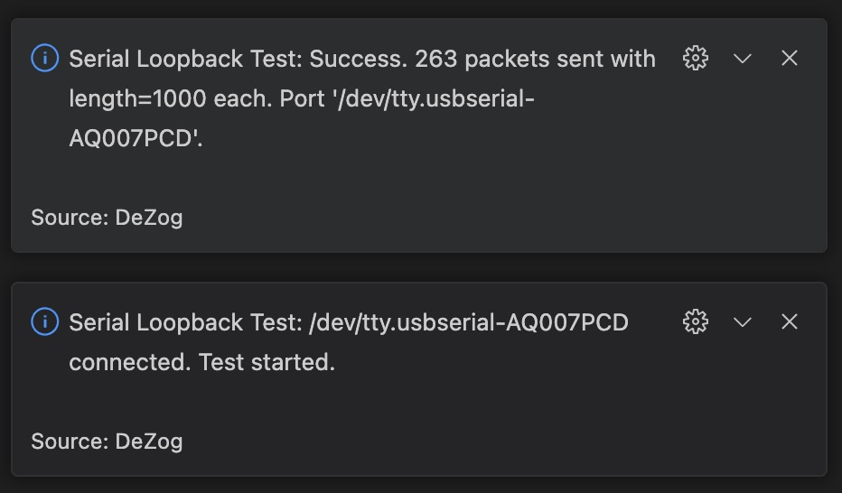
Otherwise a failure note.


Setup a debug session:
1. Follow steps 1-3 in "Test the serial connection"
2. Add a configuration as shown in [Overview](#overview) to your launch.json (For an example look at the [z80-sample-program]).
3. In vscode start the debug session.
4. Step through your code.

You should see that the debugged program is transmitted to the ZX Next: the border colors change similar as when you would load a program from tape.


Please use the [z80-sample-program] for your first tries. It already contains a working "ZXNext" launch.json configuration.
You just need to change the "serial" property.

You can now step through your code and set breakpoints.
The debugger will stop at a breakpoint.

Note: If one of the 2 joystick ports is used to connect the UART it is still possible to use the other joy port for a joystick and even a MD joystick would work fine.

#### Pausing the Debugged Program

While the debugged program is running there is no communication between DeZog and the ZX Next.
I.e. it is also not possible to pause the program through the serial cable.
For pausing your program you need to press the yellow M1 button at the left side of your ZX Next.


#### HW

**Disclaimer**

**As you will probably have to construct your own cable which involves HW, there is always a small risk that you damage your ZX Next or your PC/Mac.
You should only try to do this yourself if you already have experience with electronics and at least basically know what you are doing.**

**IN NO EVENT SHALL THE AUTHOR BE LIABLE FOR ANY SPECIAL, DIRECT, INDIRECT, OR CONSEQUENTIAL DAMAGES OR ANY DAMAGES WHATSOEVER RESULTING FROM THE USE OF THE HW, SW OR ANYTHING ELSE PRESENTED HERE.**

You require a USB/Serial converter like this [one](https://www.amazon.com/Serial-Adapter-Female-FT232RL-Windows/dp/B07R45QJVR/ref=sr_1_1_sspa?__mk_de_DE=ÅMÅŽÕÑ&dchild=1&keywords=Serial+UART-Konverterkabel+USB+TTL+3.3+V&qid=1595515176&sr=8-1-spons&psc=1&spLa=ZW5jcnlwdGVkUXVhbGlmaWVyPUEyR1M0VFUzR0tGVkgmZW5jcnlwdGVkSWQ9QTA0Mzk4NDYzVUkySkE0S0ZGS0MwJmVuY3J5cHRlZEFkSWQ9QTA3NzU0NDQzRU85R05FQkJMMEFSJndpZGdldE5hbWU9c3BfYXRmJmFjdGlvbj1jbGlja1JlZGlyZWN0JmRvTm90TG9nQ2xpY2s9dHJ1ZQ==):


It needs to be capable of 921600 Baud.

(Note: I also used a cable from Adafruit. It's working as well. It was faster for small packets but I had to disconnect it physically from my mac more often to get it back working.)

On the other side only 3 wires are required:

- GND
- TX (TXD)
- RX (RXD)

These wires have to be connected to the UART.

Easiest way, without opening the ZX Next case, is to use one of the joy ports of the ZX Next.

You need to attach a female D-SUB 9 connector to your serial cable:


You need to connect:
| Serial cable | connected to |   D-Sub 9    |
| :----------: | :----------: | :----------: |
|     GND      |     <->      | 8 (Next GND) |
|      RX      |     <->      | 7 (Next Tx)  |
|      TX      |     <->      | 9 (Next Rx)  |

Note: You connect the serial cable's Tx to the Next's Rx and the Rx with the Tx.


Alternatively, if you need to use both joysticks while debugging you directly connect the ESP UART:


You need to connect:
| Serial cable | connected to |    CN9     |
| :----------: | :----------: | :--------: |
|     GND      |     <->      |  4 (GND)   |
|      RX      |     <->      | 1 (ESP RX) |
|      TX      |     <->      | 5 (ESP_TX) |

You can solder it directly or use the socket that is already available on the board:


#### Caveats

##### Joystick ports

As the joystick ports are shared by the joysticks and by the UART/serial cable the communication with DeZog can happen only when the debugged program is being paused.
E.g. you can't set a breakpoint while your program is running. You need to pause it first, set a new breakpoint and then continue the program.


##### Memory banks

The dezogif program on the ZX Next needs some space. It uses the MF ROM/RAM and bank 94.
For your program it means you mustn't use bank 94 otherwise DeZog will not work.


##### Stack

A) This is more a note: If you watch the stack while stepping you can see that some values below the SP are changing on each step. This is additional info (e.g. for breakpoint addresses) used by DeZog. The values are below SP so they should not harm normal program operation.

B) Performance: If you have a large stack or a **wrong topOfStack** setting in the launch.json stepping might become sluggish. This is because DeZog does a lot of analysis on the stack, e.g. it reads not only the stack but also memory that a stack entry points to. If the topOfStack is wrong many false reading is done after each step which slows down the system.


##### SW Breakpoints

A) For SW breakpoints internally the instruction is replaced with a RST instruction. I.e. when a breakpoint is hit the PC is placed on the stack.
Thus, if a breakpoint is placed at a location where the SP has been manipulated the stack is corrupted when the breakpoint is hit.
~~~assembly
		push bc
		inc sp
BP->	inc sp
BP->	do something
BP->	...
BP->	...
BP->	dec sp
BP->	dec sp
	pop bc
~~~
Placing a BP at any of the above location will destroy the pushed BC value if the BP is hit.

Workaround: Don't place a breakpoint at these locations.

Furthermore the debugger program requires 8 bytes on the debugged program's stack.

So take care to use a stack that can hold these additional bytes at any time.

B) Memory Paging
The ZX Next SW Breakpoints do not work very well with memory paging.
If you place a breakpoint in your source file the address for the source file line is taken and a breakpoint is put at that address.
If at this moment a bank is paged in that does not correspondent to the source file a breakpoint is placed in the wrong bank.
As for the ZX Next a breakpoint means to change the code at the address it means that the code/data in the wrong bank is changed.
This could either
- be at instruction start by accident with no further consequences
- destroying instructions if placed in the middle of a multi-byte instructions
- corrupt some data

Therefore you need to place the breakpoints carefully if you are placing them in an area that is shared between different memory banks.

Furthermore you should note that all breakpoints are put in just before a debugger step or continue and removed afterwards.
I.e. if you have a "stale" breakpoint in some file it could make problems if this location changes the used bank.


C) As SW breakpoints replace the code at the breakpoint address you cannot place any SW breakpoint inside ROM code.


D) You cannot set a breakpoint while the debugged program is running. This is because no communication between deZog and the debugged program takes place while it is running.
To set a breakpoint first pause your program by pressing the yellow NMI button. Then set the breakpoint and continue.


##### Layer 2

DeZog can work with "Layer 2 write-only paging", i.e. bit 0 of port 0x123B being set.
For bit 2, "read-only paging" it is different as DeZog needs a few bytes in the area 0x0000-0x1FFF for execution, i.e. for breakpoints and stepping. If "read-only paging" is enabled this area is blocked for DeZog.
If you e.g. try to step when "read-only paging" is enabled then the system will crash.
However, you can still use "read-only paging" in your program, you just shouldn't put a breakpoint somewhere where it is enabled or step in such code.


##### NMI

Note: The dezogif (enNextMf.rom) uses core 03.01.10 which supports the "stackless NMI".
I.e. interrupting the debugged program (by pressing the yellow NMI button) cannot corrupt the stack of the debugged program.


### MAME - Multiple Machine Arcade Emulator

MAME implements a gdbstub that can be accessed from DeZog via a socket.
Therefore it is necessary to start MAME (v0.242) with e.g. these options:
~~~bash
./mame pacman -window -debugger gdbstub -debug -debugger_port 12000
~~~

MAME will start waiting on a connection.
The launch.json for DeZog is:
~~~json
    "remoteType": "mame",
    "mame": {
        "port": 12000
    }
~~~

~~~
┌───────────────┐              ┌─────────────────┐          ┌────────────────────┐
│               │              │                 │          │                    │
│               │              │                 │          │                    │
│               │              │                 │          │                    │
│    vscode     │              │      DeZog      │          │        MAME        │
│               │◀─────────────│                 │          │                    │
│               │              │                 │          │                    │
│               │              │                 │          │                    │
│               │              │                 │          └────────────────────┘
└───────────────┘              └─────────────────┘                     ▲
                                        ▲                              │
                                        │                              │
                               ┌────────▼──────────────────────────────▼─────────┐
                               │  ┌──────────┐                   ┌──────────┐    │
                               │  │  Socket  │◀─────────────────▶│  Socket  │    │
                               │  └──────────┘                   └──────────┘    │
                               │              macOS, Linux, Windows              │
                               └─────────────────────────────────────────────────┘
~~~

MAME (as of version 0.242) does only support 1 connection. A 2nd connection attempt is refused.
This does not mean concurrent connection, it means: only 1 connection per session.
Therefore MAME needs to be terminated after each debug session.
DeZog sends MAME a kill command when the session is terminated.
The best debug experience at the moment is to re-start MAME in a loop, e.g. on linux/macOS use:
~~~bash
while true; do ./mame pacman -window -debugger gdbstub -debug -debugger_port 12000 -verbose ; sleep 2 ; done
~~~


If you use MAME for reverse engineering you would normally load the program together with starting mame MAME. I.e. it is not transmitted by DeZog into MAME.

But you could also use "loadObjs" or even "load" (for ZX 48K Spectrum files) if the target program area is RAM (and not ROM).

Please also see [Reverse Engineering with DeZog](https://github.com/maziac/DeZog/blob/master/documentation/ReverseEngineeringUsage.md).


#### Memory Banks / Paging

At the moment the MAME gdbstub does not deliver any information about the used memory banks.
I.e. as soon as there is a memory area that is shared between 2 or more banks DeZog cannot distinguish the addresses anymore.
You would see once the disassembly of bank X and, when it is switched, the disassembly of bank Y for the same addresses.

So, meaningful reverse engineering with MAME will work only for systems without memory banks / paging.


## Usage

If you use any Remote other than the internal Simulator please make sure that it is started before you start the debug session with DeZog.

Now start DeZog by pressing the green arrow in the debug pane.

DeZog will now

- connect to the remote (e.g. open the socket connection to ZEsarUX)
- instruct the Remote (e.g. ZEsarUX) to load the nex, snapshot file or tap file
- set breakpoints (if there are breakpoints set in vscode)
- stop/break the just started assembler program

DeZog/vscode will now display the current PC (program counter) with a yellow arrow in the left side of your .asm file.
Left to that you see the VARIABLES section and the
call stack in the CALL STACK section.

You can now try the following:

- hover over registers in your source code -> should display the value of the register
- step-over, step-in etc.
- click in the call stack -> will navigate you directly to the file
- set breakpoints, press continue to run to the breakpoints


### Registers

You can view and change registers in the VARIABLES panel.
The registers are normally shown with their values in hex and decimal. If a label is equal to a register contents the label is shown as well.
You can change a register value by double clicking it, entering the number and pressing 'enter'.

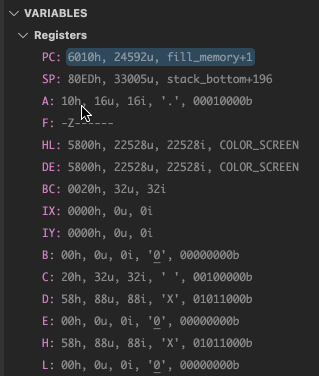


### Reverse Debugging

A special feature of DeZog is the possibility to reverse debug your program.
(Sometimes this is referred to as "[Time travel debugging](https://en.wikipedia.org/wiki/Time_travel_debugging)", "Historical debugging" or "Replay debugger".)
This means you can go "back in time" and inspect program flow and register values from the past.

The number of instructions you can step back is configurable and just a matter of memory.
E.g. one instruction line will occupy ca. 40 bytes of memory. So to store 1 second you need approx. 1 million instructions with a Z80 CPU that uses 4Mhz. This results in about 40MB.
Or in other words: if you would like to spend 1GB RAM you could store 25 secs.

The number of instructions is set in
~~~json
"history": {
    "reverseDebugInstructionCount": 20000,
}
~~~
The default is set to 10000 instructions and should be more than enough for most use cases. (Use 0 to disable.)

Reverse debugging is basically done via the 2 red circled buttons in vscode:


The first does a single step back (one instruction) and the 2nd runs through the whole recorded history until it hits a breakpoint or until the end of the history is reached.

When you step back the lines in the source code are visually marked with a slight gray background so you know that you are in reverse debugging mode:


When you are in reverse debugging mode and do a forward continue/step-over/step-into/step-out the commands operate on the instruction history.
I.e. you can step back and forward in the code as you like.
Registers and the callstack are updated accordingly.

But please note: The history stores only the register values and stack contents. I.e. the memory or other HW state is not stored.
So whenever a memory location is changed from the program code in reverse debugging this will not be reflected in e.g. the memory view.
You can only rely on the register values, though.


#### History Spot

You can enable/disable a history spot around the current PC:
~~~json
"history": {
    "spotCount": 10
}
~~~

If enabled (!= 0) you see the historic indices of the instructions. E.g. here:


The indices are shown in brackets to the right.
The PC is currently in line 32.
The previous executed instruction is at index -1. Before at line 30 is index -2.

With the *History Spot* you can see what has just happened before without having to back step.

After the ":" you can see register values of changed registers. The displayed value is the register(s) that have been changed after the instruction was executed.
Some explanations:
- line 25: SP is shown because it was changed from the previous line which called the function (not shown here).
- line 26: No register value has changed
- line 27: In previous instruction register e has been loaded from l. But because e and l were already equal no value was changed. Therefore no register is displayed.
- line 28: In previous line register D was changed.
- line 29: In previous line register DE was incremented.
- line 30: In previous line register BC was decremented.
- line 31: In previous line LDIR has been executed. This is a block command. I.e. several registers are changed at once. After LDIR has been executed BC is 0 and you see the last values of DE and HL.

In case a line/instruction has been executed more than once you will find several indices in the brackets. E.g.:


When you step back you can also see the next instructions i.e. where you came from.
If 'spotCount' is e.g. 10 you see a maximum of 10 previous and next indices.

Note: Changed registers are not shown for the first line of the spot.

Display of changed registers is enabled by default. You can turn it off by setting 'spotShowRegisters' to false:
~~~json
"history": {
    "spotCount": 10,
    "spotShowRegisters": false
}
~~~

Here is an animated gif to illustrate the history spot behavior while stepping (with register display turned on):


#### Breakpoints etc. in Reverse Debug Mode

You can also use breakpoints during reverse debugging.
The normal (program counter related) breakpoints work just as you would expect.

It is also possible to add a condition. I.e. you can additionally test for certain register values.

But please note that during reverse debugging the memory contents is not evaluated. A breakpoint that checks for memory is not evaluated correctly. In such a case the breakpoint will fire always.
E.g. a condition like this
~~~
b@(HL) == 0
~~~
will be evaluated to true always so that you don't miss such a breakpoint.


Logpoints (LOGPOINT), watchpoints (WPMEM) and ASSERTIONs are not evaluated during reverse debugging.


### Code Coverage

Code coverage can be enabled/disabled via:
~~~json
"history": {
    "codeCoverageEnabled": true
}
~~~

The default is 'true'.

If code coverage is enabled all executed lines in your source code are visually marked with a green background.


You can use the code coverage feature in several ways. E.g. in unit tests you can directly see which lines of code are not covered. I.e. for which conditions you still need to write a test.
Or during debugging you can clear the code coverage (palette command "dezog: Clear current code coverage decoration") and then step over a function (a CALL). Afterwards you can navigate into the function and see what has been executed and which branches have not.


### Stop Debugging

To stop debugging press the orange square button in vscode. This will stop DeZog and disconnect from ZEsarUX.
After disconnecting ZEsarUX, ZEsarUX will also leave cpu-step mode and therefore continue running the program.


### WPMEM

WPMEM offers a way to put watch points persistently into your sources.

WPMEM is put into a comment in your assembler source files. As the comments also appear in the .list file these comments will be parsed when the .list file is read.

Here are some examples how this looks like in code:

~~~assembly
fill_colors:    ; WPMEM, 5, w
    defb RED, YELLOW, BLUE, GREEN, MAGENTA
fill_colors_end:
~~~
~~~assembly
; WPMEM 0x0000, 0x4000
~~~
~~~assembly
; WPMEM fill_colors, 5, r
~~~

Syntax:

~~~
WPMEM [addr [, length [, access]]]
~~~
with:
- addr = address (or label) to observe (optional). Defaults to current address.
- length = the count of bytes to observe (optional). Default = 1.
- access = Read/write access (optional). Possible values: r, w or rw. Defaults to rw.

I.e. if you omit all values a watch-point will be created for the current address.
E.g. in the first example a watchpoint is created that checks that the array (fill_colors) is not overwritten with something else.

The most often used form of WPMEM is to put a WPMEM simply after an byte area that is used for reading/writing. E.g. like this:

~~~assembly
scratch_area:
    defs 10
    defb 1      ; WPMEM
~~~
In this example it is assumed that your algorithm uses the 'scratch_area' to write some data. You defined that this area is 10 bytes in size. Thus if someone would write after
these 10 bytes it would mean that the algorithm is wrong.
Please note that we waste 1 byte (defb 1) for this safety check. This byte is not to be used by any pointer in our program. So writing/reading to it is a failure and the program will break if this happens.

Another useful scenario is to secure the stack for over- or underrun:

~~~assembly
; Reserve stack space
stack_bottom:
    defw    0   ; WPMEM, 2
    defs    50*2, 0
stack_top:
    defw 0  ; WPMEM, 2
~~~
This will observe 2 addresses at the bottom and 2 addresses at the top.

In the vscode UI WPMEM breakpoints can be turned on or off alltogether in the breakpoints pane:
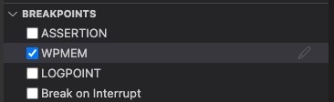

Caveats:
- Other than for sjasmplus WPMEMs are evaluated also in not assembled areas in the list file, e.g. in case the surrounding IF/ENDIF is not valid.
- The 'memory breakpoints' used in ZEsarUX have 2 specific limitations:
    - Imagine you have set a watchpoint WPMEM at address 4000h.
If a byte is written to 4000h, e.g. with "LD (4000h),A" the break will occur, no problem.
But if a word (i.e. 2 bytes) is written to 4000h like in "LD (4000h),HL" the lower address is not checked. I.e. a break will not happen. Only the upper address is checked. If the word would be written to 3FFFh e.g. with "LD (3FFFh),HL" then a break would happen. So make sure to always cover the whole memory area with WPMEM (for a word e.g. "WPMEM,2") and not only the first (lower) address.
    - You need to make sure that the debug settings for the memory breakpoints are set to "Settings->Debug->Breakp. behavior" to "On Change". Otherwise a break will be done on every instructions following the memory access until another different memory access happens.
    But even if set to "On Change" it's problematic. If afterwards another access to the same address happens no break will occur.

Notes:
- (sjasmplus) If you use label names make sure to use the global name (i.e. full dot notation).
- If no 'addr' is given but the current address is used the long address (i.e. with bank info) is used.
If 'addr' is given the 64k address is used.
- WPMEM is not available in CSpect.


### ASSERTION

Similar to WPMEM you can use ASSERTIONs in comments in the assembler sources.
An ASSERTION is translated by DeZog into a breakpoints with an "inverted" condition.
For all ASSERTIONs in your source code DeZog can set the correspondent breakpoints automatically at startup.

The ASSERTION syntax is:

~~~
; [.*] ASSERTION expr [;.*]
~~~
'expr' is just like the expressions in [breakpoints](#vscode-breakpoint).

Examples:
~~~
; ASSERTION HL <= LBL_END+2
ld a,b  ; Check that index is not too big ASSERTION B < (MAX_COUNT+1)/2
ld de,hl    ; ASSERTION A < 5 && hl != 0 ; Check that pointer is alright
~~~

As an ASSERTION converts to a breakpoint it is always evaluated **before** the instruction.
I.e. the following check will most probably not work as expected.

~~~
ld a,c  ; ASSERTION a < 7
~~~
A is not loaded yet when the ASSERTION is checked. So use

~~~
ld a,c
; ASSERTION a < 7
~~~
instead: The ASSERTION is on the next line i.e. at the address after the "LD" instruction and thus A is checked correctly.

In the vscode UI ASSERTION breakpoints can be turned on or off alltogether in the breakpoints pane:
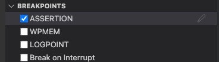


Notes:
- ASSERTION is not available in ZEsarUX.
- you can use "ASSERTION" only, which evaluates to "ASSERTION false". I.e. this is equivalent to an unconditional break.
- The assertions are checked in the list file. I.e. whenever you change an ASSERTION it is not immediately used. You have to assemble a new list file and start the debugger anew.
- Other than for sjasmplus ASSERTIONs are evaluated also in not assembled areas, e.g. in case the surrounding IF/ENDIF is not valid.
- As a special form you can also define an ASSERTION without any condition. This will act as a breakpoint that will always be hit when the program counter reaches the instruction.
- sjasmplus: If you use label names make sure to use the global name (i.e. full dot notation).


### LOGPOINT

Another special keyword is LOGPOINT in comments in the assembler sources.
A LOGPOINT is translated by DeZog into a breakpoint that does not stop execution but instead prints a log message.

The LOGPOINT syntax is:

~~~
; LOGPOINT [group] text ${expression[:format]}
~~~
with:

- [group]: (Note: the [ ] are meant literally here) The log group. Separate log groups might be turned on/off separately. E.g. "[SPRITES]". If omitted "DEFAULT" is used as group.
- expression: a mathematical expression, e.g. 2*7. It can contain special values like:
  - register names, e.g. A, BC, HL, IX, H, IXL, AF'
  - labels
  - memory accessors: b@(...) and w@(...) to obtain a byte or a word at the memory position
- optional formatting: 'string', 'hex8', 'hex16', 'int8', 'int16', 'uint8', 'uint16', 'bits'
- examples:
    - ```LOGPOINT [SPRITES] Status=${A:hex8}, Counter=${b@(sprite.counter)}```
    - ```LOGPOINT Status=${w@(HL)}, ${DE}, ${b@(DE+1)}```

In the vscode UI LOGPOINT breakpoints can be turned on or off altogether in the breakpoints pane:
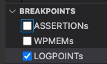

As LOGPOINTs are organized in groups you can turn on also only specific LOGPOINT groups.
This is done by editing the LOGPOINTs in vscode (i.e. press the small pencil right to the 'LOGPOINTs' text). You have to pass a space separated list of the groups you want to enable.
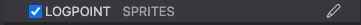
If no group is given always all groups will be enabled (disabled).


Notes:
- The LOGPOINTs are checked in the list file. I.e. whenever you change a LOGPOINT it is not immediately used. You have to assemble a new list file and start the debugger anew.
- LOGPOINTs are not available in ZEsarUX.
- sjasmplus: If you use label names make sure to use the global name (i.e. full dot notation).
- You can also create temporary logpoints in vscode's UI: where you would normally create a breakpoint by a mouse-click in the assembly file do a right-click instead and choose "Add logpoint...". Now enter the logpoint text as explained above.

### Break on Interrupt

When enabling 'Break on Interrupt'
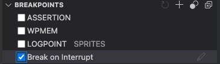
the debugger will stop when an interrupt is executed.

This allows to easily find the interrupt routine in case you are doing reverse debugging.
If you have the sources / know the interrupt address already you could as well put a normal breakpoint in the interrupt routine.

Note: This feature is only available with the internal simulator 'zsim'.


### vscode breakpoint

You simply set a breakpoint by clicking left to the line where you want the breakpoint to be.
A red dot indicates the presence of a breakpoint.

Breakpoints can be set only per line. I.e. it is not possible to have multiple breakpoints in one line.


__Breakpoint conditions:__

Along with breakpoints you can also use breakpoint conditions. The breakpoint condition is checked additionally whenever a breakpoint is fired at a certain address.
Only if also the breakpoint condition is met the program execution will stop.

Breakpoint conditions can be any valid expression including labels, registers and parenthesis.
Examples:
~~~
BC==0x12FA
DE==HL+1
(A&7Fh) >= 10
D==5 || B==0 && C==1
B >= (MAX_COUNT+1)/2
b@(mylabel) == 50
w@(mylabel) == 0x34BC
b@(mylabel+5) == 50
b@(mylabel+A) == 50
b@(HL) > 10
~~~

Note 1: "&&" has higher priority than "||".

Note 2: Brackets, "()", are used only for prioritization of the expression. To read the contents of an address use "b@(...)" or "w@(...)". "b@(address)" and "w@(address)" return the byte and word contents at 'address'

Note 3: Some of the operators (like "!=", "||" or "b@(...)" are converted to the ZEsarUX format style (i.e. "=", "OR", "peek(...)") but you can also use the ZEsarUX style directly.


__Breakpoints in interrupts:__

You can also set breakpoints in interrupts.

But when you also set the launch.json option "skipInterrupt" to true you will feel that the behavior is somewhat strange for ZEsarUX:
If the breakpoint is hit the program will stop, but because of "skipInterrupt" it will stop after the interrupt finished.

Although the behavior is correct it looks like the program is randomly stopping.


### vscode logpoints

You can set vscode logpoints on the fly during debugging with the vscode logpoint feature.

The log message that you enter will appear in the "Debug Console" if the logpoint is hit.
You can also use variables similar to the description in chapter [LOGPOINT].
E.g. use "Counter=${(sprite.counter)}" as a log message.

Here an example:
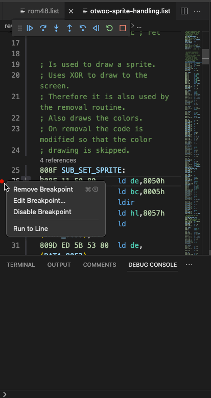

Note: logpoints are not available in ZEsarUX.


### Stack

A thing that might confuse traditional assembler programmers is the way how DeZog handles the stack.
Dezog does not show a combined stack with all subroutine return values and all pushed values. Instead it shows a "Local Stack" in the "VARIABLES" section and a call stack in "Call Stack" section.
It works more how the stack is used in a higher level language, e.g. C.
I.e. DeZog analyzes the global stack and grasps the return addresses from it.
These (or better the corresponding CALLs) are shown in the "Call Stack".
The "Local Stack" shows the pushed values only for the current sub routine.
You can even switch around in the call stack by clicking on the CALL address.
At the same time you see that the local stack is being switched.

However, if you would rather like to see the global, traditional stack with mixed return addresses and pushed values you can easily achieve this by entering e.g.
~~~
sp,2,20
~~~
into the [WATCH](#watches) window. This will display the last 20 values on the global stack.


### Debug Console

The debug console prints out useful information and might be used to enter additional commands and communicate with the emulator.

E.g. on every step-over you get an info about the used T-states and time. This can be used to measure the performance of sub routines. (Note: the calculation of the time uses the CPU frequency, if the CPU frequency changes during execution the calculated time will be wrong.)


You can add commands directly at the debug console. E.g. you can pass commands directly to ZEsarUX or you can enable/disable WPMEM.

Enter '-help' in the debug console to see all available commands.

The debug console can normally be found in the bottom of vscode after successful launch of the debugger:


#### Execute emulator commands

Withe "-exec" you can directly pass emulator commands to the emulator.
The response is send to the debug console.
If you add the argument "-view" the output is redirected into a view.
Currently this is only available to ZEsarUX.
For ZEsarUX you can e.g. use

~~~
-exec -view help
~~~
to put the ZEsarUX zrcp help documentation in a view in vscode.
You see the result here:


#### State Save/Restore

It is possible to save/restore the current machine state (mainly RAM, Z80 registers) during a debug session.
I.e. you can save the state prior to a problem and reload the state to investigate the problem once again.

Use

~~~
-state save state_name
~~~
to save the current state.
And

~~~
-state restore state_name
~~~
to restore the state.


With state_name being a name or number of your choice, e.g.:

~~~
-state save 1
or
-state save just-before-crash
~~~

are valid names.


Note: What is saved depends solely on the Remote, i.e. ZEsarUx or the internal simulator.


#### Memory Viewer

If you enter

~~~
-mv <address> <size>
~~~
in the debug console you open a memory viewer.

Here an example:
z80


The memory viewer will offer a few extra infos:

- The address is printed on the left side.
- The selected area (address, size) is emphasized, the other area is grayed out.
- Any address for which a label exists is underlined.
- Addresses that are pointed to by registers (e.g HL, DE, IX) are displayed with a colored background (here HL got green).
- Any changed value is highlighted in red.
- Hovering over values reveals more information. In the picture above the move was hovering over the red "42". You can see the associated address, label(s) and (since the value was changed) also the previous value.

You can also open multiple memory dumps at once by adding more address/size ranges to the command, e.g.:

~~~
-mv 0 0x100 0x8000 0x40 0x8340 0x10
~~~
This opens a memory dump view 3 memory blocks.
Please note that if you enter overlapping blocks the dump will merge them in the display.


If you have data organized in words instead of bytes, you can open the memory viewer in word mode:

~~~
-mvw 8001h 900 [big]
~~~

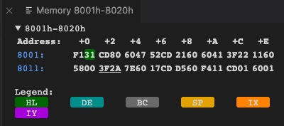

By default the view opens in little endian but by specifying "big" as the last argument the viewer shows the values as big endian.

The color coding for registers works here as well. E.g. in the picture above HL points to 8001h. Therefore the lower half of F131h gets a green color.


There is also a special memory viewer, the Register Memory View. open it with:
~~~
-rmv
~~~

It shows the memory contents at the locations the registers point to. I.e. you can directly see where the registers are pointing at and what the values are. This memory will change its range automatically if the associated register(s) change.

The register memory view:


To search the memory there is a search bar in the top.
A search is done on the given memory range.
You can search for strings or byte sequences and you can also search for a mix of strings and bytes.

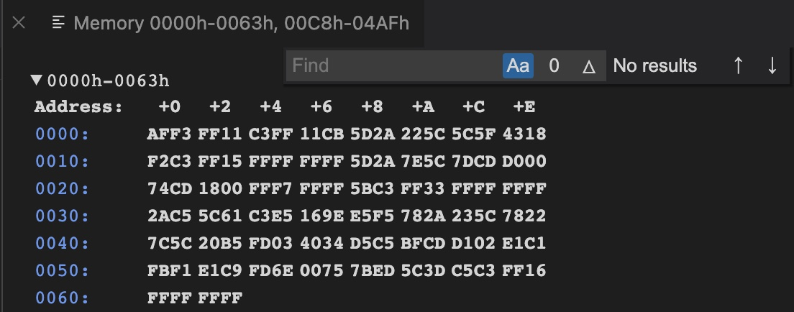

To search for a string use quotation marks, e.g. ```"abcde"```. A sequence of bytes is simply separated by a space. Bytes can be entered as decimal (e.g. ```193```) or hex (e.g. ```$AF```, ```AFh``` or ```0xAF```). Only positive values are allowed and they must be smaller than 256. (If you want to search for a " you need to escape it, e.g. use "\\"".

Use
- 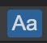 for a case sensitive search. Note that this option works on the whole search sequence, i.e. not only on the strings. E.g. if you have a sequence  ```61h 62h``` ("ab") also ```41h 42h``` ("AB") will be found. The default is ON.
- 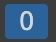 will add a ```0``` to the search. Useful for searching strings. Default is OFF.
-  for delta search. For a delta search you need minimum 2 numbers. The delta search will search for a sequence which contains exactly the same deltas. E.g. if you would search for a string "acd" every sequence with the deltas 2 and 1 would be found as well, for this example "bde" or "gij". This search can be helpful if your target uses strings but these are ot ASCII coded. In most cases at least the same alphabet sequence is used and so also these strings can be found. Default is OFF. Read more in [Reverse Engineering](https://github.com/maziac/DeZog/blob/master/documentation/ReverseEngineeringUsage.md#delta-search).


Note:
- The memory views always work in the 64k area. I.e. they don't use 'long addresses' (banks).
- If you want to launch the register memory view every time you start a debug session then add it to the "commandsAfterLaunch" in the launch.json. E.g.
    ~~~json
    "commandsAfterLaunch": [
        "-rmv"
    ]
    ~~~
- The register memory view (-rmv) lacks the search bar, highlighting of changed values and showing previous values when hovering.


##### Memory Editor

In the memory viewer you can edit individual memory values with a double-click on the value.
You can now enter the new value as hex, decimal, bin or even as a math formula.

Any changed value wil be updated automatically in all memory views.
Note: The changed value is not updated immediately in the WATCH area. There you need to 'step' once to get the updated values.


##### Configuration

The visualization of the memory viewer can be configured. All values are collected under the 'memoryViewer' setting. You can change the registers in the registersMemoryView, the colors of the register pointers and the format of values that is shown when you hover over the memory values.


#### Memory Diff View

The Memory Diff View is more complex to use but also very powerful.
It allows you to take a snapshot of the memory and filter for changes.
E.g. you can do a filter on the complete memory to find any locations that were decremented by one.

This is a useful tool especially for reverse engineering but you can also use it to debug your own code.

To use it invoke the Memory Diff View via
~~~
-mvd 0x5000 0x3000
~~~

This will e.g. show you the contents:

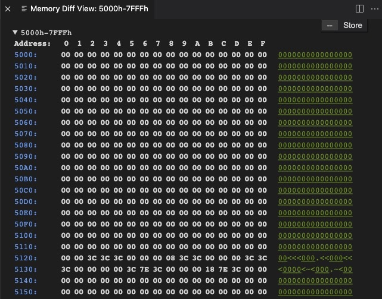

Internally a snapshot of the memory area is taken.

Now let your program run and stop after some time. The memory view will change to display the current memory content.

Now press the combobox and choose to display any memory location that was changed compared to the internal snapshot:
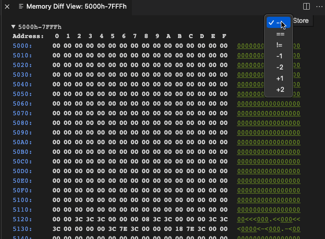

This already could give you the information you need. But if you need to narrow down the location in question you can store the current displayed memory as the new snapshot by pressing "Store" and run your SW once again.

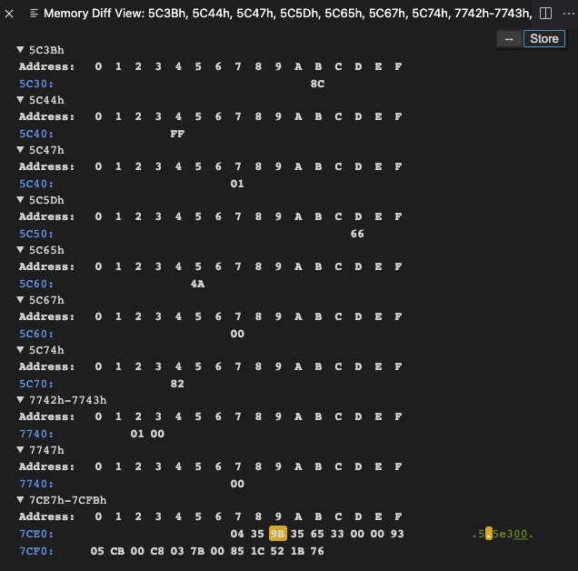
Please note that the title now changed to reflect the new observed memory locations.
You can stop your program and like above check for any changes.

The Memory Diff View allows a few different checks that can be selected with the combobox:

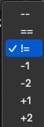

- "--" will display the current memory contents and does not do a filtering at all.
- "==" will show all equal memory locations.
- "!=" will show all memory locations that are not equal.
- "-1" will show all memory locations that were decremented by 1.
- "-2" will show all memory locations that were decremented by 2.
- "+1" will show all memory locations that were incremented by 1.
- "+2" will show all memory locations that were incremented by 2.


If you hover over a value you will see a few conversions of the value, it's address AND also the previous value, i.e. the value of the snapshot:

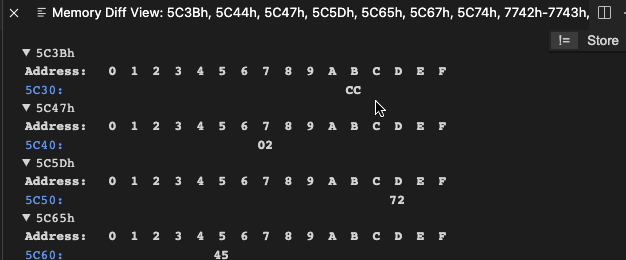


Note: Since the nature of this view is to show the differences to the snapshot it will not show any changes in red like the other memory views do.


#### Memory Dumps

There are other useful memory commands, please use '-help' to see them all.
You can for example print a memory dump to the console with
~~~
-md 0 200h
~~~

### Altering Memory Contents

You can alter memory contents directly within the Memory Viewer or you can alter it in the WATCHes pane.

But there are also a special commands to change memory contents, the
~~~
-msetb <address> <value> [<repeat>]
~~~
- address: The address to fill. Can also be a label or expression.
- value: The value to set
- repeat: (Optional) How often the value is repeated.

and

~~~
-msetw <address> <value> [<repeat> [<endianness>]]
~~~
- address: The address to fill. Can also be a label or expression.
- value: The value to set
- repeat: (Optional) How often the value is repeated.
- endianness: (Optional) 'little' (default) or 'big'.

Examples:
- "-msetb 8000h 0Fh" : Puts a 15 into memory location 0x8000.
- "-msetw 8000h AF34h" : Puts 34h into location 0x8000 and AFh into location 0x8001.
- "-msetw 8000h AF34h 1 big" : Puts AFh into location 0x8000 and 34h into location 0x8001.
- "-msetb 8000h 0 100h" : fills memory locations 0x8000 to 0x80FF with zeroes.
- "-msetb fill_colors_ptr FEh": If fill_colors_ptr is e.g. 0xCF02 the value FEh is put into location 0xCF02.
- "-msetb fill_colors_ptr+4 FEh": If fill_colors_ptr is e.g. 0xCF02 the value FEh is put into location 0xCF06. Note: There mustn't be any spaces in 'fill_colors_ptr+4'. Everything after a space is considered as a new argument.


#### Sprites & Patterns

You can open a view which displays the current sprite slots by entering

~~~
-sprites
~~~

This will display all 'visible' sprites in a table with all associated attributes like mirroring, rotation, palette offset and pattern id.

Note: When hovering over a column title you will also get an explanation.

Furthermore it also offers a simplified screen view which displays the border, the screen area and the sprites clipping rectangle.
Here you can see all sprites from the list above with right offsets and rotation, no matter if they are visible or clipped.
(Of course, if the list shows only visible sprites, you will also only see visible sprites in the screen view.)


Each sprite is shown by a rectangle and it's image. Additional you see it's slot number at the right bottom.

The viewer is also capable to display 4 bit color pattern sprites and relative sprites.

Here is an example view from [ped7g's](https://github.com/MrKWatkins/ZXSpectrumNextTests/tree/develop/Tests/Sprites/BigSprite4b) sprite test programs that show anchor and relative uniform sprites in different rotations.


The last 2 columns show the composition: Relative sprites show 'Relative' here and have a reference to the anchor sprite index.
The anchor sprites are either 'Composite' or 'Uniform' which selects how the following relative sprites are used in respect to mirroring, rotation and scaling.
All sprites belonging to the same anchor get the same background color so you can easily spot where the next "big" sprite begins.


If you only want to watch specific sprites you can add the slot numbers as arguments.

Example: "-sprite 10-15 20+3 33" will observe sprite slots 10, 11, 12, 13, 14, 15, 20, 21, 22, 33 only.

The view will update the sprite's position and attributes on every 'step' in the debugger.
If a new sprite appears the corresponding  sprite pattern will be loaded as well. But for performance reasons: On a 'step' the sprite patterns for already existing sprites are not updated. On a 'break' the sprite patterns will always be updated.
So in most of the cases the sprite patterns will show correctly.
However for special situations it is also possible to reload the patterns with a button.
If the sprite pattern might be outdated you see a '*' left to the 'Reload' button.


If the background color does not offer enough contrast for the sprite pattern it is possible to change the background color with the dropdown menu.

To see just the sprite patterns you can use

~~~
-patterns
~~~
with the same syntax.

It will display the sprite patterns.
It is also possible to change the palette if the current palette is not suitable.

For each of the 64 indices 3 patterns are shown:
- the 8bit color pattern (256 bytes)
- the 4bit color pattern for N6=0 (128 bytes)
- the 4bit color pattern for N6=1 (128 bytes)

Note: From the pattern memory it cannot be known if the pattern is used as 8bit or 4bit pattern so all possible patterns are shown in this view.
This, of course, means that normally only the 8bit or the 4bit color pattern is valid. Decision is done by the sprite.


If you want to test the sprite and pattern capabilities you can clone a project from [Peter Ped Helcmanovsky](https://github.com/ped7g). It has been forked and configured for DeZog here: [SpecBong Fork].


### WATCHes

If you select a label with the mouse in the source code and do a right-click you can add it to the watches (alternatively you can also enter it manually in the WATCH window). The watches show the value of the memory contents the label points to in different formats.
The content is updated on each step.
Example:

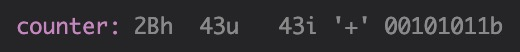

You can hover over the label in the WATCH window to display the address of the label.

DeZog tries to estimate the size of the label but if that is incorrect you can assign the size of the label contents manually by placing the size after the label name.
E.g. use ```2```for a word.

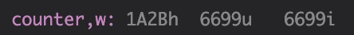

The 3rd parameter is the number of elements to show.
The example here uses an "array" of 5 word-sized counters starting at the label 'counters'. E.g.
~~~asm
counters:
    defw 0x1000 ; Counter 0
    defw 0x0030 ; Counter 1
    defw 0x0800 ; Counter 2
    defw 0xA000 ; Counter 3
    defw 0x0010 ; Counter 4
~~~

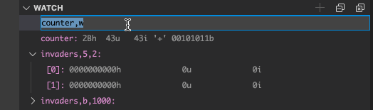

Again DeZog would try to estimate the element count if you omit the 3rd parameter.
DeZog will succeed estimating if the counters are immediately followed by some other label. DeZog's element count estimation would fail if there is some space (e.g. a DEFS area) before the next label is defined.

If you'd choose a different size the display changes accordingly.
You can also put another label (EQU) value here.

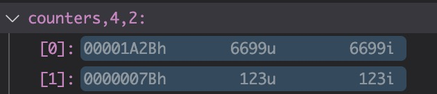

In the example above there are 2 element each with a size of 4 bytes.

But DeZog can show even more advanced memory layouts if the assembler provides the necessary information.
For now the only assembler that provides this information is sjasmplus which allows to display STRUCTs.
Instead of a number for the size you have to give the name of a STRUCT.

The following example defines 2 nested STRUCTs (HITBOX and INVADER) and a label (invaders) which preserve memory for 5 (INV_COUNT) invaders:

~~~js
        STRUCT HITBOX
x       BYTE 0
y       BYTE 0
width   BYTE 0
height  BYTE 0
        ENDS

        STRUCT INVADER
enabled      BYTE
hitbox       HITBOX
type         BYTE
attributes   WORD
optional     DEFS 3
        ENDS

INV_COUNT: EQU 5

invaders: DS INV_COUNT*INVADER
~~~

In DeZog the first invader can be displayed like this:
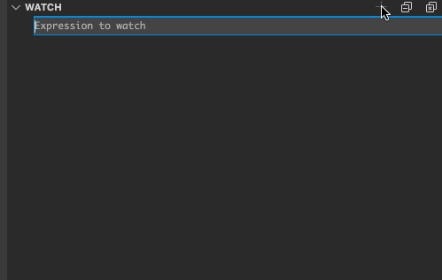

To inspect all invaders just add the count:
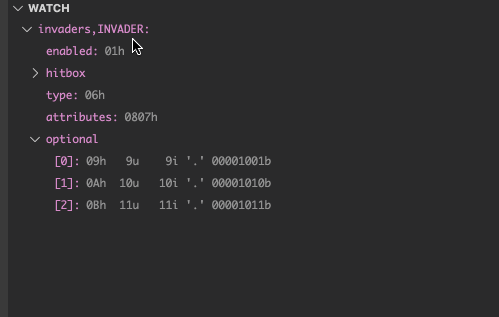

To inspect a specific invader you can do so by adding an index to the label.
The index step is the type (size) of an element.
Indexes start at 0.
E.g. to inspect the 3rd invader use:
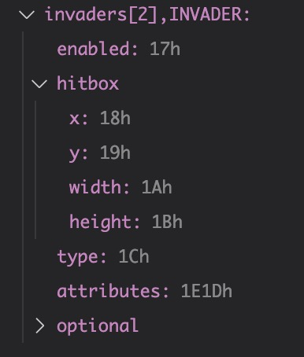


If you like you can also "comment" your watches which e.g. further explains the use. You can separate it with a e.g. a ";", e.g.:
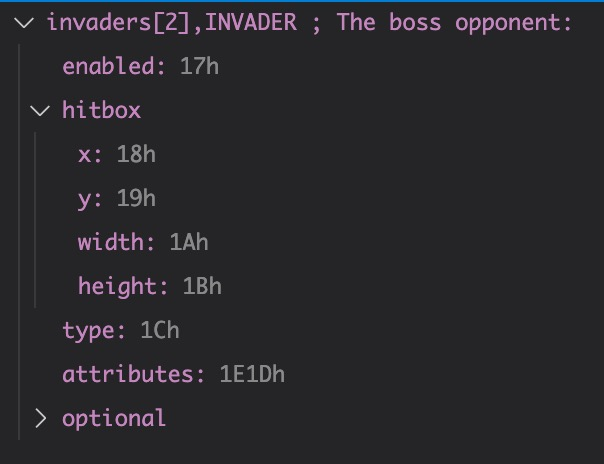


Notes:
- Watches always work in the 64k area. I.e. they don't use 'long addresses' (banks). If the wrong bank is paged in you will see wrong values here.
- You can also put a register name (e.g. "BC") in the WATCHes area. E.g. you can easily watch the last 10 elements on the stack by typing:```SP,2,10```.
- Don't get confused: If you use a register then not the register content is shown! Instead the memory contents the register points to is displayed. The same as it is with labels. And, consequently, if you have an EQU not the value itself but that of the memory location the EQU points to is shown.
- Instead of simple labels ore integers it is possible to use expressions. E.g. you could use ```BC+2*INV_COUNT[4]``` which translates to: Use the value of register BC, add 2 times the INV_COUNT constant. From the resulting address use the 4th element.
- To watch the stack in the WATCH section you could use: ```SP,2,(stack_top-SP)/2```which shows a dynamic size array which starts at SP and ends at stack_top (assuming stack_top is defined as a label just above your stack).
- If a label is not recognized try to use the fully qualified name. I.e. in case of a dot label try to use the full label name with the module name (if used).
- You can change values in the WATCHes pane by right-clicking and selecting 'Set value'.


### Change the Program Counter

The PC can be changed via the menu. Click in a source line with an assembly statement. Then do a right-click and choose "Move Program Counter to Cursor".

You can as well simply change the PC in the VARIABLES pane and enter a new value.


### 'Long Addresses' Explanation

In DeZog the term 'long address' is used to distinguish an address with banking information from a 'normal' 64k address.

A Z80 CPU can address only 64k of address space, i.e. addresses 0x0000 to 0xFFFF.
For big programs this is too small.
Therefore banking/paging mechanisms have been invented which swap the memory of certain address ranges (e.g. 0xC000-0xDFFF) and exchange it with memory contents of another bank.
E.g. the ZX 128K has 8 different memory banks. The ZX Next has more than 100.
The size of a bank may also differ. E.g. a ZX 128K has 8 banks a 16K byte. The ZX Next (in assembler) uses 8K byte banks (often also referred to as a page).

A 'long address' refers to an address (0x0000-0xFFFF) plus its bank information. I.e. even if an address points to an address in the Z80 64k address space, DeZog can determine the correct memory by additionally evaluating what memory is currently paged in.


## Unittests

You can use DeZog to execute unit tests.
Please see [here](https://github.com/maziac/DeZog/blob/master/documentation/UnitTests.md).


## Known Issues

- **ZEsarUX** (found with v8.1)
    - **Windows** only: Some people encounter a crash (rainbow/kernel panic) of ZEsarUX at the start of a debug session. If that is true for you as well you can experiment with the "[loadDelay](#zesarux)" option which adds an additional delay at startup. This mitigates the problem.
The default for Windows is 100 (ms). If you run into this problem you can try to increase the value to 400 or even 1000. (You can also try smaller values than 100).
    - Watchpoint (**WPMEM** aka memory breakpoints) and reverse debugging: There is a subtle problem with the memory breakpoints in ZEsarUX. The cpu-history command (used when reverse debugging) does access the memory the same way as the Z80 cpu emulation does. Thus a read might fire a memory breakpoint in the same way. This results in breaks of the program execution when you would not expect it. The memory read is 4 byte at PC (program counter) and 2 bytes at SP. Often you don't even notice because you don't place a watchpoint (WPMEM) at those places but in case you guard your **stack** with WPMEM you need to be aware of it: You shouldn't guard the top of the stack directly but at least grant 2 extra bytes at the top of the stack that are unguarded. See the [z80-sample-program] for placing the WPMEM correctly.
- **CSpect** (found with v2.13.0 through at least 2.16.6)
    - The Watchpoints API has side effects and therefore Watchpoints are disabled. See [issue #18](https://github.com/maziac/DeZog/issues/18).
- **General**
    - **Hovering** does work only on the file that is currently debugged, i.e. where the PC (program counter) points to. This seems to be a restriction of vscode. See [debug-adapter-protocol issue #86](https://github.com/microsoft/debug-adapter-protocol/issues/86).
