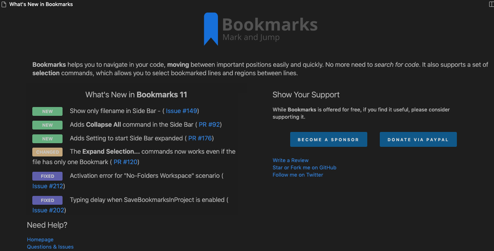

# What's New submodule

This submodule is used to display a **What's New** page on my VS Code extensions. It has a simple (but yet effective) UI, optimized to display all the information in a single page.



## Usage

```ts

// provide the data
import { ChangeLogItem, ChangeLogKind, ContentProvider, Header, Image } from "../../vscode-whats-new/src/ContentProvider";

export class WhatsNewBookmarksContentProvider implements ContentProvider {

    provideHeader(logoUrl: string): Header {
        return <Header>{logo: <Image> {src: logoUrl, height: 50, width: 50}, 
            message: `<b>Bookmarks</b> helps you to navigate in your code, <b>moving</b> 
            between important positions easily and quickly. No more need 
            to <i>search for code</i>. It also supports a set of <b>selection</b>
            commands, which allows you to select bookmarked lines and regions between
            lines.`};
    }

    provideChangeLog(): ChangeLogItem[] {
        let changeLog: ChangeLogItem[] = [];
        changeLog.push({kind: ChangeLogKind.NEW, message: `Show only filename in Side Bar - (<a title=\"Open Issue #149\" 
            href=\"https://github.com/alefragnani/vscode-bookmarks/issues/149\">
            Issue #149</a>)`});
        changeLog.push({kind: ChangeLogKind.CHANGED, message: `The <b>Expand Selection...</b> commands now works even if the file has only one Bookmark (<a title=\"Open Issue #120\" 
            href=\"https://github.com/alefragnani/vscode-bookmarks/issues/120\">
            PR #120</a>)`});
        changeLog.push({kind: ChangeLogKind.FIXED, message: `Activation error for "No-Folders Workspace" scenario (<a title=\"Open Issue #212\" 
            href=\"https://github.com/alefragnani/vscode-bookmarks/issues/212\">
            Issue #212</a>)`});
}

// register the provider
const provider = new WhatsNewBookmarksContentProvider();
const viewer = new WhatsNewManager(context).registerContentProvider("bookmarks", provider);

// show the page (if necessary)
viewer.showPageInActivation();

// register the additional command (not really necessary, unless you want a command registered in your extension)
context.subscriptions.push(vscode.commands.registerCommand("bookmarks.whatsNew", () => viewer.showPage()));
```
## Features

### Detects version updates

It follows [SEMVER - Semantic Versioning](https://www.semver.org) to detect **Major**, **Minor** and **Patch** versions. The **What's New** page will only be displayed when a **Major** or **Minor** update occurs. **Patches** are updated silently.

### Template Based

I don't have to deal with HTML or CSS on my extensions anymore. I just have to _provide_ the relevant information and the HTML page is automatically generated/updated.

## Inspiration

The idea came from the [GitLens extension](https://marketplace.visualstudio.com/items?itemName=eamodio.gitlens) by @eamodio (big thanks to Eric Amodio :claps:). Based on pieces of its welcome page, I created this template based engine, to be able to use in any of my extensions, with minimum effort.

# License

[MIT](LICENSE.md) &copy; Alessandro Fragnani